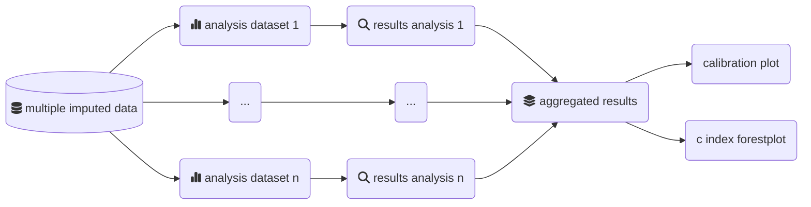

# MiceExtVal

External model validation is a necessary step in the implementation of risk prediction models in real life situations. There is an overabundance of models that are not really tested in environments other than their development. To aknowledge that a model will perform properly in different environments we need to perform external validations in them.

Simultanously, the majority of the availabe datasets for external validation will come from electronic health records (EHR) resulting in datasets with missing information. One of the most recommended techniques to reduce the BIAS produced by the missing values is the multiple imputation.

The package `MiceExtVal` helps to create workflows to externally validate logistic regression and Cox models among a multiple imputed dataset. The package helps users to generate the multiple imputation workflow properly while maintaining a common syntax for both models.



If you need information on how the package works we recommend you to read the documentation available in our [webpage](https://metodologianavarrabiomed.github.io/mice-ext-val)

## Installation

You can install the development version of `MiceExtVal` from [GitHub](https://github.com/) with:

``` r
# install.packages("devtools")
devtools::install_github("metodologianavarrabiomed/mice-ext-val")

# alternativelly you can use the `pak` package
# install.packages("pak")
pak::pkg_install("metodologianavarrabiomed/mice-ext-val")
```
