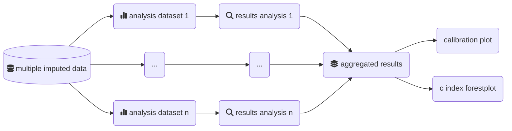
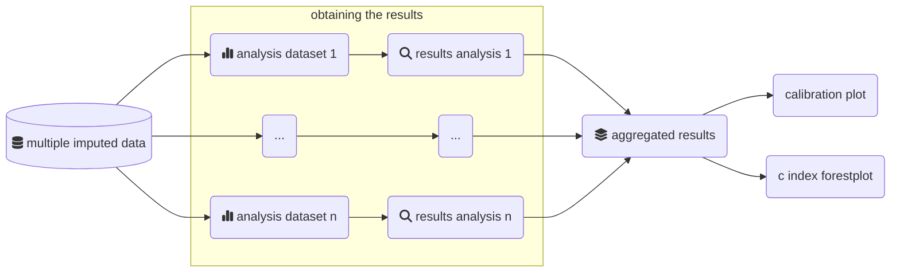
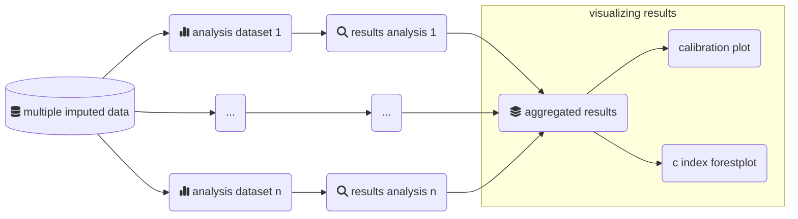

# MiceExtVal

<!-- badges: start -->
[](https://lifecycle.r-lib.org/articles/stages.html#experimental)
<!-- badges: end -->

The goal of `MiceExtVal` is to give the users tools to externally validate models using the multiple imputation methodology. There are lots of packages to externally validate models in complete datasets but there is a lack of tools when we are working with multiple imputed datasets. 

It is recommended to use techniques like multiple imputation by chained equations ([MICE](https://stefvanbuuren.name/fimd/)) to impute the missing values when they are present, the MICE methodology requires to realize as many alanysis as imputed datasets are. The next graph shows the flowchart of a multple imputed analysis. This package is generated to assist the users along the external validation analysis.



## Installation

You can install the development version of `MiceExtVal` from [GitHub](https://github.com/) with:

``` r
# install.packages("devtools")
devtools::install_github("metodologianavarrabiomed/mice-ext-val")

# alternativelly you can use the `pak` package
# install.packages("pak")
pak::pkg_install("metodologianavarrabiomed/mice-ext-val")
```

## Example

The package assumes that the user have generated a multiple imputed dataset. The imputed dataset must be stored in `long` format. We have considered that the multiple imputation is generated with the [`mice` package](https://cran.r-project.org/web/packages/mice/index.html).

> [!TIP]
>
> From the [`mice` package](https://cran.r-project.org/web/packages/mice/index.html) you can obtain the complete dataset in long format as
>
> ```r
> complete <- mice::complete(imp, action = "long")
> ```

The external validation dataset must only contain the information about the imputed dataset and no information about the original dataset. The package functions are divided in three groups, the model definition functions starting with `mv_model`, the functions that calculate model results starting with `calculate_`, and the plot functions starting with `get_`. Through this example we have also assumed that the complete dataset is called `external_validation_data`.

Firstly, we import the package.

``` r
library(MiceExtVal)
```

### Defining a model

By using the `mv_model` functions we can generate the package model definitions. To define a Cox model we use the function `mv_model_cox` and to define a logistic regression model we use the function `mv_model_logreg`. Each model have different requirements to be generated.

#### Cox model

To define the cox model we need to be able to describe the following characteristics of the model.

* `formula`: Model formula to calculate the $\beta \cdot X$ values.
* $S_0(t)$: Value of the basal survival function at the time of study $t$ (must be the maximum time in the dataset)

As an example we have defined a Cox model that is defined by the formula:

$$
0.98765^{exp(0.5 \cdot (x - 3) + 0.3 \cdot (z - 0.2))}
$$

```r
cox_model <- MiceExtVal::mv_model_cox(
 formula = event ~ 0.5 * (x - 3) + 0.3 * (z - 0.2),
 S0 = 0.98765
)
```

> [!IMPORTANT]
> The `formula` argument is the declaration of the code that calculates the $\beta \cdot X$ values. In this formula should be included the model coefficients and also the mean values, if there is a need of centering the results.
>
> The formula have two parts the left part and the right part, in the left part we must include the dependent variable (outcome of interest) and in the right part we must define the calculation formula for the $\beta \cdot X$.
>
> The variables used in the formula must be part of the external validation dataset. The dependent variable must be a `Surv` object and the right part of the formula needs to be executable code to calculate the $\beta \cdot X$.
>
> It will be executable code if it can be executed as the following code snippet.
>
> ```r
>   # this is not actual package code
>   data |>
>     dplyr::mutate(risk_prediction = 1 - S0^exp(eval(right_formula)))
> ```
>
> The variables must be defined in the external validation dataset and they must be a type of variables that `eval(right_formula)` returns a value. It is important to take care of the `factor` and `character` variables that could throw errors or non-value results. It could be interesting to transform this variables to dummies.

#### Logistic regression model

Similarly to the Cox model we need to be able to describe the following characteristics of the model.

* `formula`: Model formula to calculate the linear predictors.

As an example we have defined a model with $\beta_0 = -1.2, \beta_x = 0.5, beta_z = 0.3$

```r
logreg_model <- mv_model_logreg(formula = event ~ 0.5 * x + 0.3 * z - 1.2)
```

### Calculate the results

Once we have defined our models the next step is to actually calculate their results. In the diagram we are now in the part where results are calculated. The statistical analysis must be performed in each of the imputed datasets separatelly and we aggregate the results afterwards.



The external validation results are summarized into `calibration plots` and the `c-index foresplot`, but to generate this plots it is needed to previously calculate the model predictions in the external validation cohort. 

We can calculate the model predictions by using `calculate_predictions`, `calculate_predictions_recalibrated_type_1` and `calculate_predictions_recalibrated_type_2` functions.

Suppose we want to calculate the model predictions in the external validation cohort, we use the function `calculate_predictions` as follows.

```r
model <- model |> calculate_predictions(external_validation_data)
```

> [!TIP]
> You can concatenate the prediction functions by using the pipe operator `%>%` or `|>`. We recommend to use the R native pipe operator `|>`. 
>
> ```r
>model <- model |>
>  calculate_predictions(external_validation_data) |>
>  calculate_predictions_recalibrated_type_1(external_validation_data) |>
>  calculate_predictions_recalibrated_type_2(external_validation_data) 
> ```

The Harrell's C-index calculation can be done using the function `calculate_c_index`. This function needs at least the model prediction calculated to be able to obtain the aggregated Harrell's C-index.

```r
model <- model |> 
  # only calculate the predictions if they are not already part of the model
  calculate_predictions(external_validation_data) |>
  calculate_c_index(external_validation_data)
```

### Visualizing the results

With all the results already generated in the model we can start to visualize them. As shown in the next graph this is the last step of the package pipeline, results visualization. In the package there are two plots defined. The `calibration plots` that shows how the model predictions matched the observed risk and the `c-index foresplot` that shows the discrimination abilities of different models.



#### Calibration plots

To obtain the calibration plots we need to use two functions `get_calibration_plot_data` that generates the needed data to actually generate the calibration plot and the `get_calibration_plot` whose only needed parameter is the outcome of `get_calibration_plot_data`. We can generate a calibration plot as shown in the next code snippet with the function `get_calibration_plot`. 

> [!TIP]
> The function returns a [`ggplot2` object](https://cran.r-project.org/web/packages/ggplot2/index.html). Therefore, it can be modified as any other `ggplot2` plot.

```r
model |>
  # only calculate the predictions if they are not already part of the model
  calculate_predictions(external_validation_data) |>
  get_calibration_plot_data(
    data = external_validation_data, 
    n_groups = 10, 
    type = "predictions_aggregated"
  ) |>
  get_calibration_plot()
```

> [!NOTE]
> The argument `type` can be used to generate calibration plots of the recalibrated predictions. The next code snippet will generate the calibration plot of the type 1 recalibrated predictions
>
> ```r
> model |>
>  # only calculate the predictions if they are not already part of the model
>  calculate_predictions(external_validation_data) |>
>  calculate_predictions_recalibrated_type_1(external_validation_data) |>
>  get_calibration_plot_data(
>    data = external_validation_data, 
>    n_groups = 10, 
>    type = "predictions_recal_type_1"
>  ) |>
>  get_calibration_plot()
> ```

#### C-index forestplot

> [!WARNING]
> This feature is currently under development.

The external validations are normally formed by many models and we want to compare their results. Forestplots are a great way of visualizing the c-index values of multiple models in one graph. The package provides the function `get_c_index_forestplot`. You can provide an illimited number of models that have their `c_index` calculated and it returns a forestplot generated with the [`forestplot` package](https://cran.r-project.org/web/packages/forestplot/index.html).

```r
get_c_index_forestplot(Cox = cox_model, `Logistic Regression`= logreg_model)
```
