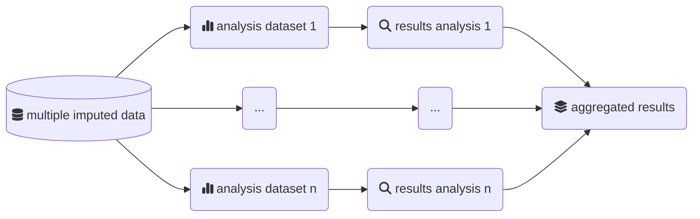

# MiceExtVal

<!-- badges: start -->
[](https://lifecycle.r-lib.org/articles/stages.html#experimental)
<!-- badges: end -->

The goal of MiceExtVal is to give the users tools to externally validate models using the multiple imputation methodology. There are lots of tools to externally validate models in complete datasets but there is a lack of tools when we are working with multiple imputed datasets. It is recommended to use techniques like multiple imputation by chained equations (MICE) to impute the missing values when they are present and this package is created to fill that gap.

The package counts with support to Cox and logistic regression models as it was generated to define the methodology of an external validation of survival analysis. The MICE methodology needs to generate as many solutions as imputed datasets.



## Installation

You can install the development version of MiceExtVal from [GitHub](https://github.com/) with:

``` r
# install.packages("devtools")
devtools::install_github("metodologianavarrabiomed/mice-ext-val")
```

## Example
The package functions are divided in three groups, the model definition functions starting wit `mv_model`, the calculating model results starting with `calculate_` and the plots starting with `get_`. This is a basic example which shows you how to solve a common problem:

``` r
library(MiceExtVal)
```

We can define a model using the `mv_model` functions

```r
cox_model <- mv_model_cox(
 coefficients = list(x = 0.5, z = 0.3),
 means = list(x = 3, z = 0.2),
 formula = event ~ x + z,
 S0 = 0.98765
)

logreg_model <- mv_model_logreg(
 coefficients = list(x = 0.5, z = 0.3),
 formula = event ~ x + z,
 intercept = 1.2
)
```

From these models we can estimate the different predictions using the function `calculate_predictions`, `calculate_predictions_recalibrated_type_1` and `calculate_predictions_recalibrated_type_2`. It is possible to concatenate the model through the function as follows.

```r
cox_model <- cox_model |>
  calculate_predictions(external_validation_data) |>
  calculate_predictions_recalibrated_type_1(external_validation_data) |>
  calculate_predictions_recalibrated_type_2(external_validation_data) 

logreg_model <- logreg_model |>
  calculate_predictions(external_validation_data) |>
  calculate_predictions_recalibrated_type_1(external_validation_data) |>
  calculate_predictions_recalibrated_type_2(external_validation_data) 
```

It is also possible to calculate the Harrell c-index using the `calculate_c_index` function. It is needed that the model predictions are calculated before the c-index.

```r
cox_model <- cox_model |> 
  calculate_c_index(external_validation_data)

logreg_model <- logreg_model |> 
  calculate_c_index(external_validation_data)
```

Once all the results are generated in the model we can start to generate the plots to visualize them. There are two plots defined the calibration plots to show the model calibration over the external validation cohort and the forestplot to visualize the c-index values of different models. The following code snippet shows how to obtain the calibration plot. 

```r
cox_model |>
  get_calibration_plot_data(data = test_data, n_groups = 10, type = "predictions_aggregated")

logreg_model |>
  get_calibration_plot_data(data = test_data, n_groups = 10, type = "predictions_recal_type_1")
```

The next code snippet is an example of the foresplot generation. 

```r
get_c_index_forestplot(Cox = cox_model, `Logistic Regression`= logreg_model)
```
