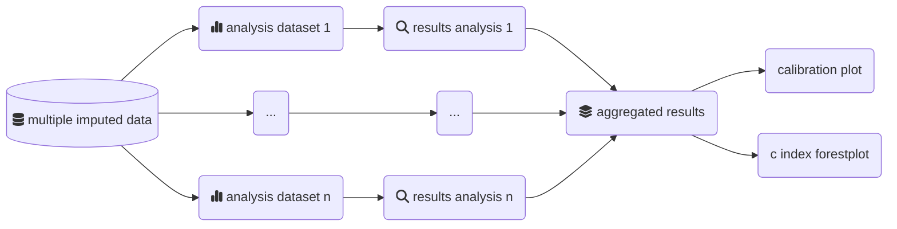
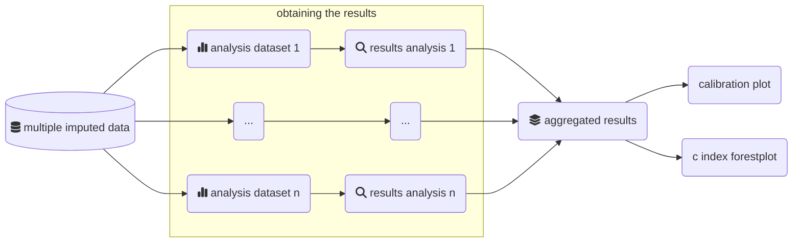
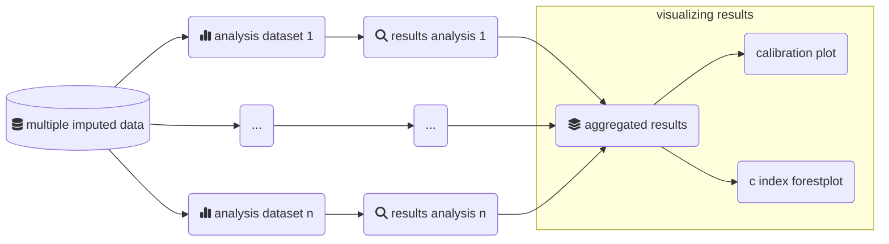

# MiceExtVal

<!-- badges: start -->
[](https://lifecycle.r-lib.org/articles/stages.html#experimental)
<!-- badges: end -->

The goal of MiceExtVal is to give the users tools to externally validate models using the multiple imputation methodology. There are lots of tools to externally validate models in complete datasets but there is a lack of tools when we are working with multiple imputed datasets. It is recommended to use techniques like multiple imputation by chained equations (MICE) to impute the missing values when they are present, the MICE methodology requires to realize as many alanysis as imputed datasets are. The next graph shows the flowchar of a multple imputed analysis. The package is generated to assist the users along the external validation analysis.



## Installation

You can install the development version of MiceExtVal from [GitHub](https://github.com/) with:

``` r
# install.packages("devtools")
devtools::install_github("metodologianavarrabiomed/mice-ext-val")
```

## Example

The package assumes that there is a multiple imputed dataset in `long` format with only the imputed datasets. The functions are divided in three groups, the model definition functions starting wit `mv_model`, the calculating model results starting with `calculate_` and the plots starting with `get_`.

> [!TIP]
>
> From the `mice` package you can obtain the complete dataset in long format as
>
> ```r
> complete <- mice::complete(imp, action = "long")
> ```

Through this example we assume that the complete dataset is called `external_validation_data`. Firstly, we import the package. 

``` r
library(MiceExtVal)
```

### Defining a model
By using the `mv_model` we can generate the package model definitions. To define a Cox model we use the function `mv_model_cox` and to define a logistic regression model we use the function `mv_model_logreg`. Each model have different requirements to be generated.

#### Cox model

To define the cox model we need to be able to describe the following characteristics of the model.

* `coefficients`: A `list` with the model coefficients
* `means`: A `list` with the mean value in the derivation cohort for each of the model variables
* `formula`: Model `formula`
* $S_0(t)$: Value of the basal survival function at the time study $t$

```r
cox_model <- mv_model_cox(
 coefficients = list(x = 0.5, z = 0.3),
 means = list(x = 3, z = 0.2),
 formula = event ~ x + z,
 S0 = 0.98765
)
```

#### Logistic regression model

Similarly to the Cox model we need to be able to describe the following characteristics of the model.

* `coefficients`: A `list` with the model coefficients
* `formula`: Model `formula`
* `intercept`: Value of the `intercept` or $\beta_0$

```r
logreg_model <- mv_model_logreg(
 coefficients = list(x = 0.5, z = 0.3),
 formula = event ~ x + z,
 intercept = 1.2
)
```

### Calculate the results



The external validation results are summarized into `calibration plots` and the `c-index foresplot`, but to generate this plots it is needed to previously calculate the model predictions in the external validation cohort. We can calculate the model predictions by using `calculate_predictions`, `calculate_predictions_recalibrated_type_1` and `calculate_predictions_recalibrated_type_2` functions.

Suppose we want to calculate the model predictions in the external validation cohort, we use the function `calculate_predictions` as follows.

```r
model <- model %>% calculate_predictions(external_validation_data)
```

> [!TIP]
> If you are working with the package `magrittr` it is possible to rewrite the code as follows
>
> ```r
> model %<>% calculate_predictions(external_validation_data)
>```
>
> The function `%<>%` pipes and assign the result to the value `model`

To calculate the recalibrated predictions it is needed to previously have calculated the model predictions. To know how far away the model is estimating from the observed risk we obviously need to know the model predictions. We can calculate the type 1 recalibrated predictions in `model`.

```r
model %<>% calculate_predictions_recalibrated_type_1(external_validation_data)
```

> [!TIP]
> You can concatenate the prediction functions by using the pipe operator `%>%` or `|>`
>
> ```r
>model %<>%
>  calculate_predictions(external_validation_data) %>%
>  calculate_predictions_recalibrated_type_1(external_validation_data) %>%
>  calculate_predictions_recalibrated_type_2(external_validation_data) 
> ```

The Harrell C-index calculation can be done by the function `calculate_c_index`. It also needs the model predictions without any recalibration to be calculated.

```r
model %<>% calculate_c_index(external_validation_data)
```

### Visualizing the results

Once all the results are generated in the model we can start to generate the plots to visualize them. As shown in the next graph this is the last step of the package pipeline where we visualize the results. In the package there are two plots defined. The `calibration plots` that shows how the predictions matched the observed risk and the `c-index foresplot` that shows the discrimination abilities of different models. 



#### Calibration plots

To obtain the calibration plots we need to use two functions `get_calibration_plot_data` that generates the needed data to actually generate the calibration plot and the `get_calibration_plot` whose only needed parameter is the outcome of `get_calibration_plot_data`. We can generate a calibration plot as shown in the next code snippet.

```r
model %>%
  get_calibration_plot_data(
    data = external_validation_data, 
    n_groups = 10, 
    type = "predictions_aggregated"
  ) %>%
  get_calibration_plot()
```

> [!NOTE]
> The argument `type` can be used to generate calibration plots of the recalibrated predictions. The next code snippet will generate the calibration plot of the type 1 recalibrated predictions
>
> ```r
> model %>%
>  get_calibration_plot_data(
>    data = external_validation_data, 
>    n_groups = 10, 
>    type = "predictions_recal_type_1"
>  ) %>%
>  get_calibration_plot()
> ```

#### C-index forestplot

The external validations are normally formed by many models and we want to compare their results. Forestplots are a great way of visualizing the c-index values of multiple models in one graph. The package provides the function `get_c_index_forestplot`. You can provide an illimited number of models that have their `c_index` calculated and it returns a forestplot generated with the `forestplot` package.

```r
get_c_index_forestplot(Cox = cox_model, `Logistic Regression`= logreg_model)
```
