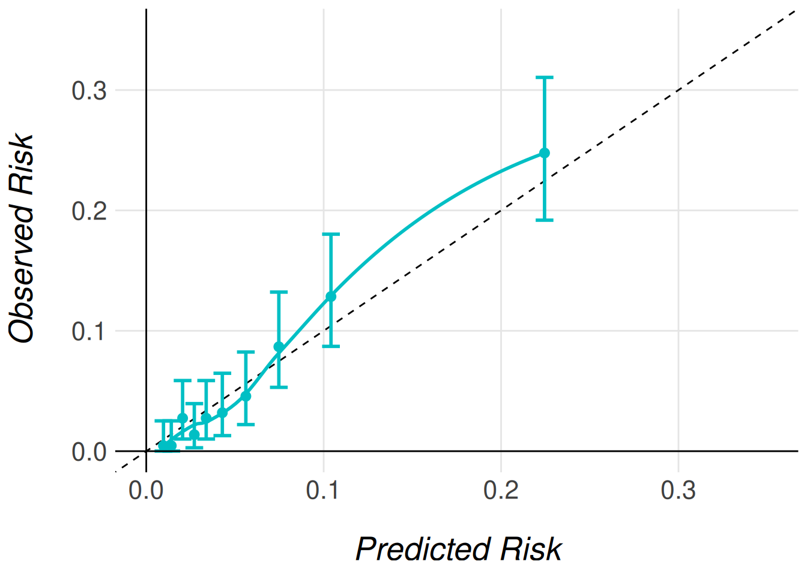
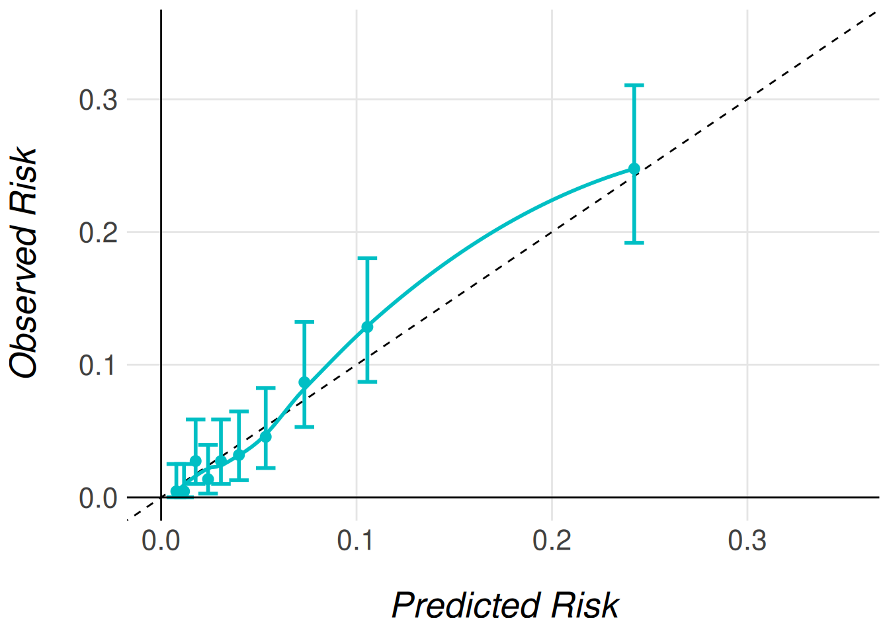
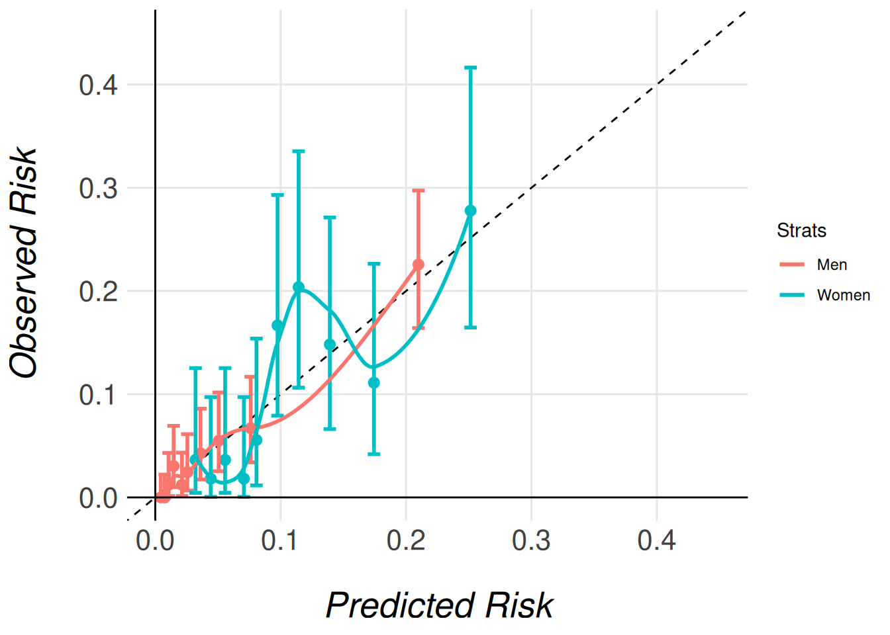

# Example Of Use With Dichotomous Outcome

##### Required Libraries

The following code snippet lists all the libraries needed to run this
report.

``` r
library(MiceExtVal)
library(gtsummary)
library(dplyr)
library(kableExtra)
```

The `MiceExtVal` package is designed to facilitate the external
validation of prediction models, particularly in clinical research
settings. In this vignette, we illustrate its use by replicating a
well-known example from Steyerberg ([2019](#ref-steyerberg)), presented
in Chapter 20 of his book. Specifically, we demonstrate how to
externally validate the TIMI-II model, originally developed by Mueller
et al. ([1992](#ref-timi-ii)), using data from the Western region cohort
of the GUSTO-I trial. This dataset is included in the package as
[`MiceExtVal::gusto`](https://metodologianavarrabiomed.github.io/mice-ext-val/reference/gusto.md).

The TIMI-II model is a logistic regression model that predicts 42-day
mortality in patients with acute myocardial infarction. Our aim is to
assess the model’s performance in a new population—patients in the
GUSTO-I Western region cohort, which provides only 30 days of follow-up.
Through this example, users will learn how the MiceExtVal package
supports the evaluation of model transportability and predictive
accuracy across different clinical settings.

| Predictor      | Coefficient |
|:---------------|------------:|
| Shock          |        1.79 |
| Age \> 65      |        0.99 |
| High risk      |        0.92 |
| Diabetes       |        0.74 |
| Hypotension    |        0.69 |
| Tachycardia    |        0.59 |
| Time to relief |        0.53 |
| Sex            |        0.47 |
| Intercept      |       -4.47 |

Table 1: TIMI-II coefficients

## Explore the dataset

The first step in any data analysis or validation project is to become
familiar with the dataset. The MiceExtVal package includes the GUSTO-I
Western region dataset, which is also used in the example from
Steyerberg ([2019](#ref-steyerberg)). To illustrate the use of multiple
imputation — a key requirement of the package — we provide a modified
version of the dataset with artificially introduced missing values. This
setup allows users to work through a realistic example where incomplete
data must be addressed.

[Table 2](#tbl-gusto-sum) presents a descriptive summary of the dataset.
Notably, the cohort includes nearly three times as many men as women.
While most variables appear similar across sexes, there is a marked
difference in mortality rates: \\11\\\\ in women compared to \\4.7\\\\
in men. This disparity may be partially explained by age, as \\57\\\\ of
the female patients are over \\65\\ years old, compared to only \\32\\\\
of the male patients. As previously mentioned, missing values are
distributed across most variables in a similar pattern, and will need to
be handled appropriately during the validation process.

``` r
gusto <- MiceExtVal::gusto |> dplyr::mutate(id = dplyr::row_number())

gusto |>
  dplyr::mutate(
    sex = dplyr::case_when(
      sex == 0 ~ "Male", sex == 1 ~ "Female",
      .default = as.character(sex)
    )
  ) |>
  dplyr::select(-id) |>
  gtsummary::tbl_summary(
    by = "sex",
    missing_text = "% of missings",
    missing_stat = "{p_miss}%"
  )
```

[TABLE]

Table 2: GUSTO-I W region dataset descriptive table

## Handling Missing Data

Although the main objective of this vignette is to demonstrate the use
of the MiceExtVal package for external model validation, addressing
missing data is a necessary step—and one that reflects best practices in
clinical research. Multiple imputation is widely recommended as a
statistically sound method for handling missing values, as it preserves
power and reduces bias compared to simpler approaches like complete case
analysis, Buuren ([2018](#ref-vanBuuren2018)).

The `MiceExtVal` package is built to integrate seamlessly with workflows
that use multiple imputation. In fact, all of its core functions expect
the input data to be provided in long format, as produced by the `mice`
package van Buuren & Groothuis-Oudshoorn ([2011](#ref-mice-package)).

Below, we present a basic example using `mice` to perform multiple
imputation. We first construct a predictor matrix, excluding the `id`
variable, and then extract the imputed datasets in long format.

``` r
pred_matrix <- mice::make.predictorMatrix(gusto)
pred_matrix[, "id"] <- 0
gusto_imp <- mice::mice(gusto, predictorMatrix = pred_matrix, seed = 123) |>
  mice::complete("long")
```

The resulting object, `gusto_imp`, contains the multiply imputed
datasets stacked in long format. This structure is required for proper
functioning of the `MiceExtVal` package.

For a more comprehensive discussion on multiple imputation methodology
and its practical application, we refer readers to Flexible Imputation
of Missing Data by Buuren ([2018](#ref-vanBuuren2018)), and to the
original mice package paper by van Buuren & Groothuis-Oudshoorn
([2011](#ref-mice-package)).

## External Validation

Traditional external validation is typically performed on a single,
complete dataset and involves several sequential steps. First, the
original model is used to generate predictions for the new dataset.
Then, the model’s performance is evaluated by assessing its
discrimination (e.g., AUC) and calibration. If necessary, the model may
be recalibrated, and performance metrics re-evaluated after adjustment.

However, when working with datasets containing missing values—especially
in clinical research—multiple imputation is often used to preserve data
integrity and avoid bias. As a result, we no longer have a single
dataset, but multiple imputed versions of the original data, each
representing a plausible completion. This complicates traditional
validation workflows, since each imputed dataset yields different
results that must be pooled appropriately.

The `MiceExtVal` package is designed to bridge this gap by streamlining
the external validation process across multiple imputed datasets. It
allows users to perform all validation steps—including prediction,
performance evaluation, and optional recalibration while properly
handling the variability introduced by imputation.

Having completed the imputation in the previous section, we are now
ready to externally validate the TIMI-II model using `MiceExtVal`. Since
TIMI-II is a logistic regression model, we begin by defining it with the
[`MiceExtVal::mv_model_logreg()`](https://metodologianavarrabiomed.github.io/mice-ext-val/reference/mv_model_logreg.md)
function. This function requires a formula specifying the model’s
coefficients and intercept. It is essential that all variables included
in the formula are present in the imputed dataset; otherwise, subsequent
functions will raise an error.

``` r
timi2_model <- MiceExtVal::mv_model_logreg(
  formula = day30 ~ 1.79 * sho + 0.99 * a65 + 0.92 * hig + 0.74 * dia +
    0.69 * hyp + 0.59 * hrt + 0.53 * ttr + 0.47 * sex - 4.47
)
```

Once the model is defined using
[`MiceExtVal::mv_model_logreg()`](https://metodologianavarrabiomed.github.io/mice-ext-val/reference/mv_model_logreg.md),
the resulting object—stored in timi2_model—contains both the model
formula and the structural skeleton needed for subsequent steps. Most
functions in the `MiceExtVal` package take this model object as input
and return an updated version with additional components, such as
predictions or performance metrics. These functions follow a consistent
naming convention: those that modify the model object begin with the
prefix calculate\_.

The first step in the external validation process is to compute the
model’s original predictions on the external dataset. To do this, the
package provides the
[`MiceExtVal::calculate_predictions()`](https://metodologianavarrabiomed.github.io/mice-ext-val/reference/calculate_predictions.md)
function. This function requires two arguments: the model object (e.g.,
`timi2_model`) and the imputed dataset in long format (e.g.,
`gusto_imp`). It returns the same model object with the predicted
probabilities added, ready for subsequent validation steps.

``` r
timi2_model <- timi2_model |>
  MiceExtVal::calculate_predictions(gusto_imp)
```

After executing
[`MiceExtVal::calculate_predictions()`](https://metodologianavarrabiomed.github.io/mice-ext-val/reference/calculate_predictions.md),
the model object is updated with additional information derived from the
imputed dataset. Specifically, the predicted probabilities are computed
for each imputation and stored within the model. In addition, the
function calculates aggregated predictions for each patient by pooling
results across imputations. An example of these values are shown in
[Table 3](#tbl-model-predictions-example).

Beyond the predicted probabilities, the model object also includes the
linear predictors (\\\beta \cdot X\\), both at the individual imputation
level and as pooled estimates. These represent the raw score from the
logistic regression model before applying the inverse logit
transformation. [Table 4](#tbl-model-betax-example) presents these
values.

This structure—where all relevant prediction outputs are integrated into
the model object—allows for a streamlined workflow in which subsequent
steps like performance evaluation or recalibration can be carried out
with minimal additional input.

``` r
timi2_model$predictions_aggregated |>
  utils::head() |>
  kableExtra::kbl()
timi2_model$predictions_data |>
  utils::head() |>
  kableExtra::kbl()
```

|  id | prediction |
|----:|-----------:|
|   1 |  0.1160889 |
|   2 |  0.0650227 |
|   3 |  0.0202330 |
|   4 |  0.0816603 |
|   5 |  0.0373269 |
|   6 |  0.0407286 |

\(a\) Aggregated predictions

| prediction | .imp |  id |
|-----------:|-----:|----:|
|  0.1160889 |    1 |   1 |
|  0.0567862 |    1 |   2 |
|  0.0202330 |    1 |   3 |
|  0.0816603 |    1 |   4 |
|  0.0373269 |    1 |   5 |
|  0.0492660 |    1 |   6 |

\(b\) Model predictions in each imputation

Table 3: Model predictions

``` r
timi2_model$betax |>
  utils::head() |>
  kableExtra::kbl()
timi2_model$betax_data |>
  utils::head() |>
  kableExtra::kbl()
```

|  id |  betax |
|----:|-------:|
|   1 | -2.030 |
|   2 | -2.692 |
|   3 | -3.880 |
|   4 | -2.420 |
|   5 | -3.250 |
|   6 | -3.196 |

\(a\) Aggregated Beta X

| betax | .imp |  id |
|------:|-----:|----:|
| -2.03 |    1 |   1 |
| -2.81 |    1 |   2 |
| -3.88 |    1 |   3 |
| -2.42 |    1 |   4 |
| -3.25 |    1 |   5 |
| -2.96 |    1 |   6 |

\(b\) Model Beta X in each imputation

Table 4: Model Beta X

### Performance Assessment

Once the model predictions have been calculated, we can proceed to
assess the model’s performance on the external cohort. The first aspect
of performance we evaluate is discrimination, which reflects the model’s
ability to distinguish between patients who experienced the event and
those who did not.

The `MiceExtVal` package provides two functions to assess
discrimination:
[`MiceExtVal::calculate_auc()`](https://metodologianavarrabiomed.github.io/mice-ext-val/reference/calculate_auc.md)
and
[`MiceExtVal::calculate_harrell_c_index()`](https://metodologianavarrabiomed.github.io/mice-ext-val/reference/calculate_harrell_c_index.md).
The former computes the Area Under the Receiver Operating Characteristic
Curve (AUC), which is appropriate for binary outcomes. The latter
calculates Harrell’s C-index, which is typically used for survival data.

Since our outcome is binary (death within 30 days), we will use AUC as
our measure of discrimination in this example.

``` r
timi2_model <- timi2_model |>
  MiceExtVal::calculate_auc(gusto_imp)

auc_res <- sprintf(
  "%.3f (95%% CI %.3f, %.3f)",
  timi2_model$auc["Estimate"],
  timi2_model$auc["95% CI L"],
  timi2_model$auc["95% CI U"]
)
```

The model yields an AUC of 0.797 (95% CI 0.775, 0.819), which indicates
a fairly good level of discrimination. As a second key component of
model performance, we now assess calibration, which evaluates how
closely the predicted probabilities agree with the observed outcomes.

Calibration is most commonly visualized using a calibration plot. In the
`MiceExtVal` package, generating this plot is a two-step process: first,
the calibration data must be computed; then, the plot itself can be
created.

To compute the calibration data, the package provides two functions:

- [`MiceExtVal::get_calibration_plot_data_prop()`](https://metodologianavarrabiomed.github.io/mice-ext-val/reference/get_calibration_plot_data_prop.md)
  estimates the observed risks using outcome proportions.
- [`MiceExtVal::get_calibration_plot_data_surv()`](https://metodologianavarrabiomed.github.io/mice-ext-val/reference/get_calibration_plot_data_surv.md)
  estimates observed risks using a Kaplan–Meier approach (for survival
  outcomes).

Since we are validating a logistic regression model with a binary
outcome, we use
[`MiceExtVal::get_calibration_plot_data_prop()`](https://metodologianavarrabiomed.github.io/mice-ext-val/reference/get_calibration_plot_data_prop.md).

In the code snippet below, we generate a calibration plot for the
TIMI-II model. We use
[`MiceExtVal::get_calibration_plot_data_prop()`](https://metodologianavarrabiomed.github.io/mice-ext-val/reference/get_calibration_plot_data_prop.md)
to compute the calibration data, followed by
[`MiceExtVal::get_calibration_plot()`](https://metodologianavarrabiomed.github.io/mice-ext-val/reference/get_calibration_plot.md)
to create the plot itself. The plot is generated using the `ggplot2`
package, allowing for full customization. In this example, we also apply
a custom function, `clip_axis_plot()`, to adjust the plot limits.

``` r
clip_axis_plot <- function(plot, limit = 1) {
  plot +
    ggplot2::xlim(c(0, limit)) +
    ggplot2::ylim(c(0, limit))
}

timi2_model |>
  MiceExtVal::get_calibration_plot_data_prop(
    data = gusto_imp,
    n_groups = 10,
    type = "predictions_aggregated"
  ) |>
  MiceExtVal::get_calibration_plot() |>
  clip_axis_plot(limit = 0.35)
```


Figure 1: Calibration plot of TIMI-II predictions

In Figure [Figure 1](#fig-timi2-calplot), we observe a well-calibrated
model: the predicted risks align closely with the observed outcomes
across most deciles of risk. In practice, this level of agreement may be
considered sufficient, and no further recalibration would be necessary.

Another way of measuring the accuracy of the predictions of the model to
the observed risk is the Brier score. This score is calculated following

\\ BS = \frac{1}{N}\sum^N\_{t = 1}(f_t - o_t)^2 \\

where \\N\\ is the size of the population, \\f_t\\ is the model
prediction for the patient \\t\\ and \\o_t\\ is the observed risk for
the patient \\t\\ in this case \\0\\ if they suffer no event and \\1\\
otherwise. In the `MiceExtVal` package we have developed the function
[`MiceExtVal::calculate_brier_score`](https://metodologianavarrabiomed.github.io/mice-ext-val/reference/calculate_brier_score.md)
that help users to calculate the model brier score.

``` r
timi2_model <- timi2_model |>
  MiceExtVal::calculate_brier_score(
    data = gusto_imp, type = "predictions_aggregated", n_boot = 100
  )

brier_score_res <- sprintf(
  "%.3f (95%% CI %.3f, %.3f)",
  timi2_model$brier_score["Estimate"],
  timi2_model$brier_score["95% CI L"],
  timi2_model$brier_score["95% CI U"]
)
```

The model yields an AUC of 0.052 (95% CI 0.045, 0.059) that demonstrait
a fair accuracy between the model predictions and the observed risks.
However, to fully demonstrate the functionality of the `MiceExtVal`
package, we will proceed with recalibrating the model predictions. This
allows us to show how recalibration can be implemented when needed and
how it affects the model’s performance.

### Model Recalibration

The MiceExtVal package provides two distinct functions to perform
recalibration of model predictions:

- [`MiceExtVal::calculate_predictions_recalibrated_type_1()`](https://metodologianavarrabiomed.github.io/mice-ext-val/reference/calculate_predictions_recalibrated_type_1.md)
- [`MiceExtVal::calculate_predictions_recalibrated_type_2()`](https://metodologianavarrabiomed.github.io/mice-ext-val/reference/calculate_predictions_recalibrated_type_2.md)

These functions apply two different recalibration strategies.
Importantly, Type 1 and Type 2 recalibrations are independent
approaches. They are not sequential steps nor refinements of one
another, but alternative methods to adjust predicted risks based on the
external dataset.

After recalibration, we reassess model calibration using updated
calibration plots. However, we do not recalculate the AUC, since
recalibration modifies the predicted probabilities but does not affect
the model’s ability to rank individuals, and thus has no impact on
discrimination.

``` r
timi2_model <- timi2_model |>
  MiceExtVal::calculate_predictions_recalibrated_type_1(gusto_imp) |>
  MiceExtVal::calculate_predictions_recalibrated_type_2(gusto_imp)
```

In the previous code snippet, both types of recalibrated predictions
were computed simultaneously and stored within the model object. These
recalibrated predictions are provided as aggregated values, meaning that
each patient receives a single recalibrated risk estimate, pooled across
the multiple imputations. The resulting predictions can be seen in
[Table 5](#tbl-recal-example).

In addition to the recalibrated predictions, the corresponding
recalibration parameters—such as intercept and slope adjustments—are
also saved within the model object. This design ensures that all
relevant recalibration outputs are centralized and accessible for
further analysis or reporting.

``` r
timi2_model$predictions_recal_type_1 |>
  utils::head() |>
  kableExtra::kbl()
timi2_model$predictions_recal_type_2 |>
  utils::head() |>
  kableExtra::kbl()
```

|  id | prediction_type_1 |
|----:|------------------:|
|   1 |         0.0835158 |
|   2 |         0.0448944 |
|   3 |         0.0141260 |
|   4 |         0.0581123 |
|   5 |         0.0261984 |
|   6 |         0.0276119 |

\(a\) Type 1 recalibration

|  id | prediction_type_2 |
|----:|------------------:|
|   1 |         0.0828035 |
|   2 |         0.0418574 |
|   3 |         0.0117352 |
|   4 |         0.0555939 |
|   5 |         0.0231448 |
|   6 |         0.0245219 |

\(b\) Type 2 recalibration

Table 5: Recalibrated predictions

The recalibration parameters obtained for this model are:

- Type 1 recalibration: \\\alpha\_{\text{type1}} = -0.366\\
- Type 2 recalibration: \\\alpha\_{\text{type2}} = -0.179,
  \beta\_{\text{overall}} = 1.096\\

These parameters are automatically stored in the model object after
recalibration. If you would like more details about how these
recalibrated predictions are computed, please refer to the documentation
for each function.

As mentioned earlier, recalibration does not affect model
discrimination. This is because all predictions are shifted or scaled
uniformly, preserving the model’s ability to rank individuals. However,
recalibration does affect model calibration, since the predictions are
explicitly adjusted to better reflect the observed outcome frequencies
in the external cohort.

To visualize the effect of recalibration, we generate calibration plots
using the same plotting functions introduced earlier. The only
difference is specifying the type of recalibrated predictions we wish to
plot. The following code snippet demonstrates how to generate
calibration plots for both Type 1 and Type 2 recalibrated predictions.

``` r
timi2_model |>
  MiceExtVal::get_calibration_plot_data_prop(
    data = gusto_imp,
    n_groups = 10,
    type = "predictions_recal_type_1"
  ) |>
  MiceExtVal::get_calibration_plot() |>
  clip_axis_plot(limit = 0.35)

timi2_model |>
  MiceExtVal::get_calibration_plot_data_prop(
    data = gusto_imp,
    n_groups = 10,
    type = "predictions_recal_type_2"
  ) |>
  MiceExtVal::get_calibration_plot() |>
  clip_axis_plot(limit = 0.35)
```



\(a\) Type 1 recalibration



\(b\) Type 2 recalibration

Figure 2: Calibration plot of recalibration predictions

Even though the AUC does not change with the model recalibration the
Brier score does change. The predictions should be more accurate to the
observed risk after this recalibrations and therefore we should obtain
better Brier scores.

``` r
timi2_model <- timi2_model |>
  MiceExtVal::calculate_brier_score(
    data = gusto_imp, type = "predictions_recal_type_1", n_boot = 100
  ) |>
  MiceExtVal::calculate_brier_score(
    data = gusto_imp, type = "predictions_recal_type_2", n_boot = 100
  )

brier_score_type_1_res <- sprintf(
  "%.3f (95%% CI %.3f, %.3f)",
  timi2_model$brier_score_type_1["Estimate"],
  timi2_model$brier_score_type_1["95% CI L"],
  timi2_model$brier_score_type_1["95% CI U"]
)

brier_score_type_2_res <- sprintf(
  "%.3f (95%% CI %.3f, %.3f)",
  timi2_model$brier_score_type_2["Estimate"],
  timi2_model$brier_score_type_2["95% CI L"],
  timi2_model$brier_score_type_2["95% CI U"]
)
```

The model obtains a Brier score of 0.051 (95% CI 0.044, 0.058) for the
type 1 recalibration and 0.052 (95% CI 0.045, 0.060) for the type 2
recalibration technique. The results are pretty similar to the original
model predictions Brier score 0.052 (95% CI 0.045, 0.059). This results
are aligned to the good calibration of the original model predictions.

## Comparing models

External validation is often performed not only to assess the
performance of a single model, but also to compare multiple models
within the same external cohort. This comparison can help determine
which model performs best overall or within specific subgroups of
interest.

In the previous sections, we demonstrated how to externally validate a
single model using the MiceExtVal package. However, the package also
includes functionality to facilitate comparisons between models, whether
they differ in structure or are applied to different subgroups.

As an example, in this section we stratify the validation of the TIMI-II
model by gender, comparing its performance separately for men and women
patients. To do this, we need to define two distinct model objects—one
for men and one for women. Although both models share the same formula,
they must be created separately to allow storage and comparison of their
respective results.

``` r
timi2_model_men <- MiceExtVal::mv_model_logreg(
  formula = day30 ~ 1.79 * sho + 0.99 * a65 + 0.92 * hig + 0.74 * dia +
    0.69 * hyp + 0.59 * hrt + 0.53 * ttr + 0.47 * sex - 4.47
)
timi2_model_women <- MiceExtVal::mv_model_logreg(
  formula = day30 ~ 1.79 * sho + 0.99 * a65 + 0.92 * hig + 0.74 * dia +
    0.69 * hyp + 0.59 * hrt + 0.53 * ttr + 0.47 * sex - 4.47
)
```

We also need to stratify the cohort by sex in order to use this
subcohorts as parameters for the prediction calculations.

``` r
gusto_imp_men <- gusto_imp |> dplyr::filter(sex == 0)
gusto_imp_women <- gusto_imp |> dplyr::filter(sex == 1)
```

With the stratified cohorts and models defined, we can now calculate the
performance results for each group. It is important to note that each
model is evaluated using the corresponding subcohort. Specifically, the
model `timi2_model_men` will only store and evaluate results from the
`gusto_imp_men` subcohort, which includes only men patients. Similarly,
the model for women will evaluate only the data from the
`gusto_imp_women` subcohort. This ensures that the models are validated
on the appropriate subset of the cohort, allowing for a fair comparison
of performance between the genders.

``` r
timi2_model_men <- timi2_model_men |>
  MiceExtVal::calculate_predictions(gusto_imp_men) |>
  MiceExtVal::calculate_predictions_recalibrated_type_1(gusto_imp_men) |>
  MiceExtVal::calculate_predictions_recalibrated_type_2(gusto_imp_men) |>
  MiceExtVal::calculate_auc(gusto_imp_men) |>
  MiceExtVal::calculate_brier_score(
    data = gusto_imp_men, type = "predictions_aggregated", n_boot = 100
  ) |>
  MiceExtVal::calculate_brier_score(
    data = gusto_imp_men, type = "predictions_recal_type_1", n_boot = 100
  ) |>
  MiceExtVal::calculate_brier_score(
    data = gusto_imp_men, type = "predictions_recal_type_2", n_boot = 100
  )

timi2_model_women <- timi2_model_women |>
  MiceExtVal::calculate_predictions(gusto_imp_women) |>
  MiceExtVal::calculate_predictions_recalibrated_type_1(gusto_imp_women) |>
  MiceExtVal::calculate_predictions_recalibrated_type_2(gusto_imp_women) |>
  MiceExtVal::calculate_auc(gusto_imp_women) |>
  MiceExtVal::calculate_brier_score(
    data = gusto_imp_women, type = "predictions_aggregated", n_boot = 100
  ) |>
  MiceExtVal::calculate_brier_score(
    data = gusto_imp_women, type = "predictions_recal_type_1", n_boot = 100
  ) |>
  MiceExtVal::calculate_brier_score(
    data = gusto_imp_women, type = "predictions_recal_type_2", n_boot = 100
  )
```

### Calibration Comparison: Stratified Calibration Plots

Once the results from both stratified models are stored, we can begin
comparing the model performances. A useful starting point is to compare
the calibration plots for the different subgroups. Similar to individual
calibration plots, we have two functions depending on how we want to
estimate the observed risks:

- [`MiceExtVal::get_stratified_calibration_plot_prop()`](https://metodologianavarrabiomed.github.io/mice-ext-val/reference/get_stratified_calibration_plot_prop.md)
  for estimating observed risks using outcome proportions.
- [`MiceExtVal::get_stratified_calibration_plot_surv()`](https://metodologianavarrabiomed.github.io/mice-ext-val/reference/get_stratified_calibration_plot_surv.md)
  for estimating risks using a Kaplan–Meier approach (typically for
  survival data).

For our case, since we are working with a binary outcome and stratifying
by sex, we only need to use
[`MiceExtVal::get_stratified_calibration_plot_prop()`](https://metodologianavarrabiomed.github.io/mice-ext-val/reference/get_stratified_calibration_plot_prop.md).

To generate the stratified calibration plot, you’ll need to pass several
arguments to the function:

- The external validation data (e.g., `gusto_imp`)
- The number of groups
- The type of prediction (either recalibrated or original predictions)
- A list of models to compare (in this case, `timi2_model_men` and
  `timi2_model_women`).

This will allow the function to overlay calibration plots for both
models on the same figure, facilitating direct comparison.

``` r
#|
MiceExtVal::get_stratified_calibration_plot_prop(
  data = gusto_imp,
  n_groups = 10,
  type = "predictions_aggregated",
  Men = timi2_model_men,
  Women = timi2_model_women
) |>
  clip_axis_plot(limit = 0.45)
MiceExtVal::get_stratified_calibration_plot_prop(
  data = gusto_imp,
  n_groups = 10,
  type = "predictions_recal_type_1",
  Men = timi2_model_men,
  Women = timi2_model_women
) |>
  clip_axis_plot(limit = 0.45)
MiceExtVal::get_stratified_calibration_plot_prop(
  data = gusto_imp,
  n_groups = 10,
  type = "predictions_recal_type_2",
  Men = timi2_model_men,
  Women = timi2_model_women
) |>
  clip_axis_plot(limit = 0.45)
```




Note that we pass the entire imputed dataset (`gusto_imp`) as an
argument, even though each model only stores the results for its
respective subcohort (men or women). This is necessary because the
function needs access to the full dataset in order to correctly extract
and process the relevant subcohort for each model. The function then
uses the subcohort specified for each model (e.g., `gusto_imp_men` for
men) to calculate the appropriate calibration data and generate the
corresponding calibration plots.

By passing the complete dataset, the function ensures that the
stratified calibration plots are generated correctly, comparing the
models’ calibration in the context of the full cohort’s distribution of
characteristics.

### Discrimination Comparison: Forestplot

The `MiceExtVal` package also includes functionality for generating a
forest plot to compare the discrimination abilities of different models.
In this example, we will visualize the AUC (Area Under the Curve), but
the package also allows for the comparison of the Harrell C-Index in
survival outcomes.

The forest plot generation process is split into two steps:

1.  Data preparation: The first step generates the data that will be
    used in the forest plot.
2.  Forest plot creation: The second step generates the actual plot from
    the prepared data.

To compare different models, we can stratify the results by binding data
from different subgroups (e.g., men and women patients). Models that
share the same name across subgroups will be merged in the final forest
plot, making it easy to compare the performance of the same model in
different groups.

In the following example, we generate two separate strata for the same
model, `TIMI-II`, one for men and one for women, and then we pass these
strata to the forest plot function.

``` r
dplyr::bind_rows(
  MiceExtVal::get_forestplot_data(strat = "Men", type = "auc", `TIMI-II` = timi2_model_men),
  MiceExtVal::get_forestplot_data(strat = "Women", type = "auc", `TIMI-II` = timi2_model_women)
) |>
  MiceExtVal::get_forestplot(center = 0.75)
```

|                                                                                                                                                                                                                                                                                                                                                                                                                                                                                                                                                                                                                                                                                                                                                                                                                                                                                                                                                                                                                                                                                                                                                                                                                                                                                                                                                                                                                                                                                                                                                                                                                                                                                                                                                                                                                                                                                                                                                                                                                                                                                                                                                                                                                                                                                                                                                                                                                                                                                                                                                                                                                                                                                                                                                                                                                                                                                                                                                                                                                                                                                                                                                                                                                                                             |                      |                      |                                                                                                                                                                                                                                                                                                                                                                                                                                                                                                                                                                                                                                                                                                                                                                                                                                                                                                                                                                                                                                                                                                                                                                                                                                                                                                                                                                                                                                                                                                                                                                                                                                                                                                                                                                                                                                                                                                                                                                                                                                                                                                                                                                                                                                                                                                                                                                                                                                                                                                                                                                                                                                                                                                                                                                                                                                                                                                                                                                                                                                                                                                                                                                                                                                                                                                                                                                                                                                                                                                                                                                                                                                                                                                                                                                                                                                                                                                                                                                                                                                                                                                                                                                                                         |
|-------------------------------------------------------------------------------------------------------------------------------------------------------------------------------------------------------------------------------------------------------------------------------------------------------------------------------------------------------------------------------------------------------------------------------------------------------------------------------------------------------------------------------------------------------------------------------------------------------------------------------------------------------------------------------------------------------------------------------------------------------------------------------------------------------------------------------------------------------------------------------------------------------------------------------------------------------------------------------------------------------------------------------------------------------------------------------------------------------------------------------------------------------------------------------------------------------------------------------------------------------------------------------------------------------------------------------------------------------------------------------------------------------------------------------------------------------------------------------------------------------------------------------------------------------------------------------------------------------------------------------------------------------------------------------------------------------------------------------------------------------------------------------------------------------------------------------------------------------------------------------------------------------------------------------------------------------------------------------------------------------------------------------------------------------------------------------------------------------------------------------------------------------------------------------------------------------------------------------------------------------------------------------------------------------------------------------------------------------------------------------------------------------------------------------------------------------------------------------------------------------------------------------------------------------------------------------------------------------------------------------------------------------------------------------------------------------------------------------------------------------------------------------------------------------------------------------------------------------------------------------------------------------------------------------------------------------------------------------------------------------------------------------------------------------------------------------------------------------------------------------------------------------------------------------------------------------------------------------------------------------------|----------------------|----------------------|---------------------------------------------------------------------------------------------------------------------------------------------------------------------------------------------------------------------------------------------------------------------------------------------------------------------------------------------------------------------------------------------------------------------------------------------------------------------------------------------------------------------------------------------------------------------------------------------------------------------------------------------------------------------------------------------------------------------------------------------------------------------------------------------------------------------------------------------------------------------------------------------------------------------------------------------------------------------------------------------------------------------------------------------------------------------------------------------------------------------------------------------------------------------------------------------------------------------------------------------------------------------------------------------------------------------------------------------------------------------------------------------------------------------------------------------------------------------------------------------------------------------------------------------------------------------------------------------------------------------------------------------------------------------------------------------------------------------------------------------------------------------------------------------------------------------------------------------------------------------------------------------------------------------------------------------------------------------------------------------------------------------------------------------------------------------------------------------------------------------------------------------------------------------------------------------------------------------------------------------------------------------------------------------------------------------------------------------------------------------------------------------------------------------------------------------------------------------------------------------------------------------------------------------------------------------------------------------------------------------------------------------------------------------------------------------------------------------------------------------------------------------------------------------------------------------------------------------------------------------------------------------------------------------------------------------------------------------------------------------------------------------------------------------------------------------------------------------------------------------------------------------------------------------------------------------------------------------------------------------------------------------------------------------------------------------------------------------------------------------------------------------------------------------------------------------------------------------------------------------------------------------------------------------------------------------------------------------------------------------------------------------------------------------------------------------------------------------------------------------------------------------------------------------------------------------------------------------------------------------------------------------------------------------------------------------------------------------------------------------------------------------------------------------------------------------------------------------------------------------------------------------------------------------------------------------------------|
| ![](data:image/svg+xml;base64,PD94bWwgdmVyc2lvbj0nMS4wJyBlbmNvZGluZz0nVVRGLTgnID8+CjxzdmcgeG1sbnM9J2h0dHA6Ly93d3cudzMub3JnLzIwMDAvc3ZnJyB4bWxuczp4bGluaz0naHR0cDovL3d3dy53My5vcmcvMTk5OS94bGluaycgd2lkdGg9JzcwOC42NnB0JyBoZWlnaHQ9JzIyLjY4cHQnIHZpZXdCb3g9JzAgMCA3MDguNjYgMjIuNjgnPgo8ZyBjbGFzcz0nc3ZnbGl0ZSc+CjxkZWZzPgogIDxzdHlsZSB0eXBlPSd0ZXh0L2Nzcyc+PCFbQ0RBVEFbCiAgICAuc3ZnbGl0ZSBsaW5lLCAuc3ZnbGl0ZSBwb2x5bGluZSwgLnN2Z2xpdGUgcG9seWdvbiwgLnN2Z2xpdGUgcGF0aCwgLnN2Z2xpdGUgcmVjdCwgLnN2Z2xpdGUgY2lyY2xlIHsKICAgICAgZmlsbDogbm9uZTsKICAgICAgc3Ryb2tlOiAjMDAwMDAwOwogICAgICBzdHJva2UtbGluZWNhcDogcm91bmQ7CiAgICAgIHN0cm9rZS1saW5lam9pbjogcm91bmQ7CiAgICAgIHN0cm9rZS1taXRlcmxpbWl0OiAxMC4wMDsKICAgIH0KICAgIC5zdmdsaXRlIHRleHQgewogICAgICB3aGl0ZS1zcGFjZTogcHJlOwogICAgfQogICAgLnN2Z2xpdGUgZy5nbHlwaGdyb3VwIHBhdGggewogICAgICBmaWxsOiBpbmhlcml0OwogICAgICBzdHJva2U6IG5vbmU7CiAgICB9CiAgXV0+PC9zdHlsZT4KPC9kZWZzPgo8cmVjdCB3aWR0aD0nMTAwJScgaGVpZ2h0PScxMDAlJyBzdHlsZT0nc3Ryb2tlOiBub25lOyBmaWxsOiBub25lOycvPgo8ZGVmcz4KICA8Y2xpcFBhdGggaWQ9J2NwTUM0d01IdzNNRGd1TmpaOE1DNHdNSHd5TWk0Mk9BPT0nPgogICAgPHJlY3QgeD0nMC4wMCcgeT0nMC4wMCcgd2lkdGg9JzcwOC42NicgaGVpZ2h0PScyMi42OCcgLz4KICA8L2NsaXBQYXRoPgo8L2RlZnM+CjxnIGNsaXAtcGF0aD0ndXJsKCNjcE1DNHdNSHczTURndU5qWjhNQzR3TUh3eU1pNDJPQT09KSc+CjxyZWN0IHg9JzAuMDAnIHk9Jy0wLjE0JyB3aWR0aD0nNzA4LjY2JyBoZWlnaHQ9JzIyLjk1JyBzdHlsZT0nc3Ryb2tlLXdpZHRoOiAwLjAwOyBzdHJva2U6IG5vbmU7JyAvPgo8L2c+CjxkZWZzPgogIDxjbGlwUGF0aCBpZD0nY3BNQzR3TUh3M01EZ3VOalo4TWpJdU5qaDhNakl1T0RFPSc+CiAgICA8cmVjdCB4PScwLjAwMDAwMDAwMDAwMDAwMDAwMDAwMDAwMDAwMDAwMDAwMDAwMDAwMDAwMDAwMDAwMDAwMDAwMDAwMDAwMDAwMDAwMDAwMDAwMDAwMDAwMDAwMDAwMDAwMDAwMDAwMDAwMDAwMDAwMDAwMDAwMDAwMDAwMDAwMDAwMDAwMDAwMDAwMDAwMDAwMDAwMDAwMDAwMDAwMDAwMDAwMDAwMDAwMDAwMDAwMDAwMDAwMDAwMDAwMDAwMDAwMDAwMDAwMDAwMDAwMDAwMDAwMDAwMDAwMDAwMDAwMDAwMDAwMDAwMDAwMDAwMDAwMDAwMDAwMDAwMDAwMDAwMDAwMDAwMDAwMCcgeT0nMjIuNjgnIHdpZHRoPSc3MDguNjYnIGhlaWdodD0nMC4xNCcgLz4KICA8L2NsaXBQYXRoPgo8L2RlZnM+CjxnIGNsaXAtcGF0aD0ndXJsKCNjcE1DNHdNSHczTURndU5qWjhNakl1TmpoOE1qSXVPREU9KSc+CjxjaXJjbGUgY3g9JzM1NC4zMycgY3k9JzIyLjgxJyByPScwLjM1JyBzdHlsZT0nc3Ryb2tlLXdpZHRoOiAwLjcxOyBzdHJva2U6IG5vbmU7JyAvPgo8Y2lyY2xlIGN4PSczNTQuMzMnIGN5PScyMi44MScgcj0nMC4zNScgc3R5bGU9J3N0cm9rZS13aWR0aDogMC43MTsgc3Ryb2tlOiBub25lOycgLz4KPC9nPgo8ZyBjbGlwLXBhdGg9J3VybCgjY3BNQzR3TUh3M01EZ3VOalo4TUM0d01Id3lNaTQyT0E9PSknPgo8cmVjdCB4PSczMDIuNDcnIHk9Jy0wLjE0JyB3aWR0aD0nMTAzLjczJyBoZWlnaHQ9JzE3LjI4JyBzdHlsZT0nc3Ryb2tlLXdpZHRoOiAwLjAwOyBzdHJva2U6IG5vbmU7JyAvPgo8Y2lyY2xlIGN4PSczMTYuNTknIGN5PSc4LjUwJyByPSc0LjYyJyBzdHlsZT0nc3Ryb2tlLXdpZHRoOiAwLjcxOyBzdHJva2U6ICNGODc2NkQ7IGZpbGw6ICNGODc2NkQ7JyAvPgo8Y2lyY2xlIGN4PSczNjEuOTMnIGN5PSc4LjUwJyByPSc0LjYyJyBzdHlsZT0nc3Ryb2tlLXdpZHRoOiAwLjcxOyBzdHJva2U6ICMwMEJGQzQ7IGZpbGw6ICMwMEJGQzQ7JyAvPgo8dGV4dCB4PSczMzAuNzEnIHk9JzExLjUzJyBzdHlsZT0nZm9udC1zaXplOiA4LjgwcHg7IGZvbnQtZmFtaWx5OiAiTGliZXJhdGlvbiBTYW5zIjsnIHRleHRMZW5ndGg9JzE3LjExcHgnIGxlbmd0aEFkanVzdD0nc3BhY2luZ0FuZEdseXBocyc+TWVuPC90ZXh0Pgo8dGV4dCB4PSczNzYuMDUnIHk9JzExLjUzJyBzdHlsZT0nZm9udC1zaXplOiA4LjgwcHg7IGZvbnQtZmFtaWx5OiAiTGliZXJhdGlvbiBTYW5zIjsnIHRleHRMZW5ndGg9JzMwLjE0cHgnIGxlbmd0aEFkanVzdD0nc3BhY2luZ0FuZEdseXBocyc+V29tZW48L3RleHQ+CjwvZz4KPC9nPgo8L3N2Zz4K) |                      |                      |                                                                                                                                                                                                                                                                                                                                                                                                                                                                                                                                                                                                                                                                                                                                                                                                                                                                                                                                                                                                                                                                                                                                                                                                                                                                                                                                                                                                                                                                                                                                                                                                                                                                                                                                                                                                                                                                                                                                                                                                                                                                                                                                                                                                                                                                                                                                                                                                                                                                                                                                                                                                                                                                                                                                                                                                                                                                                                                                                                                                                                                                                                                                                                                                                                                                                                                                                                                                                                                                                                                                                                                                                                                                                                                                                                                                                                                                                                                                                                                                                                                                                                                                                                                                         |
| Model                                                                                                                                                                                                                                                                                                                                                                                                                                                                                                                                                                                                                                                                                                                                                                                                                                                                                                                                                                                                                                                                                                                                                                                                                                                                                                                                                                                                                                                                                                                                                                                                                                                                                                                                                                                                                                                                                                                                                                                                                                                                                                                                                                                                                                                                                                                                                                                                                                                                                                                                                                                                                                                                                                                                                                                                                                                                                                                                                                                                                                                                                                                                                                                                                                                       | Men (95% CI)         | Women (95% CI)       |                                                                                                                                                                                                                                                                                                                                                                                                                                                                                                                                                                                                                                                                                                                                                                                                                                                                                                                                                                                                                                                                                                                                                                                                                                                                                                                                                                                                                                                                                                                                                                                                                                                                                                                                                                                                                                                                                                                                                                                                                                                                                                                                                                                                                                                                                                                                                                                                                                                                                                                                                                                                                                                                                                                                                                                                                                                                                                                                                                                                                                                                                                                                                                                                                                                                                                                                                                                                                                                                                                                                                                                                                                                                                                                                                                                                                                                                                                                                                                                                                                                                                                                                                                                                         |
| TIMI-II                                                                                                                                                                                                                                                                                                                                                                                                                                                                                                                                                                                                                                                                                                                                                                                                                                                                                                                                                                                                                                                                                                                                                                                                                                                                                                                                                                                                                                                                                                                                                                                                                                                                                                                                                                                                                                                                                                                                                                                                                                                                                                                                                                                                                                                                                                                                                                                                                                                                                                                                                                                                                                                                                                                                                                                                                                                                                                                                                                                                                                                                                                                                                                                                                                                     | 0.813 (0.783, 0.842) | 0.706 (0.665, 0.747) | ![](data:image/svg+xml;base64,PD94bWwgdmVyc2lvbj0nMS4wJyBlbmNvZGluZz0nVVRGLTgnID8+CjxzdmcgeG1sbnM9J2h0dHA6Ly93d3cudzMub3JnLzIwMDAvc3ZnJyB4bWxuczp4bGluaz0naHR0cDovL3d3dy53My5vcmcvMTk5OS94bGluaycgd2lkdGg9JzQyNS4yMHB0JyBoZWlnaHQ9JzQ4LjE5cHQnIHZpZXdCb3g9JzAgMCA0MjUuMjAgNDguMTknPgo8ZyBjbGFzcz0nc3ZnbGl0ZSc+CjxkZWZzPgogIDxzdHlsZSB0eXBlPSd0ZXh0L2Nzcyc+PCFbQ0RBVEFbCiAgICAuc3ZnbGl0ZSBsaW5lLCAuc3ZnbGl0ZSBwb2x5bGluZSwgLnN2Z2xpdGUgcG9seWdvbiwgLnN2Z2xpdGUgcGF0aCwgLnN2Z2xpdGUgcmVjdCwgLnN2Z2xpdGUgY2lyY2xlIHsKICAgICAgZmlsbDogbm9uZTsKICAgICAgc3Ryb2tlOiAjMDAwMDAwOwogICAgICBzdHJva2UtbGluZWNhcDogcm91bmQ7CiAgICAgIHN0cm9rZS1saW5lam9pbjogcm91bmQ7CiAgICAgIHN0cm9rZS1taXRlcmxpbWl0OiAxMC4wMDsKICAgIH0KICAgIC5zdmdsaXRlIHRleHQgewogICAgICB3aGl0ZS1zcGFjZTogcHJlOwogICAgfQogICAgLnN2Z2xpdGUgZy5nbHlwaGdyb3VwIHBhdGggewogICAgICBmaWxsOiBpbmhlcml0OwogICAgICBzdHJva2U6IG5vbmU7CiAgICB9CiAgXV0+PC9zdHlsZT4KPC9kZWZzPgo8cmVjdCB3aWR0aD0nMTAwJScgaGVpZ2h0PScxMDAlJyBzdHlsZT0nc3Ryb2tlOiBub25lOyBmaWxsOiBub25lOycvPgo8ZGVmcz4KICA8Y2xpcFBhdGggaWQ9J2NwTUM0d01IdzBNalV1TWpCOE1DNHdNSHcwT0M0eE9RPT0nPgogICAgPHJlY3QgeD0nMC4wMCcgeT0nMC4wMCcgd2lkdGg9JzQyNS4yMCcgaGVpZ2h0PSc0OC4xOScgLz4KICA8L2NsaXBQYXRoPgo8L2RlZnM+CjxnIGNsaXAtcGF0aD0ndXJsKCNjcE1DNHdNSHcwTWpVdU1qQjhNQzR3TUh3ME9DNHhPUT09KSc+CjxyZWN0IHg9JzAuMDAnIHk9JzAuMDAnIHdpZHRoPSc0MjUuMjAnIGhlaWdodD0nNDguMTknIHN0eWxlPSdzdHJva2Utd2lkdGg6IDEuMDc7IHN0cm9rZTogbm9uZTsnIC8+CjwvZz4KPGRlZnM+CiAgPGNsaXBQYXRoIGlkPSdjcE5TNDBPSHcwTVRrdU56SjhOUzQwT0h3ME1pNDNNUT09Jz4KICAgIDxyZWN0IHg9JzUuNDgnIHk9JzUuNDgnIHdpZHRoPSc0MTQuMjQnIGhlaWdodD0nMzcuMjMnIC8+CiAgPC9jbGlwUGF0aD4KPC9kZWZzPgo8ZyBjbGlwLXBhdGg9J3VybCgjY3BOUzQwT0h3ME1Ua3VOeko4TlM0ME9IdzBNaTQzTVE9PSknPgo8cmVjdCB4PSc1LjQ4JyB5PSc1LjQ4JyB3aWR0aD0nNDE0LjI0JyBoZWlnaHQ9JzM3LjIzJyBzdHlsZT0nc3Ryb2tlLXdpZHRoOiAxLjA3OyBzdHJva2U6IG5vbmU7JyAvPgo8cG9seWxpbmUgcG9pbnRzPSc2Ni45NCw0Mi43MSA2Ni45NCw1LjQ4ICcgc3R5bGU9J3N0cm9rZS13aWR0aDogMC41Mzsgc3Ryb2tlOiAjOEM4QzhDOyBzdHJva2UtbGluZWNhcDogYnV0dDsnIC8+Cjxwb2x5bGluZSBwb2ludHM9JzE1Ny42NCw0Mi43MSAxNTcuNjQsNS40OCAnIHN0eWxlPSdzdHJva2Utd2lkdGg6IDAuNTM7IHN0cm9rZTogIzhDOEM4Qzsgc3Ryb2tlLWxpbmVjYXA6IGJ1dHQ7JyAvPgo8cG9seWxpbmUgcG9pbnRzPScyNDguMzMsNDIuNzEgMjQ4LjMzLDUuNDggJyBzdHlsZT0nc3Ryb2tlLXdpZHRoOiAwLjUzOyBzdHJva2U6ICM4QzhDOEM7IHN0cm9rZS1saW5lY2FwOiBidXR0OycgLz4KPHBvbHlsaW5lIHBvaW50cz0nMzM5LjAyLDQyLjcxIDMzOS4wMiw1LjQ4ICcgc3R5bGU9J3N0cm9rZS13aWR0aDogMC41Mzsgc3Ryb2tlOiAjOEM4QzhDOyBzdHJva2UtbGluZWNhcDogYnV0dDsnIC8+Cjxwb2x5bGluZSBwb2ludHM9JzIxLjYwLDQyLjcxIDIxLjYwLDUuNDggJyBzdHlsZT0nc3Ryb2tlLXdpZHRoOiAxLjA3OyBzdHJva2U6ICM4QzhDOEM7IHN0cm9rZS1saW5lY2FwOiBidXR0OycgLz4KPHBvbHlsaW5lIHBvaW50cz0nMTEyLjI5LDQyLjcxIDExMi4yOSw1LjQ4ICcgc3R5bGU9J3N0cm9rZS13aWR0aDogMS4wNzsgc3Ryb2tlOiAjOEM4QzhDOyBzdHJva2UtbGluZWNhcDogYnV0dDsnIC8+Cjxwb2x5bGluZSBwb2ludHM9JzIwMi45OCw0Mi43MSAyMDIuOTgsNS40OCAnIHN0eWxlPSdzdHJva2Utd2lkdGg6IDEuMDc7IHN0cm9rZTogIzhDOEM4Qzsgc3Ryb2tlLWxpbmVjYXA6IGJ1dHQ7JyAvPgo8cG9seWxpbmUgcG9pbnRzPScyOTMuNjgsNDIuNzEgMjkzLjY4LDUuNDggJyBzdHlsZT0nc3Ryb2tlLXdpZHRoOiAxLjA3OyBzdHJva2U6ICM4QzhDOEM7IHN0cm9rZS1saW5lY2FwOiBidXR0OycgLz4KPHBvbHlsaW5lIHBvaW50cz0nMzg0LjM3LDQyLjcxIDM4NC4zNyw1LjQ4ICcgc3R5bGU9J3N0cm9rZS13aWR0aDogMS4wNzsgc3Ryb2tlOiAjOEM4QzhDOyBzdHJva2UtbGluZWNhcDogYnV0dDsnIC8+CjxsaW5lIHgxPScyNjMuMTQnIHkxPSczMi41NicgeDI9JzM3MC4zMycgeTI9JzMyLjU2JyBzdHlsZT0nc3Ryb2tlLXdpZHRoOiAxLjA3OyBzdHJva2U6ICNGODc2NkQ7IHN0cm9rZS1saW5lY2FwOiBidXR0OycgLz4KPGxpbmUgeDE9JzQ4LjQzJyB5MT0nMTUuNjMnIHgyPScxOTcuMjEnIHkyPScxNS42Mycgc3R5bGU9J3N0cm9rZS13aWR0aDogMS4wNzsgc3Ryb2tlOiAjMDBCRkM0OyBzdHJva2UtbGluZWNhcDogYnV0dDsnIC8+CjxjaXJjbGUgY3g9JzMxNi43NCcgY3k9JzMyLjU2JyByPScyLjg0JyBzdHlsZT0nc3Ryb2tlLXdpZHRoOiAxLjQyOyBzdHJva2U6ICNGODc2NkQ7IGZpbGw6ICNGODc2NkQ7JyAvPgo8Y2lyY2xlIGN4PScxMjIuODInIGN5PScxNS42Mycgcj0nMi44NCcgc3R5bGU9J3N0cm9rZS13aWR0aDogMS40Mjsgc3Ryb2tlOiAjMDBCRkM0OyBmaWxsOiAjMDBCRkM0OycgLz4KPGxpbmUgeDE9JzIwMi45OCcgeTE9JzQyLjcxJyB4Mj0nMjAyLjk4JyB5Mj0nNS40OCcgc3R5bGU9J3N0cm9rZS13aWR0aDogMS4wNzsgc3Ryb2tlLWRhc2hhcnJheTogNS42OSw1LjY5OyBzdHJva2UtbGluZWNhcDogYnV0dDsnIC8+CjwvZz4KPGcgY2xpcC1wYXRoPSd1cmwoI2NwTUM0d01IdzBNalV1TWpCOE1DNHdNSHcwT0M0eE9RPT0pJz4KPC9nPgo8L2c+Cjwvc3ZnPgo=) |
|                                                                                                                                                                                                                                                                                                                                                                                                                                                                                                                                                                                                                                                                                                                                                                                                                                                                                                                                                                                                                                                                                                                                                                                                                                                                                                                                                                                                                                                                                                                                                                                                                                                                                                                                                                                                                                                                                                                                                                                                                                                                                                                                                                                                                                                                                                                                                                                                                                                                                                                                                                                                                                                                                                                                                                                                                                                                                                                                                                                                                                                                                                                                                                                                                                                             |                      |                      | ![](data:image/svg+xml;base64,PD94bWwgdmVyc2lvbj0nMS4wJyBlbmNvZGluZz0nVVRGLTgnID8+CjxzdmcgeG1sbnM9J2h0dHA6Ly93d3cudzMub3JnLzIwMDAvc3ZnJyB4bWxuczp4bGluaz0naHR0cDovL3d3dy53My5vcmcvMTk5OS94bGluaycgd2lkdGg9JzYzNy44MHB0JyBoZWlnaHQ9JzE5Ljg0cHQnIHZpZXdCb3g9JzAgMCA2MzcuODAgMTkuODQnPgo8ZyBjbGFzcz0nc3ZnbGl0ZSc+CjxkZWZzPgogIDxzdHlsZSB0eXBlPSd0ZXh0L2Nzcyc+PCFbQ0RBVEFbCiAgICAuc3ZnbGl0ZSBsaW5lLCAuc3ZnbGl0ZSBwb2x5bGluZSwgLnN2Z2xpdGUgcG9seWdvbiwgLnN2Z2xpdGUgcGF0aCwgLnN2Z2xpdGUgcmVjdCwgLnN2Z2xpdGUgY2lyY2xlIHsKICAgICAgZmlsbDogbm9uZTsKICAgICAgc3Ryb2tlOiAjMDAwMDAwOwogICAgICBzdHJva2UtbGluZWNhcDogcm91bmQ7CiAgICAgIHN0cm9rZS1saW5lam9pbjogcm91bmQ7CiAgICAgIHN0cm9rZS1taXRlcmxpbWl0OiAxMC4wMDsKICAgIH0KICAgIC5zdmdsaXRlIHRleHQgewogICAgICB3aGl0ZS1zcGFjZTogcHJlOwogICAgfQogICAgLnN2Z2xpdGUgZy5nbHlwaGdyb3VwIHBhdGggewogICAgICBmaWxsOiBpbmhlcml0OwogICAgICBzdHJva2U6IG5vbmU7CiAgICB9CiAgXV0+PC9zdHlsZT4KPC9kZWZzPgo8cmVjdCB3aWR0aD0nMTAwJScgaGVpZ2h0PScxMDAlJyBzdHlsZT0nc3Ryb2tlOiBub25lOyBmaWxsOiBub25lOycvPgo8ZGVmcz4KICA8Y2xpcFBhdGggaWQ9J2NwTUM0d01IdzJNemN1T0RCOE1DNHdNSHd4T1M0NE5BPT0nPgogICAgPHJlY3QgeD0nMC4wMCcgeT0nMC4wMCcgd2lkdGg9JzYzNy44MCcgaGVpZ2h0PScxOS44NCcgLz4KICA8L2NsaXBQYXRoPgo8L2RlZnM+CjxnIGNsaXAtcGF0aD0ndXJsKCNjcE1DNHdNSHcyTXpjdU9EQjhNQzR3TUh3eE9TNDROQT09KSc+CjxyZWN0IHg9JzAuMDAnIHk9Jy0zLjQwJyB3aWR0aD0nNjM3LjgwJyBoZWlnaHQ9JzI2LjY0JyBzdHlsZT0nc3Ryb2tlLXdpZHRoOiAxLjA3OyBzdHJva2U6IG5vbmU7JyAvPgo8L2c+CjxkZWZzPgogIDxjbGlwUGF0aCBpZD0nY3BOUzQwT0h3Mk16SXVNeko4TWk0d09Id3lMakE0Jz4KICAgIDxyZWN0IHg9JzUuNDgnIHk9JzIuMDgnIHdpZHRoPSc2MjYuODQnIGhlaWdodD0nMC4wMCcgLz4KICA8L2NsaXBQYXRoPgo8L2RlZnM+CjxnIGNsaXAtcGF0aD0ndXJsKCNjcE5TNDBPSHcyTXpJdU16SjhNaTR3T0h3eUxqQTQpJz4KPHJlY3QgeD0nNS40OCcgeT0nMi4wOCcgd2lkdGg9JzYyNi44NCcgaGVpZ2h0PScwLjAwJyBzdHlsZT0nc3Ryb2tlLXdpZHRoOiAxLjA3OyBzdHJva2U6IG5vbmU7JyAvPgo8cG9seWxpbmUgcG9pbnRzPSc1LjQ4LDIuMDggNjMyLjMyLDIuMDggJyBzdHlsZT0nc3Ryb2tlLXdpZHRoOiAwLjUzOyBzdHJva2U6ICNFQkVCRUI7IHN0cm9rZS1saW5lY2FwOiBidXR0OycgLz4KPHBvbHlsaW5lIHBvaW50cz0nNS40OCwyLjA4IDYzMi4zMiwyLjA4ICcgc3R5bGU9J3N0cm9rZS13aWR0aDogMC41Mzsgc3Ryb2tlOiAjRUJFQkVCOyBzdHJva2UtbGluZWNhcDogYnV0dDsnIC8+Cjxwb2x5bGluZSBwb2ludHM9JzUuNDgsMi4wOCA2MzIuMzIsMi4wOCAnIHN0eWxlPSdzdHJva2Utd2lkdGg6IDAuNTM7IHN0cm9rZTogI0VCRUJFQjsgc3Ryb2tlLWxpbmVjYXA6IGJ1dHQ7JyAvPgo8cG9seWxpbmUgcG9pbnRzPSc1LjQ4LDIuMDggNjMyLjMyLDIuMDggJyBzdHlsZT0nc3Ryb2tlLXdpZHRoOiAwLjUzOyBzdHJva2U6ICNFQkVCRUI7IHN0cm9rZS1saW5lY2FwOiBidXR0OycgLz4KPC9nPgo8ZyBjbGlwLXBhdGg9J3VybCgjY3BNQzR3TUh3Mk16Y3VPREI4TUM0d01Id3hPUzQ0TkE9PSknPgo8dGV4dCB4PScyOS44NycgeT0nMTYuNTInIHRleHQtYW5jaG9yPSdtaWRkbGUnIHN0eWxlPSdmb250LXNpemU6IDEyLjAwcHg7ZmlsbDogIzRENEQ0RDsgZm9udC1mYW1pbHk6ICJMaWJlcmF0aW9uIFNhbnMiOycgdGV4dExlbmd0aD0nMjMuMzRweCcgbGVuZ3RoQWRqdXN0PSdzcGFjaW5nQW5kR2x5cGhzJz4wLjY1PC90ZXh0Pgo8dGV4dCB4PScxNjcuMTEnIHk9JzE2LjUyJyB0ZXh0LWFuY2hvcj0nbWlkZGxlJyBzdHlsZT0nZm9udC1zaXplOiAxMi4wMHB4O2ZpbGw6ICM0RDRENEQ7IGZvbnQtZmFtaWx5OiAiTGliZXJhdGlvbiBTYW5zIjsnIHRleHRMZW5ndGg9JzIzLjM0cHgnIGxlbmd0aEFkanVzdD0nc3BhY2luZ0FuZEdseXBocyc+MC43MDwvdGV4dD4KPHRleHQgeD0nMzA0LjM1JyB5PScxNi41MicgdGV4dC1hbmNob3I9J21pZGRsZScgc3R5bGU9J2ZvbnQtc2l6ZTogMTIuMDBweDtmaWxsOiAjNEQ0RDREOyBmb250LWZhbWlseTogIkxpYmVyYXRpb24gU2FucyI7JyB0ZXh0TGVuZ3RoPScyMy4zNHB4JyBsZW5ndGhBZGp1c3Q9J3NwYWNpbmdBbmRHbHlwaHMnPjAuNzU8L3RleHQ+Cjx0ZXh0IHg9JzQ0MS41OScgeT0nMTYuNTInIHRleHQtYW5jaG9yPSdtaWRkbGUnIHN0eWxlPSdmb250LXNpemU6IDEyLjAwcHg7ZmlsbDogIzRENEQ0RDsgZm9udC1mYW1pbHk6ICJMaWJlcmF0aW9uIFNhbnMiOycgdGV4dExlbmd0aD0nMjMuMzRweCcgbGVuZ3RoQWRqdXN0PSdzcGFjaW5nQW5kR2x5cGhzJz4wLjgwPC90ZXh0Pgo8dGV4dCB4PSc1NzguODMnIHk9JzE2LjUyJyB0ZXh0LWFuY2hvcj0nbWlkZGxlJyBzdHlsZT0nZm9udC1zaXplOiAxMi4wMHB4O2ZpbGw6ICM0RDRENEQ7IGZvbnQtZmFtaWx5OiAiTGliZXJhdGlvbiBTYW5zIjsnIHRleHRMZW5ndGg9JzIzLjM0cHgnIGxlbmd0aEFkanVzdD0nc3BhY2luZ0FuZEdseXBocyc+MC44NTwvdGV4dD4KPC9nPgo8L2c+Cjwvc3ZnPgo=)                                                                                                                                                                                                                                                                                                                                 |

In the following example, we generate a single strat, labeled `Overall`,
that combines the data from both models, one for men and one for women.
This allows us to compare the performance of the two stratified models
in a single forest plot.

Note that we have removed the legend from the plot, as we only have one
strat. Since the legend would be redundant in this case, we have opted
to exclude it. It’s worth noting that, as with any other `ggplot2` plot,
the forest plot can be further customized. You can modify it in any way,
such as by reintroducing the legend, adjusting colors, or tweaking other
visual elements to fit your needs.

``` r
MiceExtVal::get_forestplot_data(
  strat = "Overall", type = "auc",
  `TIMI-II Men` = timi2_model_men, `TIMI-II Women` = timi2_model_women
) |>
  MiceExtVal::get_forestplot(center = 0.75, digits = 2)
```

|                                                                                                                                                                                                                                                                                                                                                                                                                                                                                                                                                                                                                                                                                                                                                                                                                                                                                                                                                                                                                                                                                                                                                                                                                                                                                                                                                                                                                                                                                                                                                                                                                                                                                                                                                                                                                                                                                                                                                                                                                                                                                                                                                                                                                                                                                                                                                                                                                                                                                                                                                                                                                                                                                                                                                                                             |                   |                                                                                                                                                                                                                                                                                                                                                                                                                                                                                                                                                                                                                                                                                                                                                                                                                                                                                                                                                                                                                                                                                                                                                                                                                                                                                                                                                                                                                                                                                                                                                                                                                                                                                                                                                                                                                                                                                                                                                                                                                                                                                                                                                                                                                                                                                                                                                                                                                                                                                                                                                                                                                                                                                                                                                                                                                                                                                                                                                                                                                                                                                                                                                                                                                                                                                                                                                                                                                                                                                                                                                                                                                                                                                                                                                                                                                                                                                             |
|---------------------------------------------------------------------------------------------------------------------------------------------------------------------------------------------------------------------------------------------------------------------------------------------------------------------------------------------------------------------------------------------------------------------------------------------------------------------------------------------------------------------------------------------------------------------------------------------------------------------------------------------------------------------------------------------------------------------------------------------------------------------------------------------------------------------------------------------------------------------------------------------------------------------------------------------------------------------------------------------------------------------------------------------------------------------------------------------------------------------------------------------------------------------------------------------------------------------------------------------------------------------------------------------------------------------------------------------------------------------------------------------------------------------------------------------------------------------------------------------------------------------------------------------------------------------------------------------------------------------------------------------------------------------------------------------------------------------------------------------------------------------------------------------------------------------------------------------------------------------------------------------------------------------------------------------------------------------------------------------------------------------------------------------------------------------------------------------------------------------------------------------------------------------------------------------------------------------------------------------------------------------------------------------------------------------------------------------------------------------------------------------------------------------------------------------------------------------------------------------------------------------------------------------------------------------------------------------------------------------------------------------------------------------------------------------------------------------------------------------------------------------------------------------|-------------------|---------------------------------------------------------------------------------------------------------------------------------------------------------------------------------------------------------------------------------------------------------------------------------------------------------------------------------------------------------------------------------------------------------------------------------------------------------------------------------------------------------------------------------------------------------------------------------------------------------------------------------------------------------------------------------------------------------------------------------------------------------------------------------------------------------------------------------------------------------------------------------------------------------------------------------------------------------------------------------------------------------------------------------------------------------------------------------------------------------------------------------------------------------------------------------------------------------------------------------------------------------------------------------------------------------------------------------------------------------------------------------------------------------------------------------------------------------------------------------------------------------------------------------------------------------------------------------------------------------------------------------------------------------------------------------------------------------------------------------------------------------------------------------------------------------------------------------------------------------------------------------------------------------------------------------------------------------------------------------------------------------------------------------------------------------------------------------------------------------------------------------------------------------------------------------------------------------------------------------------------------------------------------------------------------------------------------------------------------------------------------------------------------------------------------------------------------------------------------------------------------------------------------------------------------------------------------------------------------------------------------------------------------------------------------------------------------------------------------------------------------------------------------------------------------------------------------------------------------------------------------------------------------------------------------------------------------------------------------------------------------------------------------------------------------------------------------------------------------------------------------------------------------------------------------------------------------------------------------------------------------------------------------------------------------------------------------------------------------------------------------------------------------------------------------------------------------------------------------------------------------------------------------------------------------------------------------------------------------------------------------------------------------------------------------------------------------------------------------------------------------------------------------------------------------------------------------------------------------------------------------------------------|
| ![](data:image/svg+xml;base64,PD94bWwgdmVyc2lvbj0nMS4wJyBlbmNvZGluZz0nVVRGLTgnID8+CjxzdmcgeG1sbnM9J2h0dHA6Ly93d3cudzMub3JnLzIwMDAvc3ZnJyB4bWxuczp4bGluaz0naHR0cDovL3d3dy53My5vcmcvMTk5OS94bGluaycgd2lkdGg9JzcwOC42NnB0JyBoZWlnaHQ9JzIyLjY4cHQnIHZpZXdCb3g9JzAgMCA3MDguNjYgMjIuNjgnPgo8ZyBjbGFzcz0nc3ZnbGl0ZSc+CjxkZWZzPgogIDxzdHlsZSB0eXBlPSd0ZXh0L2Nzcyc+PCFbQ0RBVEFbCiAgICAuc3ZnbGl0ZSBsaW5lLCAuc3ZnbGl0ZSBwb2x5bGluZSwgLnN2Z2xpdGUgcG9seWdvbiwgLnN2Z2xpdGUgcGF0aCwgLnN2Z2xpdGUgcmVjdCwgLnN2Z2xpdGUgY2lyY2xlIHsKICAgICAgZmlsbDogbm9uZTsKICAgICAgc3Ryb2tlOiAjMDAwMDAwOwogICAgICBzdHJva2UtbGluZWNhcDogcm91bmQ7CiAgICAgIHN0cm9rZS1saW5lam9pbjogcm91bmQ7CiAgICAgIHN0cm9rZS1taXRlcmxpbWl0OiAxMC4wMDsKICAgIH0KICAgIC5zdmdsaXRlIHRleHQgewogICAgICB3aGl0ZS1zcGFjZTogcHJlOwogICAgfQogICAgLnN2Z2xpdGUgZy5nbHlwaGdyb3VwIHBhdGggewogICAgICBmaWxsOiBpbmhlcml0OwogICAgICBzdHJva2U6IG5vbmU7CiAgICB9CiAgXV0+PC9zdHlsZT4KPC9kZWZzPgo8cmVjdCB3aWR0aD0nMTAwJScgaGVpZ2h0PScxMDAlJyBzdHlsZT0nc3Ryb2tlOiBub25lOyBmaWxsOiBub25lOycvPgo8ZGVmcz4KICA8Y2xpcFBhdGggaWQ9J2NwTUM0d01IdzNNRGd1TmpaOE1DNHdNSHd5TWk0Mk9BPT0nPgogICAgPHJlY3QgeD0nMC4wMCcgeT0nMC4wMCcgd2lkdGg9JzcwOC42NicgaGVpZ2h0PScyMi42OCcgLz4KICA8L2NsaXBQYXRoPgo8L2RlZnM+CjxnIGNsaXAtcGF0aD0ndXJsKCNjcE1DNHdNSHczTURndU5qWjhNQzR3TUh3eU1pNDJPQT09KSc+CjxyZWN0IHg9JzAuMDAnIHk9Jy0wLjE0JyB3aWR0aD0nNzA4LjY2JyBoZWlnaHQ9JzIyLjk1JyBzdHlsZT0nc3Ryb2tlLXdpZHRoOiAwLjAwOyBzdHJva2U6IG5vbmU7JyAvPgo8L2c+CjxkZWZzPgogIDxjbGlwUGF0aCBpZD0nY3BNQzR3TUh3M01EZ3VOalo4TWpJdU5qaDhNakl1T0RFPSc+CiAgICA8cmVjdCB4PScwLjAwMDAwMDAwMDAwMDAwMDAwMDAwMDAwMDAwMDAwMDAwMDAwMDAwMDAwMDAwMDAwMDAwMDAwMDAwMDAwMDAwMDAwMDAwMDAwMDAwMDAwMDAwMDAwMDAwMDAwMDAwMDAwMDAwMDAwMDAwMDAwMDAwMDAwMDAwMDAwMDAwMDAwMDAwMDAwMDAwMDAwMDAwMDAwMDAwMDAwMDAwMDAwMDAwMDAwMDAwMDAwMDAwMDAwMDAwMDAwMDAwMDAwMDAwMDAwMDAwMDAwMDAwMDAwMDAwMDAwMDAwMDAwMDAwMDAwMDAwMDAwMDAwMDAwMDAwMDAwMDAwMDAwMDAwMDAwMDAwMCcgeT0nMjIuNjgnIHdpZHRoPSc3MDguNjYnIGhlaWdodD0nMC4xNCcgLz4KICA8L2NsaXBQYXRoPgo8L2RlZnM+CjxnIGNsaXAtcGF0aD0ndXJsKCNjcE1DNHdNSHczTURndU5qWjhNakl1TmpoOE1qSXVPREU9KSc+CjxjaXJjbGUgY3g9JzM1NC4zMycgY3k9JzIyLjgxJyByPScwLjM1JyBzdHlsZT0nc3Ryb2tlLXdpZHRoOiAwLjcxOyBzdHJva2U6IG5vbmU7JyAvPgo8L2c+CjxnIGNsaXAtcGF0aD0ndXJsKCNjcE1DNHdNSHczTURndU5qWjhNQzR3TUh3eU1pNDJPQT09KSc+CjxyZWN0IHg9JzMyNi4yOCcgeT0nLTAuMTQnIHdpZHRoPSc1Ni4xMCcgaGVpZ2h0PScxNy4yOCcgc3R5bGU9J3N0cm9rZS13aWR0aDogMC4wMDsgc3Ryb2tlOiBub25lOycgLz4KPGNpcmNsZSBjeD0nMzQwLjQwJyBjeT0nOC41MCcgcj0nNC42Micgc3R5bGU9J3N0cm9rZS13aWR0aDogMC43MTsgc3Ryb2tlOiAjRjg3NjZEOyBmaWxsOiAjRjg3NjZEOycgLz4KPHRleHQgeD0nMzU0LjUyJyB5PScxMS41Mycgc3R5bGU9J2ZvbnQtc2l6ZTogOC44MHB4OyBmb250LWZhbWlseTogIkxpYmVyYXRpb24gU2FucyI7JyB0ZXh0TGVuZ3RoPScyNy44NnB4JyBsZW5ndGhBZGp1c3Q9J3NwYWNpbmdBbmRHbHlwaHMnPk92ZXJhbGw8L3RleHQ+CjwvZz4KPC9nPgo8L3N2Zz4K) |                   |                                                                                                                                                                                                                                                                                                                                                                                                                                                                                                                                                                                                                                                                                                                                                                                                                                                                                                                                                                                                                                                                                                                                                                                                                                                                                                                                                                                                                                                                                                                                                                                                                                                                                                                                                                                                                                                                                                                                                                                                                                                                                                                                                                                                                                                                                                                                                                                                                                                                                                                                                                                                                                                                                                                                                                                                                                                                                                                                                                                                                                                                                                                                                                                                                                                                                                                                                                                                                                                                                                                                                                                                                                                                                                                                                                                                                                                                                             |
| Model                                                                                                                                                                                                                                                                                                                                                                                                                                                                                                                                                                                                                                                                                                                                                                                                                                                                                                                                                                                                                                                                                                                                                                                                                                                                                                                                                                                                                                                                                                                                                                                                                                                                                                                                                                                                                                                                                                                                                                                                                                                                                                                                                                                                                                                                                                                                                                                                                                                                                                                                                                                                                                                                                                                                                                                       | Overall (95% CI)  |                                                                                                                                                                                                                                                                                                                                                                                                                                                                                                                                                                                                                                                                                                                                                                                                                                                                                                                                                                                                                                                                                                                                                                                                                                                                                                                                                                                                                                                                                                                                                                                                                                                                                                                                                                                                                                                                                                                                                                                                                                                                                                                                                                                                                                                                                                                                                                                                                                                                                                                                                                                                                                                                                                                                                                                                                                                                                                                                                                                                                                                                                                                                                                                                                                                                                                                                                                                                                                                                                                                                                                                                                                                                                                                                                                                                                                                                                             |
| TIMI-II Men                                                                                                                                                                                                                                                                                                                                                                                                                                                                                                                                                                                                                                                                                                                                                                                                                                                                                                                                                                                                                                                                                                                                                                                                                                                                                                                                                                                                                                                                                                                                                                                                                                                                                                                                                                                                                                                                                                                                                                                                                                                                                                                                                                                                                                                                                                                                                                                                                                                                                                                                                                                                                                                                                                                                                                                 | 0.81 (0.78, 0.84) | ![](data:image/svg+xml;base64,PD94bWwgdmVyc2lvbj0nMS4wJyBlbmNvZGluZz0nVVRGLTgnID8+CjxzdmcgeG1sbnM9J2h0dHA6Ly93d3cudzMub3JnLzIwMDAvc3ZnJyB4bWxuczp4bGluaz0naHR0cDovL3d3dy53My5vcmcvMTk5OS94bGluaycgd2lkdGg9JzQyNS4yMHB0JyBoZWlnaHQ9JzQ4LjE5cHQnIHZpZXdCb3g9JzAgMCA0MjUuMjAgNDguMTknPgo8ZyBjbGFzcz0nc3ZnbGl0ZSc+CjxkZWZzPgogIDxzdHlsZSB0eXBlPSd0ZXh0L2Nzcyc+PCFbQ0RBVEFbCiAgICAuc3ZnbGl0ZSBsaW5lLCAuc3ZnbGl0ZSBwb2x5bGluZSwgLnN2Z2xpdGUgcG9seWdvbiwgLnN2Z2xpdGUgcGF0aCwgLnN2Z2xpdGUgcmVjdCwgLnN2Z2xpdGUgY2lyY2xlIHsKICAgICAgZmlsbDogbm9uZTsKICAgICAgc3Ryb2tlOiAjMDAwMDAwOwogICAgICBzdHJva2UtbGluZWNhcDogcm91bmQ7CiAgICAgIHN0cm9rZS1saW5lam9pbjogcm91bmQ7CiAgICAgIHN0cm9rZS1taXRlcmxpbWl0OiAxMC4wMDsKICAgIH0KICAgIC5zdmdsaXRlIHRleHQgewogICAgICB3aGl0ZS1zcGFjZTogcHJlOwogICAgfQogICAgLnN2Z2xpdGUgZy5nbHlwaGdyb3VwIHBhdGggewogICAgICBmaWxsOiBpbmhlcml0OwogICAgICBzdHJva2U6IG5vbmU7CiAgICB9CiAgXV0+PC9zdHlsZT4KPC9kZWZzPgo8cmVjdCB3aWR0aD0nMTAwJScgaGVpZ2h0PScxMDAlJyBzdHlsZT0nc3Ryb2tlOiBub25lOyBmaWxsOiBub25lOycvPgo8ZGVmcz4KICA8Y2xpcFBhdGggaWQ9J2NwTUM0d01IdzBNalV1TWpCOE1DNHdNSHcwT0M0eE9RPT0nPgogICAgPHJlY3QgeD0nMC4wMCcgeT0nMC4wMCcgd2lkdGg9JzQyNS4yMCcgaGVpZ2h0PSc0OC4xOScgLz4KICA8L2NsaXBQYXRoPgo8L2RlZnM+CjxnIGNsaXAtcGF0aD0ndXJsKCNjcE1DNHdNSHcwTWpVdU1qQjhNQzR3TUh3ME9DNHhPUT09KSc+CjxyZWN0IHg9JzAuMDAnIHk9JzAuMDAnIHdpZHRoPSc0MjUuMjAnIGhlaWdodD0nNDguMTknIHN0eWxlPSdzdHJva2Utd2lkdGg6IDEuMDc7IHN0cm9rZTogbm9uZTsnIC8+CjwvZz4KPGRlZnM+CiAgPGNsaXBQYXRoIGlkPSdjcE5TNDBPSHcwTVRrdU56SjhOUzQwT0h3ME1pNDNNUT09Jz4KICAgIDxyZWN0IHg9JzUuNDgnIHk9JzUuNDgnIHdpZHRoPSc0MTQuMjQnIGhlaWdodD0nMzcuMjMnIC8+CiAgPC9jbGlwUGF0aD4KPC9kZWZzPgo8ZyBjbGlwLXBhdGg9J3VybCgjY3BOUzQwT0h3ME1Ua3VOeko4TlM0ME9IdzBNaTQzTVE9PSknPgo8cmVjdCB4PSc1LjQ4JyB5PSc1LjQ4JyB3aWR0aD0nNDE0LjI0JyBoZWlnaHQ9JzM3LjIzJyBzdHlsZT0nc3Ryb2tlLXdpZHRoOiAxLjA3OyBzdHJva2U6IG5vbmU7JyAvPgo8cG9seWxpbmUgcG9pbnRzPSc2Ni45NCw0Mi43MSA2Ni45NCw1LjQ4ICcgc3R5bGU9J3N0cm9rZS13aWR0aDogMC41Mzsgc3Ryb2tlOiAjOEM4QzhDOyBzdHJva2UtbGluZWNhcDogYnV0dDsnIC8+Cjxwb2x5bGluZSBwb2ludHM9JzE1Ny42NCw0Mi43MSAxNTcuNjQsNS40OCAnIHN0eWxlPSdzdHJva2Utd2lkdGg6IDAuNTM7IHN0cm9rZTogIzhDOEM4Qzsgc3Ryb2tlLWxpbmVjYXA6IGJ1dHQ7JyAvPgo8cG9seWxpbmUgcG9pbnRzPScyNDguMzMsNDIuNzEgMjQ4LjMzLDUuNDggJyBzdHlsZT0nc3Ryb2tlLXdpZHRoOiAwLjUzOyBzdHJva2U6ICM4QzhDOEM7IHN0cm9rZS1saW5lY2FwOiBidXR0OycgLz4KPHBvbHlsaW5lIHBvaW50cz0nMzM5LjAyLDQyLjcxIDMzOS4wMiw1LjQ4ICcgc3R5bGU9J3N0cm9rZS13aWR0aDogMC41Mzsgc3Ryb2tlOiAjOEM4QzhDOyBzdHJva2UtbGluZWNhcDogYnV0dDsnIC8+Cjxwb2x5bGluZSBwb2ludHM9JzIxLjYwLDQyLjcxIDIxLjYwLDUuNDggJyBzdHlsZT0nc3Ryb2tlLXdpZHRoOiAxLjA3OyBzdHJva2U6ICM4QzhDOEM7IHN0cm9rZS1saW5lY2FwOiBidXR0OycgLz4KPHBvbHlsaW5lIHBvaW50cz0nMTEyLjI5LDQyLjcxIDExMi4yOSw1LjQ4ICcgc3R5bGU9J3N0cm9rZS13aWR0aDogMS4wNzsgc3Ryb2tlOiAjOEM4QzhDOyBzdHJva2UtbGluZWNhcDogYnV0dDsnIC8+Cjxwb2x5bGluZSBwb2ludHM9JzIwMi45OCw0Mi43MSAyMDIuOTgsNS40OCAnIHN0eWxlPSdzdHJva2Utd2lkdGg6IDEuMDc7IHN0cm9rZTogIzhDOEM4Qzsgc3Ryb2tlLWxpbmVjYXA6IGJ1dHQ7JyAvPgo8cG9seWxpbmUgcG9pbnRzPScyOTMuNjgsNDIuNzEgMjkzLjY4LDUuNDggJyBzdHlsZT0nc3Ryb2tlLXdpZHRoOiAxLjA3OyBzdHJva2U6ICM4QzhDOEM7IHN0cm9rZS1saW5lY2FwOiBidXR0OycgLz4KPHBvbHlsaW5lIHBvaW50cz0nMzg0LjM3LDQyLjcxIDM4NC4zNyw1LjQ4ICcgc3R5bGU9J3N0cm9rZS13aWR0aDogMS4wNzsgc3Ryb2tlOiAjOEM4QzhDOyBzdHJva2UtbGluZWNhcDogYnV0dDsnIC8+CjxsaW5lIHgxPScyNjMuMTQnIHkxPScyNC4wOScgeDI9JzM3MC4zMycgeTI9JzI0LjA5JyBzdHlsZT0nc3Ryb2tlLXdpZHRoOiAxLjA3OyBzdHJva2U6ICNGODc2NkQ7IHN0cm9rZS1saW5lY2FwOiBidXR0OycgLz4KPGNpcmNsZSBjeD0nMzE2Ljc0JyBjeT0nMjQuMDknIHI9JzIuODQnIHN0eWxlPSdzdHJva2Utd2lkdGg6IDEuNDI7IHN0cm9rZTogI0Y4NzY2RDsgZmlsbDogI0Y4NzY2RDsnIC8+CjxsaW5lIHgxPScyMDIuOTgnIHkxPSc0Mi43MScgeDI9JzIwMi45OCcgeTI9JzUuNDgnIHN0eWxlPSdzdHJva2Utd2lkdGg6IDEuMDc7IHN0cm9rZS1kYXNoYXJyYXk6IDUuNjksNS42OTsgc3Ryb2tlLWxpbmVjYXA6IGJ1dHQ7JyAvPgo8L2c+CjxnIGNsaXAtcGF0aD0ndXJsKCNjcE1DNHdNSHcwTWpVdU1qQjhNQzR3TUh3ME9DNHhPUT09KSc+CjwvZz4KPC9nPgo8L3N2Zz4K) |
| TIMI-II Women                                                                                                                                                                                                                                                                                                                                                                                                                                                                                                                                                                                                                                                                                                                                                                                                                                                                                                                                                                                                                                                                                                                                                                                                                                                                                                                                                                                                                                                                                                                                                                                                                                                                                                                                                                                                                                                                                                                                                                                                                                                                                                                                                                                                                                                                                                                                                                                                                                                                                                                                                                                                                                                                                                                                                                               | 0.71 (0.66, 0.75) | ![](data:image/svg+xml;base64,PD94bWwgdmVyc2lvbj0nMS4wJyBlbmNvZGluZz0nVVRGLTgnID8+CjxzdmcgeG1sbnM9J2h0dHA6Ly93d3cudzMub3JnLzIwMDAvc3ZnJyB4bWxuczp4bGluaz0naHR0cDovL3d3dy53My5vcmcvMTk5OS94bGluaycgd2lkdGg9JzQyNS4yMHB0JyBoZWlnaHQ9JzQ4LjE5cHQnIHZpZXdCb3g9JzAgMCA0MjUuMjAgNDguMTknPgo8ZyBjbGFzcz0nc3ZnbGl0ZSc+CjxkZWZzPgogIDxzdHlsZSB0eXBlPSd0ZXh0L2Nzcyc+PCFbQ0RBVEFbCiAgICAuc3ZnbGl0ZSBsaW5lLCAuc3ZnbGl0ZSBwb2x5bGluZSwgLnN2Z2xpdGUgcG9seWdvbiwgLnN2Z2xpdGUgcGF0aCwgLnN2Z2xpdGUgcmVjdCwgLnN2Z2xpdGUgY2lyY2xlIHsKICAgICAgZmlsbDogbm9uZTsKICAgICAgc3Ryb2tlOiAjMDAwMDAwOwogICAgICBzdHJva2UtbGluZWNhcDogcm91bmQ7CiAgICAgIHN0cm9rZS1saW5lam9pbjogcm91bmQ7CiAgICAgIHN0cm9rZS1taXRlcmxpbWl0OiAxMC4wMDsKICAgIH0KICAgIC5zdmdsaXRlIHRleHQgewogICAgICB3aGl0ZS1zcGFjZTogcHJlOwogICAgfQogICAgLnN2Z2xpdGUgZy5nbHlwaGdyb3VwIHBhdGggewogICAgICBmaWxsOiBpbmhlcml0OwogICAgICBzdHJva2U6IG5vbmU7CiAgICB9CiAgXV0+PC9zdHlsZT4KPC9kZWZzPgo8cmVjdCB3aWR0aD0nMTAwJScgaGVpZ2h0PScxMDAlJyBzdHlsZT0nc3Ryb2tlOiBub25lOyBmaWxsOiBub25lOycvPgo8ZGVmcz4KICA8Y2xpcFBhdGggaWQ9J2NwTUM0d01IdzBNalV1TWpCOE1DNHdNSHcwT0M0eE9RPT0nPgogICAgPHJlY3QgeD0nMC4wMCcgeT0nMC4wMCcgd2lkdGg9JzQyNS4yMCcgaGVpZ2h0PSc0OC4xOScgLz4KICA8L2NsaXBQYXRoPgo8L2RlZnM+CjxnIGNsaXAtcGF0aD0ndXJsKCNjcE1DNHdNSHcwTWpVdU1qQjhNQzR3TUh3ME9DNHhPUT09KSc+CjxyZWN0IHg9JzAuMDAnIHk9JzAuMDAnIHdpZHRoPSc0MjUuMjAnIGhlaWdodD0nNDguMTknIHN0eWxlPSdzdHJva2Utd2lkdGg6IDEuMDc7IHN0cm9rZTogbm9uZTsnIC8+CjwvZz4KPGRlZnM+CiAgPGNsaXBQYXRoIGlkPSdjcE5TNDBPSHcwTVRrdU56SjhOUzQwT0h3ME1pNDNNUT09Jz4KICAgIDxyZWN0IHg9JzUuNDgnIHk9JzUuNDgnIHdpZHRoPSc0MTQuMjQnIGhlaWdodD0nMzcuMjMnIC8+CiAgPC9jbGlwUGF0aD4KPC9kZWZzPgo8ZyBjbGlwLXBhdGg9J3VybCgjY3BOUzQwT0h3ME1Ua3VOeko4TlM0ME9IdzBNaTQzTVE9PSknPgo8cmVjdCB4PSc1LjQ4JyB5PSc1LjQ4JyB3aWR0aD0nNDE0LjI0JyBoZWlnaHQ9JzM3LjIzJyBzdHlsZT0nc3Ryb2tlLXdpZHRoOiAxLjA3OyBzdHJva2U6IG5vbmU7JyAvPgo8cG9seWxpbmUgcG9pbnRzPSc2Ni45NCw0Mi43MSA2Ni45NCw1LjQ4ICcgc3R5bGU9J3N0cm9rZS13aWR0aDogMC41Mzsgc3Ryb2tlOiAjOEM4QzhDOyBzdHJva2UtbGluZWNhcDogYnV0dDsnIC8+Cjxwb2x5bGluZSBwb2ludHM9JzE1Ny42NCw0Mi43MSAxNTcuNjQsNS40OCAnIHN0eWxlPSdzdHJva2Utd2lkdGg6IDAuNTM7IHN0cm9rZTogIzhDOEM4Qzsgc3Ryb2tlLWxpbmVjYXA6IGJ1dHQ7JyAvPgo8cG9seWxpbmUgcG9pbnRzPScyNDguMzMsNDIuNzEgMjQ4LjMzLDUuNDggJyBzdHlsZT0nc3Ryb2tlLXdpZHRoOiAwLjUzOyBzdHJva2U6ICM4QzhDOEM7IHN0cm9rZS1saW5lY2FwOiBidXR0OycgLz4KPHBvbHlsaW5lIHBvaW50cz0nMzM5LjAyLDQyLjcxIDMzOS4wMiw1LjQ4ICcgc3R5bGU9J3N0cm9rZS13aWR0aDogMC41Mzsgc3Ryb2tlOiAjOEM4QzhDOyBzdHJva2UtbGluZWNhcDogYnV0dDsnIC8+Cjxwb2x5bGluZSBwb2ludHM9JzIxLjYwLDQyLjcxIDIxLjYwLDUuNDggJyBzdHlsZT0nc3Ryb2tlLXdpZHRoOiAxLjA3OyBzdHJva2U6ICM4QzhDOEM7IHN0cm9rZS1saW5lY2FwOiBidXR0OycgLz4KPHBvbHlsaW5lIHBvaW50cz0nMTEyLjI5LDQyLjcxIDExMi4yOSw1LjQ4ICcgc3R5bGU9J3N0cm9rZS13aWR0aDogMS4wNzsgc3Ryb2tlOiAjOEM4QzhDOyBzdHJva2UtbGluZWNhcDogYnV0dDsnIC8+Cjxwb2x5bGluZSBwb2ludHM9JzIwMi45OCw0Mi43MSAyMDIuOTgsNS40OCAnIHN0eWxlPSdzdHJva2Utd2lkdGg6IDEuMDc7IHN0cm9rZTogIzhDOEM4Qzsgc3Ryb2tlLWxpbmVjYXA6IGJ1dHQ7JyAvPgo8cG9seWxpbmUgcG9pbnRzPScyOTMuNjgsNDIuNzEgMjkzLjY4LDUuNDggJyBzdHlsZT0nc3Ryb2tlLXdpZHRoOiAxLjA3OyBzdHJva2U6ICM4QzhDOEM7IHN0cm9rZS1saW5lY2FwOiBidXR0OycgLz4KPHBvbHlsaW5lIHBvaW50cz0nMzg0LjM3LDQyLjcxIDM4NC4zNyw1LjQ4ICcgc3R5bGU9J3N0cm9rZS13aWR0aDogMS4wNzsgc3Ryb2tlOiAjOEM4QzhDOyBzdHJva2UtbGluZWNhcDogYnV0dDsnIC8+CjxsaW5lIHgxPSc0OC40MycgeTE9JzI0LjA5JyB4Mj0nMTk3LjIxJyB5Mj0nMjQuMDknIHN0eWxlPSdzdHJva2Utd2lkdGg6IDEuMDc7IHN0cm9rZTogI0Y4NzY2RDsgc3Ryb2tlLWxpbmVjYXA6IGJ1dHQ7JyAvPgo8Y2lyY2xlIGN4PScxMjIuODInIGN5PScyNC4wOScgcj0nMi44NCcgc3R5bGU9J3N0cm9rZS13aWR0aDogMS40Mjsgc3Ryb2tlOiAjRjg3NjZEOyBmaWxsOiAjRjg3NjZEOycgLz4KPGxpbmUgeDE9JzIwMi45OCcgeTE9JzQyLjcxJyB4Mj0nMjAyLjk4JyB5Mj0nNS40OCcgc3R5bGU9J3N0cm9rZS13aWR0aDogMS4wNzsgc3Ryb2tlLWRhc2hhcnJheTogNS42OSw1LjY5OyBzdHJva2UtbGluZWNhcDogYnV0dDsnIC8+CjwvZz4KPGcgY2xpcC1wYXRoPSd1cmwoI2NwTUM0d01IdzBNalV1TWpCOE1DNHdNSHcwT0M0eE9RPT0pJz4KPC9nPgo8L2c+Cjwvc3ZnPgo=) |
|                                                                                                                                                                                                                                                                                                                                                                                                                                                                                                                                                                                                                                                                                                                                                                                                                                                                                                                                                                                                                                                                                                                                                                                                                                                                                                                                                                                                                                                                                                                                                                                                                                                                                                                                                                                                                                                                                                                                                                                                                                                                                                                                                                                                                                                                                                                                                                                                                                                                                                                                                                                                                                                                                                                                                                                             |                   | ![](data:image/svg+xml;base64,PD94bWwgdmVyc2lvbj0nMS4wJyBlbmNvZGluZz0nVVRGLTgnID8+CjxzdmcgeG1sbnM9J2h0dHA6Ly93d3cudzMub3JnLzIwMDAvc3ZnJyB4bWxuczp4bGluaz0naHR0cDovL3d3dy53My5vcmcvMTk5OS94bGluaycgd2lkdGg9JzYzNy44MHB0JyBoZWlnaHQ9JzE5Ljg0cHQnIHZpZXdCb3g9JzAgMCA2MzcuODAgMTkuODQnPgo8ZyBjbGFzcz0nc3ZnbGl0ZSc+CjxkZWZzPgogIDxzdHlsZSB0eXBlPSd0ZXh0L2Nzcyc+PCFbQ0RBVEFbCiAgICAuc3ZnbGl0ZSBsaW5lLCAuc3ZnbGl0ZSBwb2x5bGluZSwgLnN2Z2xpdGUgcG9seWdvbiwgLnN2Z2xpdGUgcGF0aCwgLnN2Z2xpdGUgcmVjdCwgLnN2Z2xpdGUgY2lyY2xlIHsKICAgICAgZmlsbDogbm9uZTsKICAgICAgc3Ryb2tlOiAjMDAwMDAwOwogICAgICBzdHJva2UtbGluZWNhcDogcm91bmQ7CiAgICAgIHN0cm9rZS1saW5lam9pbjogcm91bmQ7CiAgICAgIHN0cm9rZS1taXRlcmxpbWl0OiAxMC4wMDsKICAgIH0KICAgIC5zdmdsaXRlIHRleHQgewogICAgICB3aGl0ZS1zcGFjZTogcHJlOwogICAgfQogICAgLnN2Z2xpdGUgZy5nbHlwaGdyb3VwIHBhdGggewogICAgICBmaWxsOiBpbmhlcml0OwogICAgICBzdHJva2U6IG5vbmU7CiAgICB9CiAgXV0+PC9zdHlsZT4KPC9kZWZzPgo8cmVjdCB3aWR0aD0nMTAwJScgaGVpZ2h0PScxMDAlJyBzdHlsZT0nc3Ryb2tlOiBub25lOyBmaWxsOiBub25lOycvPgo8ZGVmcz4KICA8Y2xpcFBhdGggaWQ9J2NwTUM0d01IdzJNemN1T0RCOE1DNHdNSHd4T1M0NE5BPT0nPgogICAgPHJlY3QgeD0nMC4wMCcgeT0nMC4wMCcgd2lkdGg9JzYzNy44MCcgaGVpZ2h0PScxOS44NCcgLz4KICA8L2NsaXBQYXRoPgo8L2RlZnM+CjxnIGNsaXAtcGF0aD0ndXJsKCNjcE1DNHdNSHcyTXpjdU9EQjhNQzR3TUh3eE9TNDROQT09KSc+CjxyZWN0IHg9JzAuMDAnIHk9Jy0zLjQwJyB3aWR0aD0nNjM3LjgwJyBoZWlnaHQ9JzI2LjY0JyBzdHlsZT0nc3Ryb2tlLXdpZHRoOiAxLjA3OyBzdHJva2U6IG5vbmU7JyAvPgo8L2c+CjxkZWZzPgogIDxjbGlwUGF0aCBpZD0nY3BOUzQwT0h3Mk16SXVNeko4TWk0d09Id3lMakE0Jz4KICAgIDxyZWN0IHg9JzUuNDgnIHk9JzIuMDgnIHdpZHRoPSc2MjYuODQnIGhlaWdodD0nMC4wMCcgLz4KICA8L2NsaXBQYXRoPgo8L2RlZnM+CjxnIGNsaXAtcGF0aD0ndXJsKCNjcE5TNDBPSHcyTXpJdU16SjhNaTR3T0h3eUxqQTQpJz4KPHJlY3QgeD0nNS40OCcgeT0nMi4wOCcgd2lkdGg9JzYyNi44NCcgaGVpZ2h0PScwLjAwJyBzdHlsZT0nc3Ryb2tlLXdpZHRoOiAxLjA3OyBzdHJva2U6IG5vbmU7JyAvPgo8cG9seWxpbmUgcG9pbnRzPSc1LjQ4LDIuMDggNjMyLjMyLDIuMDggJyBzdHlsZT0nc3Ryb2tlLXdpZHRoOiAwLjUzOyBzdHJva2U6ICNFQkVCRUI7IHN0cm9rZS1saW5lY2FwOiBidXR0OycgLz4KPHBvbHlsaW5lIHBvaW50cz0nNS40OCwyLjA4IDYzMi4zMiwyLjA4ICcgc3R5bGU9J3N0cm9rZS13aWR0aDogMC41Mzsgc3Ryb2tlOiAjRUJFQkVCOyBzdHJva2UtbGluZWNhcDogYnV0dDsnIC8+Cjxwb2x5bGluZSBwb2ludHM9JzUuNDgsMi4wOCA2MzIuMzIsMi4wOCAnIHN0eWxlPSdzdHJva2Utd2lkdGg6IDAuNTM7IHN0cm9rZTogI0VCRUJFQjsgc3Ryb2tlLWxpbmVjYXA6IGJ1dHQ7JyAvPgo8cG9seWxpbmUgcG9pbnRzPSc1LjQ4LDIuMDggNjMyLjMyLDIuMDggJyBzdHlsZT0nc3Ryb2tlLXdpZHRoOiAwLjUzOyBzdHJva2U6ICNFQkVCRUI7IHN0cm9rZS1saW5lY2FwOiBidXR0OycgLz4KPC9nPgo8ZyBjbGlwLXBhdGg9J3VybCgjY3BNQzR3TUh3Mk16Y3VPREI4TUM0d01Id3hPUzQ0TkE9PSknPgo8dGV4dCB4PScyOS44NycgeT0nMTYuNTInIHRleHQtYW5jaG9yPSdtaWRkbGUnIHN0eWxlPSdmb250LXNpemU6IDEyLjAwcHg7ZmlsbDogIzRENEQ0RDsgZm9udC1mYW1pbHk6ICJMaWJlcmF0aW9uIFNhbnMiOycgdGV4dExlbmd0aD0nMjMuMzRweCcgbGVuZ3RoQWRqdXN0PSdzcGFjaW5nQW5kR2x5cGhzJz4wLjY1PC90ZXh0Pgo8dGV4dCB4PScxNjcuMTEnIHk9JzE2LjUyJyB0ZXh0LWFuY2hvcj0nbWlkZGxlJyBzdHlsZT0nZm9udC1zaXplOiAxMi4wMHB4O2ZpbGw6ICM0RDRENEQ7IGZvbnQtZmFtaWx5OiAiTGliZXJhdGlvbiBTYW5zIjsnIHRleHRMZW5ndGg9JzIzLjM0cHgnIGxlbmd0aEFkanVzdD0nc3BhY2luZ0FuZEdseXBocyc+MC43MDwvdGV4dD4KPHRleHQgeD0nMzA0LjM1JyB5PScxNi41MicgdGV4dC1hbmNob3I9J21pZGRsZScgc3R5bGU9J2ZvbnQtc2l6ZTogMTIuMDBweDtmaWxsOiAjNEQ0RDREOyBmb250LWZhbWlseTogIkxpYmVyYXRpb24gU2FucyI7JyB0ZXh0TGVuZ3RoPScyMy4zNHB4JyBsZW5ndGhBZGp1c3Q9J3NwYWNpbmdBbmRHbHlwaHMnPjAuNzU8L3RleHQ+Cjx0ZXh0IHg9JzQ0MS41OScgeT0nMTYuNTInIHRleHQtYW5jaG9yPSdtaWRkbGUnIHN0eWxlPSdmb250LXNpemU6IDEyLjAwcHg7ZmlsbDogIzRENEQ0RDsgZm9udC1mYW1pbHk6ICJMaWJlcmF0aW9uIFNhbnMiOycgdGV4dExlbmd0aD0nMjMuMzRweCcgbGVuZ3RoQWRqdXN0PSdzcGFjaW5nQW5kR2x5cGhzJz4wLjgwPC90ZXh0Pgo8dGV4dCB4PSc1NzguODMnIHk9JzE2LjUyJyB0ZXh0LWFuY2hvcj0nbWlkZGxlJyBzdHlsZT0nZm9udC1zaXplOiAxMi4wMHB4O2ZpbGw6ICM0RDRENEQ7IGZvbnQtZmFtaWx5OiAiTGliZXJhdGlvbiBTYW5zIjsnIHRleHRMZW5ndGg9JzIzLjM0cHgnIGxlbmd0aEFkanVzdD0nc3BhY2luZ0FuZEdseXBocyc+MC44NTwvdGV4dD4KPC9nPgo8L2c+Cjwvc3ZnPgo=)                     |

Finally, both concepts can be combined to generate a forest plot that
compares multiple models across multiple strata. The following example
demonstrates how to compare the general model with its stratified
validation, allowing a side-by-side comparison of model performance
across different subgroups and the overall cohort.

``` r
dplyr::bind_rows(
  MiceExtVal::get_forestplot_data(
    strat = "Overall", type = "auc",
    `TIMI-II` = timi2_model
  ),
  MiceExtVal::get_forestplot_data(
    strat = "Men", type = "auc", `TIMI-II strat` = timi2_model_men
  ),
  MiceExtVal::get_forestplot_data(
    strat = "Women", type = "auc", `TIMI-II strat` = timi2_model_women
  ),
) |>
  MiceExtVal::get_forestplot(center = 0.75, digits = 2)
```

|                                                                                                                                                                                                                                                                                                                                                                                                                                                                                                                                                                                                                                                                                                                                                                                                                                                                                                                                                                                                                                                                                                                                                                                                                                                                                                                                                                                                                                                                                                                                                                                                                                                                                                                                                                                                                                                                                                                                                                                                                                                                                                                                                                                                                                                                                                                                                                                                                                                                                                                                                                                                                                                                                                                                                                                                                                                                                                                                                                                                                                                                                                                                                                                                                                                                                                                                                                                                                                                                                                                                                                                                                                                                                                                                     |                   |                   |                   |                                                                                                                                                                                                                                                                                                                                                                                                                                                                                                                                                                                                                                                                                                                                                                                                                                                                                                                                                                                                                                                                                                                                                                                                                                                                                                                                                                                                                                                                                                                                                                                                                                                                                                                                                                                                                                                                                                                                                                                                                                                                                                                                                                                                                                                                                                                                                                                                                                                                                                                                                                                                                                                                                                                                                                                                                                                                                                                                                                                                                                                                                                                                                                                                                                                                                                                                                                                                                                                                                                                                                                                                                                                                                                                                                                                                                                                                                                                                                                                                                                                                                                                                                                                                         |
|-------------------------------------------------------------------------------------------------------------------------------------------------------------------------------------------------------------------------------------------------------------------------------------------------------------------------------------------------------------------------------------------------------------------------------------------------------------------------------------------------------------------------------------------------------------------------------------------------------------------------------------------------------------------------------------------------------------------------------------------------------------------------------------------------------------------------------------------------------------------------------------------------------------------------------------------------------------------------------------------------------------------------------------------------------------------------------------------------------------------------------------------------------------------------------------------------------------------------------------------------------------------------------------------------------------------------------------------------------------------------------------------------------------------------------------------------------------------------------------------------------------------------------------------------------------------------------------------------------------------------------------------------------------------------------------------------------------------------------------------------------------------------------------------------------------------------------------------------------------------------------------------------------------------------------------------------------------------------------------------------------------------------------------------------------------------------------------------------------------------------------------------------------------------------------------------------------------------------------------------------------------------------------------------------------------------------------------------------------------------------------------------------------------------------------------------------------------------------------------------------------------------------------------------------------------------------------------------------------------------------------------------------------------------------------------------------------------------------------------------------------------------------------------------------------------------------------------------------------------------------------------------------------------------------------------------------------------------------------------------------------------------------------------------------------------------------------------------------------------------------------------------------------------------------------------------------------------------------------------------------------------------------------------------------------------------------------------------------------------------------------------------------------------------------------------------------------------------------------------------------------------------------------------------------------------------------------------------------------------------------------------------------------------------------------------------------------------------------------------|-------------------|-------------------|-------------------|---------------------------------------------------------------------------------------------------------------------------------------------------------------------------------------------------------------------------------------------------------------------------------------------------------------------------------------------------------------------------------------------------------------------------------------------------------------------------------------------------------------------------------------------------------------------------------------------------------------------------------------------------------------------------------------------------------------------------------------------------------------------------------------------------------------------------------------------------------------------------------------------------------------------------------------------------------------------------------------------------------------------------------------------------------------------------------------------------------------------------------------------------------------------------------------------------------------------------------------------------------------------------------------------------------------------------------------------------------------------------------------------------------------------------------------------------------------------------------------------------------------------------------------------------------------------------------------------------------------------------------------------------------------------------------------------------------------------------------------------------------------------------------------------------------------------------------------------------------------------------------------------------------------------------------------------------------------------------------------------------------------------------------------------------------------------------------------------------------------------------------------------------------------------------------------------------------------------------------------------------------------------------------------------------------------------------------------------------------------------------------------------------------------------------------------------------------------------------------------------------------------------------------------------------------------------------------------------------------------------------------------------------------------------------------------------------------------------------------------------------------------------------------------------------------------------------------------------------------------------------------------------------------------------------------------------------------------------------------------------------------------------------------------------------------------------------------------------------------------------------------------------------------------------------------------------------------------------------------------------------------------------------------------------------------------------------------------------------------------------------------------------------------------------------------------------------------------------------------------------------------------------------------------------------------------------------------------------------------------------------------------------------------------------------------------------------------------------------------------------------------------------------------------------------------------------------------------------------------------------------------------------------------------------------------------------------------------------------------------------------------------------------------------------------------------------------------------------------------------------------------------------------------------------------------------------------------|
| ![](data:image/svg+xml;base64,PD94bWwgdmVyc2lvbj0nMS4wJyBlbmNvZGluZz0nVVRGLTgnID8+CjxzdmcgeG1sbnM9J2h0dHA6Ly93d3cudzMub3JnLzIwMDAvc3ZnJyB4bWxuczp4bGluaz0naHR0cDovL3d3dy53My5vcmcvMTk5OS94bGluaycgd2lkdGg9JzcwOC42NnB0JyBoZWlnaHQ9JzIyLjY4cHQnIHZpZXdCb3g9JzAgMCA3MDguNjYgMjIuNjgnPgo8ZyBjbGFzcz0nc3ZnbGl0ZSc+CjxkZWZzPgogIDxzdHlsZSB0eXBlPSd0ZXh0L2Nzcyc+PCFbQ0RBVEFbCiAgICAuc3ZnbGl0ZSBsaW5lLCAuc3ZnbGl0ZSBwb2x5bGluZSwgLnN2Z2xpdGUgcG9seWdvbiwgLnN2Z2xpdGUgcGF0aCwgLnN2Z2xpdGUgcmVjdCwgLnN2Z2xpdGUgY2lyY2xlIHsKICAgICAgZmlsbDogbm9uZTsKICAgICAgc3Ryb2tlOiAjMDAwMDAwOwogICAgICBzdHJva2UtbGluZWNhcDogcm91bmQ7CiAgICAgIHN0cm9rZS1saW5lam9pbjogcm91bmQ7CiAgICAgIHN0cm9rZS1taXRlcmxpbWl0OiAxMC4wMDsKICAgIH0KICAgIC5zdmdsaXRlIHRleHQgewogICAgICB3aGl0ZS1zcGFjZTogcHJlOwogICAgfQogICAgLnN2Z2xpdGUgZy5nbHlwaGdyb3VwIHBhdGggewogICAgICBmaWxsOiBpbmhlcml0OwogICAgICBzdHJva2U6IG5vbmU7CiAgICB9CiAgXV0+PC9zdHlsZT4KPC9kZWZzPgo8cmVjdCB3aWR0aD0nMTAwJScgaGVpZ2h0PScxMDAlJyBzdHlsZT0nc3Ryb2tlOiBub25lOyBmaWxsOiBub25lOycvPgo8ZGVmcz4KICA8Y2xpcFBhdGggaWQ9J2NwTUM0d01IdzNNRGd1TmpaOE1DNHdNSHd5TWk0Mk9BPT0nPgogICAgPHJlY3QgeD0nMC4wMCcgeT0nMC4wMCcgd2lkdGg9JzcwOC42NicgaGVpZ2h0PScyMi42OCcgLz4KICA8L2NsaXBQYXRoPgo8L2RlZnM+CjxnIGNsaXAtcGF0aD0ndXJsKCNjcE1DNHdNSHczTURndU5qWjhNQzR3TUh3eU1pNDJPQT09KSc+CjxyZWN0IHg9JzAuMDAnIHk9Jy0wLjE0JyB3aWR0aD0nNzA4LjY2JyBoZWlnaHQ9JzIyLjk1JyBzdHlsZT0nc3Ryb2tlLXdpZHRoOiAwLjAwOyBzdHJva2U6IG5vbmU7JyAvPgo8L2c+CjxkZWZzPgogIDxjbGlwUGF0aCBpZD0nY3BNQzR3TUh3M01EZ3VOalo4TWpJdU5qaDhNakl1T0RFPSc+CiAgICA8cmVjdCB4PScwLjAwMDAwMDAwMDAwMDAwMDAwMDAwMDAwMDAwMDAwMDAwMDAwMDAwMDAwMDAwMDAwMDAwMDAwMDAwMDAwMDAwMDAwMDAwMDAwMDAwMDAwMDAwMDAwMDAwMDAwMDAwMDAwMDAwMDAwMDAwMDAwMDAwMDAwMDAwMDAwMDAwMDAwMDAwMDAwMDAwMDAwMDAwMDAwMDAwMDAwMDAwMDAwMDAwMDAwMDAwMDAwMDAwMDAwMDAwMDAwMDAwMDAwMDAwMDAwMDAwMDAwMDAwMDAwMDAwMDAwMDAwMDAwMDAwMDAwMDAwMDAwMDAwMDAwMDAwMDAwMDAwMDAwMDAwMDAwMDAwMCcgeT0nMjIuNjgnIHdpZHRoPSc3MDguNjYnIGhlaWdodD0nMC4xNCcgLz4KICA8L2NsaXBQYXRoPgo8L2RlZnM+CjxnIGNsaXAtcGF0aD0ndXJsKCNjcE1DNHdNSHczTURndU5qWjhNakl1TmpoOE1qSXVPREU9KSc+CjxjaXJjbGUgY3g9JzM1NC4zMycgY3k9JzIyLjgxJyByPScwLjM1JyBzdHlsZT0nc3Ryb2tlLXdpZHRoOiAwLjcxOyBzdHJva2U6IG5vbmU7JyAvPgo8Y2lyY2xlIGN4PSczNTQuMzMnIGN5PScyMi44MScgcj0nMC4zNScgc3R5bGU9J3N0cm9rZS13aWR0aDogMC43MTsgc3Ryb2tlOiBub25lOycgLz4KPGNpcmNsZSBjeD0nMzU0LjMzJyBjeT0nMjIuODEnIHI9JzAuMzUnIHN0eWxlPSdzdHJva2Utd2lkdGg6IDAuNzE7IHN0cm9rZTogbm9uZTsnIC8+CjwvZz4KPGcgY2xpcC1wYXRoPSd1cmwoI2NwTUM0d01IdzNNRGd1TmpaOE1DNHdNSHd5TWk0Mk9BPT0pJz4KPHJlY3QgeD0nMjc0LjQyJyB5PSctMC4xNCcgd2lkdGg9JzE1OS44MycgaGVpZ2h0PScxNy4yOCcgc3R5bGU9J3N0cm9rZS13aWR0aDogMC4wMDsgc3Ryb2tlOiBub25lOycgLz4KPGNpcmNsZSBjeD0nMjg4LjU0JyBjeT0nOC41MCcgcj0nNC42Micgc3R5bGU9J3N0cm9rZS13aWR0aDogMC43MTsgc3Ryb2tlOiAjRjg3NjZEOyBmaWxsOiAjRjg3NjZEOycgLz4KPGNpcmNsZSBjeD0nMzMzLjg5JyBjeT0nOC41MCcgcj0nNC42Micgc3R5bGU9J3N0cm9rZS13aWR0aDogMC43MTsgc3Ryb2tlOiAjMDBCQTM4OyBmaWxsOiAjMDBCQTM4OycgLz4KPGNpcmNsZSBjeD0nMzg5Ljk4JyBjeT0nOC41MCcgcj0nNC42Micgc3R5bGU9J3N0cm9rZS13aWR0aDogMC43MTsgc3Ryb2tlOiAjNjE5Q0ZGOyBmaWxsOiAjNjE5Q0ZGOycgLz4KPHRleHQgeD0nMzAyLjY2JyB5PScxMS41Mycgc3R5bGU9J2ZvbnQtc2l6ZTogOC44MHB4OyBmb250LWZhbWlseTogIkxpYmVyYXRpb24gU2FucyI7JyB0ZXh0TGVuZ3RoPScxNy4xMXB4JyBsZW5ndGhBZGp1c3Q9J3NwYWNpbmdBbmRHbHlwaHMnPk1lbjwvdGV4dD4KPHRleHQgeD0nMzQ4LjAwJyB5PScxMS41Mycgc3R5bGU9J2ZvbnQtc2l6ZTogOC44MHB4OyBmb250LWZhbWlseTogIkxpYmVyYXRpb24gU2FucyI7JyB0ZXh0TGVuZ3RoPScyNy44NnB4JyBsZW5ndGhBZGp1c3Q9J3NwYWNpbmdBbmRHbHlwaHMnPk92ZXJhbGw8L3RleHQ+Cjx0ZXh0IHg9JzQwNC4xMCcgeT0nMTEuNTMnIHN0eWxlPSdmb250LXNpemU6IDguODBweDsgZm9udC1mYW1pbHk6ICJMaWJlcmF0aW9uIFNhbnMiOycgdGV4dExlbmd0aD0nMzAuMTRweCcgbGVuZ3RoQWRqdXN0PSdzcGFjaW5nQW5kR2x5cGhzJz5Xb21lbjwvdGV4dD4KPC9nPgo8L2c+Cjwvc3ZnPgo=) |                   |                   |                   |                                                                                                                                                                                                                                                                                                                                                                                                                                                                                                                                                                                                                                                                                                                                                                                                                                                                                                                                                                                                                                                                                                                                                                                                                                                                                                                                                                                                                                                                                                                                                                                                                                                                                                                                                                                                                                                                                                                                                                                                                                                                                                                                                                                                                                                                                                                                                                                                                                                                                                                                                                                                                                                                                                                                                                                                                                                                                                                                                                                                                                                                                                                                                                                                                                                                                                                                                                                                                                                                                                                                                                                                                                                                                                                                                                                                                                                                                                                                                                                                                                                                                                                                                                                                         |
| Model                                                                                                                                                                                                                                                                                                                                                                                                                                                                                                                                                                                                                                                                                                                                                                                                                                                                                                                                                                                                                                                                                                                                                                                                                                                                                                                                                                                                                                                                                                                                                                                                                                                                                                                                                                                                                                                                                                                                                                                                                                                                                                                                                                                                                                                                                                                                                                                                                                                                                                                                                                                                                                                                                                                                                                                                                                                                                                                                                                                                                                                                                                                                                                                                                                                                                                                                                                                                                                                                                                                                                                                                                                                                                                                               | Overall (95% CI)  | Men (95% CI)      | Women (95% CI)    |                                                                                                                                                                                                                                                                                                                                                                                                                                                                                                                                                                                                                                                                                                                                                                                                                                                                                                                                                                                                                                                                                                                                                                                                                                                                                                                                                                                                                                                                                                                                                                                                                                                                                                                                                                                                                                                                                                                                                                                                                                                                                                                                                                                                                                                                                                                                                                                                                                                                                                                                                                                                                                                                                                                                                                                                                                                                                                                                                                                                                                                                                                                                                                                                                                                                                                                                                                                                                                                                                                                                                                                                                                                                                                                                                                                                                                                                                                                                                                                                                                                                                                                                                                                                         |
| TIMI-II                                                                                                                                                                                                                                                                                                                                                                                                                                                                                                                                                                                                                                                                                                                                                                                                                                                                                                                                                                                                                                                                                                                                                                                                                                                                                                                                                                                                                                                                                                                                                                                                                                                                                                                                                                                                                                                                                                                                                                                                                                                                                                                                                                                                                                                                                                                                                                                                                                                                                                                                                                                                                                                                                                                                                                                                                                                                                                                                                                                                                                                                                                                                                                                                                                                                                                                                                                                                                                                                                                                                                                                                                                                                                                                             | 0.80 (0.78, 0.82) | NA                | NA                | ![](data:image/svg+xml;base64,PD94bWwgdmVyc2lvbj0nMS4wJyBlbmNvZGluZz0nVVRGLTgnID8+CjxzdmcgeG1sbnM9J2h0dHA6Ly93d3cudzMub3JnLzIwMDAvc3ZnJyB4bWxuczp4bGluaz0naHR0cDovL3d3dy53My5vcmcvMTk5OS94bGluaycgd2lkdGg9JzQyNS4yMHB0JyBoZWlnaHQ9JzQ4LjE5cHQnIHZpZXdCb3g9JzAgMCA0MjUuMjAgNDguMTknPgo8ZyBjbGFzcz0nc3ZnbGl0ZSc+CjxkZWZzPgogIDxzdHlsZSB0eXBlPSd0ZXh0L2Nzcyc+PCFbQ0RBVEFbCiAgICAuc3ZnbGl0ZSBsaW5lLCAuc3ZnbGl0ZSBwb2x5bGluZSwgLnN2Z2xpdGUgcG9seWdvbiwgLnN2Z2xpdGUgcGF0aCwgLnN2Z2xpdGUgcmVjdCwgLnN2Z2xpdGUgY2lyY2xlIHsKICAgICAgZmlsbDogbm9uZTsKICAgICAgc3Ryb2tlOiAjMDAwMDAwOwogICAgICBzdHJva2UtbGluZWNhcDogcm91bmQ7CiAgICAgIHN0cm9rZS1saW5lam9pbjogcm91bmQ7CiAgICAgIHN0cm9rZS1taXRlcmxpbWl0OiAxMC4wMDsKICAgIH0KICAgIC5zdmdsaXRlIHRleHQgewogICAgICB3aGl0ZS1zcGFjZTogcHJlOwogICAgfQogICAgLnN2Z2xpdGUgZy5nbHlwaGdyb3VwIHBhdGggewogICAgICBmaWxsOiBpbmhlcml0OwogICAgICBzdHJva2U6IG5vbmU7CiAgICB9CiAgXV0+PC9zdHlsZT4KPC9kZWZzPgo8cmVjdCB3aWR0aD0nMTAwJScgaGVpZ2h0PScxMDAlJyBzdHlsZT0nc3Ryb2tlOiBub25lOyBmaWxsOiBub25lOycvPgo8ZGVmcz4KICA8Y2xpcFBhdGggaWQ9J2NwTUM0d01IdzBNalV1TWpCOE1DNHdNSHcwT0M0eE9RPT0nPgogICAgPHJlY3QgeD0nMC4wMCcgeT0nMC4wMCcgd2lkdGg9JzQyNS4yMCcgaGVpZ2h0PSc0OC4xOScgLz4KICA8L2NsaXBQYXRoPgo8L2RlZnM+CjxnIGNsaXAtcGF0aD0ndXJsKCNjcE1DNHdNSHcwTWpVdU1qQjhNQzR3TUh3ME9DNHhPUT09KSc+CjxyZWN0IHg9JzAuMDAnIHk9JzAuMDAnIHdpZHRoPSc0MjUuMjAnIGhlaWdodD0nNDguMTknIHN0eWxlPSdzdHJva2Utd2lkdGg6IDEuMDc7IHN0cm9rZTogbm9uZTsnIC8+CjwvZz4KPGRlZnM+CiAgPGNsaXBQYXRoIGlkPSdjcE5TNDBPSHcwTVRrdU56SjhOUzQwT0h3ME1pNDNNUT09Jz4KICAgIDxyZWN0IHg9JzUuNDgnIHk9JzUuNDgnIHdpZHRoPSc0MTQuMjQnIGhlaWdodD0nMzcuMjMnIC8+CiAgPC9jbGlwUGF0aD4KPC9kZWZzPgo8ZyBjbGlwLXBhdGg9J3VybCgjY3BOUzQwT0h3ME1Ua3VOeko4TlM0ME9IdzBNaTQzTVE9PSknPgo8cmVjdCB4PSc1LjQ4JyB5PSc1LjQ4JyB3aWR0aD0nNDE0LjI0JyBoZWlnaHQ9JzM3LjIzJyBzdHlsZT0nc3Ryb2tlLXdpZHRoOiAxLjA3OyBzdHJva2U6IG5vbmU7JyAvPgo8cG9seWxpbmUgcG9pbnRzPSc2Ni45NCw0Mi43MSA2Ni45NCw1LjQ4ICcgc3R5bGU9J3N0cm9rZS13aWR0aDogMC41Mzsgc3Ryb2tlOiAjOEM4QzhDOyBzdHJva2UtbGluZWNhcDogYnV0dDsnIC8+Cjxwb2x5bGluZSBwb2ludHM9JzE1Ny42NCw0Mi43MSAxNTcuNjQsNS40OCAnIHN0eWxlPSdzdHJva2Utd2lkdGg6IDAuNTM7IHN0cm9rZTogIzhDOEM4Qzsgc3Ryb2tlLWxpbmVjYXA6IGJ1dHQ7JyAvPgo8cG9seWxpbmUgcG9pbnRzPScyNDguMzMsNDIuNzEgMjQ4LjMzLDUuNDggJyBzdHlsZT0nc3Ryb2tlLXdpZHRoOiAwLjUzOyBzdHJva2U6ICM4QzhDOEM7IHN0cm9rZS1saW5lY2FwOiBidXR0OycgLz4KPHBvbHlsaW5lIHBvaW50cz0nMzM5LjAyLDQyLjcxIDMzOS4wMiw1LjQ4ICcgc3R5bGU9J3N0cm9rZS13aWR0aDogMC41Mzsgc3Ryb2tlOiAjOEM4QzhDOyBzdHJva2UtbGluZWNhcDogYnV0dDsnIC8+Cjxwb2x5bGluZSBwb2ludHM9JzIxLjYwLDQyLjcxIDIxLjYwLDUuNDggJyBzdHlsZT0nc3Ryb2tlLXdpZHRoOiAxLjA3OyBzdHJva2U6ICM4QzhDOEM7IHN0cm9rZS1saW5lY2FwOiBidXR0OycgLz4KPHBvbHlsaW5lIHBvaW50cz0nMTEyLjI5LDQyLjcxIDExMi4yOSw1LjQ4ICcgc3R5bGU9J3N0cm9rZS13aWR0aDogMS4wNzsgc3Ryb2tlOiAjOEM4QzhDOyBzdHJva2UtbGluZWNhcDogYnV0dDsnIC8+Cjxwb2x5bGluZSBwb2ludHM9JzIwMi45OCw0Mi43MSAyMDIuOTgsNS40OCAnIHN0eWxlPSdzdHJva2Utd2lkdGg6IDEuMDc7IHN0cm9rZTogIzhDOEM4Qzsgc3Ryb2tlLWxpbmVjYXA6IGJ1dHQ7JyAvPgo8cG9seWxpbmUgcG9pbnRzPScyOTMuNjgsNDIuNzEgMjkzLjY4LDUuNDggJyBzdHlsZT0nc3Ryb2tlLXdpZHRoOiAxLjA3OyBzdHJva2U6ICM4QzhDOEM7IHN0cm9rZS1saW5lY2FwOiBidXR0OycgLz4KPHBvbHlsaW5lIHBvaW50cz0nMzg0LjM3LDQyLjcxIDM4NC4zNyw1LjQ4ICcgc3R5bGU9J3N0cm9rZS13aWR0aDogMS4wNzsgc3Ryb2tlOiAjOEM4QzhDOyBzdHJva2UtbGluZWNhcDogYnV0dDsnIC8+CjxsaW5lIHgxPScyNDguOTUnIHkxPScyNC4wOScgeDI9JzMyOC44MicgeTI9JzI0LjA5JyBzdHlsZT0nc3Ryb2tlLXdpZHRoOiAxLjA3OyBzdHJva2U6ICNGODc2NkQ7IHN0cm9rZS1saW5lY2FwOiBidXR0OycgLz4KPGNpcmNsZSBjeD0nMjg4Ljg4JyBjeT0nMjQuMDknIHI9JzIuODQnIHN0eWxlPSdzdHJva2Utd2lkdGg6IDEuNDI7IHN0cm9rZTogI0Y4NzY2RDsgZmlsbDogI0Y4NzY2RDsnIC8+CjxsaW5lIHgxPScyMDIuOTgnIHkxPSc0Mi43MScgeDI9JzIwMi45OCcgeTI9JzUuNDgnIHN0eWxlPSdzdHJva2Utd2lkdGg6IDEuMDc7IHN0cm9rZS1kYXNoYXJyYXk6IDUuNjksNS42OTsgc3Ryb2tlLWxpbmVjYXA6IGJ1dHQ7JyAvPgo8L2c+CjxnIGNsaXAtcGF0aD0ndXJsKCNjcE1DNHdNSHcwTWpVdU1qQjhNQzR3TUh3ME9DNHhPUT09KSc+CjwvZz4KPC9nPgo8L3N2Zz4K)                                                                                                                                                                                                                                                                                                             |
| TIMI-II strat                                                                                                                                                                                                                                                                                                                                                                                                                                                                                                                                                                                                                                                                                                                                                                                                                                                                                                                                                                                                                                                                                                                                                                                                                                                                                                                                                                                                                                                                                                                                                                                                                                                                                                                                                                                                                                                                                                                                                                                                                                                                                                                                                                                                                                                                                                                                                                                                                                                                                                                                                                                                                                                                                                                                                                                                                                                                                                                                                                                                                                                                                                                                                                                                                                                                                                                                                                                                                                                                                                                                                                                                                                                                                                                       | NA                | 0.81 (0.78, 0.84) | 0.71 (0.66, 0.75) | ![](data:image/svg+xml;base64,PD94bWwgdmVyc2lvbj0nMS4wJyBlbmNvZGluZz0nVVRGLTgnID8+CjxzdmcgeG1sbnM9J2h0dHA6Ly93d3cudzMub3JnLzIwMDAvc3ZnJyB4bWxuczp4bGluaz0naHR0cDovL3d3dy53My5vcmcvMTk5OS94bGluaycgd2lkdGg9JzQyNS4yMHB0JyBoZWlnaHQ9JzQ4LjE5cHQnIHZpZXdCb3g9JzAgMCA0MjUuMjAgNDguMTknPgo8ZyBjbGFzcz0nc3ZnbGl0ZSc+CjxkZWZzPgogIDxzdHlsZSB0eXBlPSd0ZXh0L2Nzcyc+PCFbQ0RBVEFbCiAgICAuc3ZnbGl0ZSBsaW5lLCAuc3ZnbGl0ZSBwb2x5bGluZSwgLnN2Z2xpdGUgcG9seWdvbiwgLnN2Z2xpdGUgcGF0aCwgLnN2Z2xpdGUgcmVjdCwgLnN2Z2xpdGUgY2lyY2xlIHsKICAgICAgZmlsbDogbm9uZTsKICAgICAgc3Ryb2tlOiAjMDAwMDAwOwogICAgICBzdHJva2UtbGluZWNhcDogcm91bmQ7CiAgICAgIHN0cm9rZS1saW5lam9pbjogcm91bmQ7CiAgICAgIHN0cm9rZS1taXRlcmxpbWl0OiAxMC4wMDsKICAgIH0KICAgIC5zdmdsaXRlIHRleHQgewogICAgICB3aGl0ZS1zcGFjZTogcHJlOwogICAgfQogICAgLnN2Z2xpdGUgZy5nbHlwaGdyb3VwIHBhdGggewogICAgICBmaWxsOiBpbmhlcml0OwogICAgICBzdHJva2U6IG5vbmU7CiAgICB9CiAgXV0+PC9zdHlsZT4KPC9kZWZzPgo8cmVjdCB3aWR0aD0nMTAwJScgaGVpZ2h0PScxMDAlJyBzdHlsZT0nc3Ryb2tlOiBub25lOyBmaWxsOiBub25lOycvPgo8ZGVmcz4KICA8Y2xpcFBhdGggaWQ9J2NwTUM0d01IdzBNalV1TWpCOE1DNHdNSHcwT0M0eE9RPT0nPgogICAgPHJlY3QgeD0nMC4wMCcgeT0nMC4wMCcgd2lkdGg9JzQyNS4yMCcgaGVpZ2h0PSc0OC4xOScgLz4KICA8L2NsaXBQYXRoPgo8L2RlZnM+CjxnIGNsaXAtcGF0aD0ndXJsKCNjcE1DNHdNSHcwTWpVdU1qQjhNQzR3TUh3ME9DNHhPUT09KSc+CjxyZWN0IHg9JzAuMDAnIHk9JzAuMDAnIHdpZHRoPSc0MjUuMjAnIGhlaWdodD0nNDguMTknIHN0eWxlPSdzdHJva2Utd2lkdGg6IDEuMDc7IHN0cm9rZTogbm9uZTsnIC8+CjwvZz4KPGRlZnM+CiAgPGNsaXBQYXRoIGlkPSdjcE5TNDBPSHcwTVRrdU56SjhOUzQwT0h3ME1pNDNNUT09Jz4KICAgIDxyZWN0IHg9JzUuNDgnIHk9JzUuNDgnIHdpZHRoPSc0MTQuMjQnIGhlaWdodD0nMzcuMjMnIC8+CiAgPC9jbGlwUGF0aD4KPC9kZWZzPgo8ZyBjbGlwLXBhdGg9J3VybCgjY3BOUzQwT0h3ME1Ua3VOeko4TlM0ME9IdzBNaTQzTVE9PSknPgo8cmVjdCB4PSc1LjQ4JyB5PSc1LjQ4JyB3aWR0aD0nNDE0LjI0JyBoZWlnaHQ9JzM3LjIzJyBzdHlsZT0nc3Ryb2tlLXdpZHRoOiAxLjA3OyBzdHJva2U6IG5vbmU7JyAvPgo8cG9seWxpbmUgcG9pbnRzPSc2Ni45NCw0Mi43MSA2Ni45NCw1LjQ4ICcgc3R5bGU9J3N0cm9rZS13aWR0aDogMC41Mzsgc3Ryb2tlOiAjOEM4QzhDOyBzdHJva2UtbGluZWNhcDogYnV0dDsnIC8+Cjxwb2x5bGluZSBwb2ludHM9JzE1Ny42NCw0Mi43MSAxNTcuNjQsNS40OCAnIHN0eWxlPSdzdHJva2Utd2lkdGg6IDAuNTM7IHN0cm9rZTogIzhDOEM4Qzsgc3Ryb2tlLWxpbmVjYXA6IGJ1dHQ7JyAvPgo8cG9seWxpbmUgcG9pbnRzPScyNDguMzMsNDIuNzEgMjQ4LjMzLDUuNDggJyBzdHlsZT0nc3Ryb2tlLXdpZHRoOiAwLjUzOyBzdHJva2U6ICM4QzhDOEM7IHN0cm9rZS1saW5lY2FwOiBidXR0OycgLz4KPHBvbHlsaW5lIHBvaW50cz0nMzM5LjAyLDQyLjcxIDMzOS4wMiw1LjQ4ICcgc3R5bGU9J3N0cm9rZS13aWR0aDogMC41Mzsgc3Ryb2tlOiAjOEM4QzhDOyBzdHJva2UtbGluZWNhcDogYnV0dDsnIC8+Cjxwb2x5bGluZSBwb2ludHM9JzIxLjYwLDQyLjcxIDIxLjYwLDUuNDggJyBzdHlsZT0nc3Ryb2tlLXdpZHRoOiAxLjA3OyBzdHJva2U6ICM4QzhDOEM7IHN0cm9rZS1saW5lY2FwOiBidXR0OycgLz4KPHBvbHlsaW5lIHBvaW50cz0nMTEyLjI5LDQyLjcxIDExMi4yOSw1LjQ4ICcgc3R5bGU9J3N0cm9rZS13aWR0aDogMS4wNzsgc3Ryb2tlOiAjOEM4QzhDOyBzdHJva2UtbGluZWNhcDogYnV0dDsnIC8+Cjxwb2x5bGluZSBwb2ludHM9JzIwMi45OCw0Mi43MSAyMDIuOTgsNS40OCAnIHN0eWxlPSdzdHJva2Utd2lkdGg6IDEuMDc7IHN0cm9rZTogIzhDOEM4Qzsgc3Ryb2tlLWxpbmVjYXA6IGJ1dHQ7JyAvPgo8cG9seWxpbmUgcG9pbnRzPScyOTMuNjgsNDIuNzEgMjkzLjY4LDUuNDggJyBzdHlsZT0nc3Ryb2tlLXdpZHRoOiAxLjA3OyBzdHJva2U6ICM4QzhDOEM7IHN0cm9rZS1saW5lY2FwOiBidXR0OycgLz4KPHBvbHlsaW5lIHBvaW50cz0nMzg0LjM3LDQyLjcxIDM4NC4zNyw1LjQ4ICcgc3R5bGU9J3N0cm9rZS13aWR0aDogMS4wNzsgc3Ryb2tlOiAjOEM4QzhDOyBzdHJva2UtbGluZWNhcDogYnV0dDsnIC8+CjxsaW5lIHgxPScyNjMuMTQnIHkxPSczMi41NicgeDI9JzM3MC4zMycgeTI9JzMyLjU2JyBzdHlsZT0nc3Ryb2tlLXdpZHRoOiAxLjA3OyBzdHJva2U6ICNGODc2NkQ7IHN0cm9rZS1saW5lY2FwOiBidXR0OycgLz4KPGxpbmUgeDE9JzQ4LjQzJyB5MT0nMTUuNjMnIHgyPScxOTcuMjEnIHkyPScxNS42Mycgc3R5bGU9J3N0cm9rZS13aWR0aDogMS4wNzsgc3Ryb2tlOiAjMDBCRkM0OyBzdHJva2UtbGluZWNhcDogYnV0dDsnIC8+CjxjaXJjbGUgY3g9JzMxNi43NCcgY3k9JzMyLjU2JyByPScyLjg0JyBzdHlsZT0nc3Ryb2tlLXdpZHRoOiAxLjQyOyBzdHJva2U6ICNGODc2NkQ7IGZpbGw6ICNGODc2NkQ7JyAvPgo8Y2lyY2xlIGN4PScxMjIuODInIGN5PScxNS42Mycgcj0nMi44NCcgc3R5bGU9J3N0cm9rZS13aWR0aDogMS40Mjsgc3Ryb2tlOiAjMDBCRkM0OyBmaWxsOiAjMDBCRkM0OycgLz4KPGxpbmUgeDE9JzIwMi45OCcgeTE9JzQyLjcxJyB4Mj0nMjAyLjk4JyB5Mj0nNS40OCcgc3R5bGU9J3N0cm9rZS13aWR0aDogMS4wNzsgc3Ryb2tlLWRhc2hhcnJheTogNS42OSw1LjY5OyBzdHJva2UtbGluZWNhcDogYnV0dDsnIC8+CjwvZz4KPGcgY2xpcC1wYXRoPSd1cmwoI2NwTUM0d01IdzBNalV1TWpCOE1DNHdNSHcwT0M0eE9RPT0pJz4KPC9nPgo8L2c+Cjwvc3ZnPgo=) |
|                                                                                                                                                                                                                                                                                                                                                                                                                                                                                                                                                                                                                                                                                                                                                                                                                                                                                                                                                                                                                                                                                                                                                                                                                                                                                                                                                                                                                                                                                                                                                                                                                                                                                                                                                                                                                                                                                                                                                                                                                                                                                                                                                                                                                                                                                                                                                                                                                                                                                                                                                                                                                                                                                                                                                                                                                                                                                                                                                                                                                                                                                                                                                                                                                                                                                                                                                                                                                                                                                                                                                                                                                                                                                                                                     |                   |                   |                   | ![](data:image/svg+xml;base64,PD94bWwgdmVyc2lvbj0nMS4wJyBlbmNvZGluZz0nVVRGLTgnID8+CjxzdmcgeG1sbnM9J2h0dHA6Ly93d3cudzMub3JnLzIwMDAvc3ZnJyB4bWxuczp4bGluaz0naHR0cDovL3d3dy53My5vcmcvMTk5OS94bGluaycgd2lkdGg9JzYzNy44MHB0JyBoZWlnaHQ9JzE5Ljg0cHQnIHZpZXdCb3g9JzAgMCA2MzcuODAgMTkuODQnPgo8ZyBjbGFzcz0nc3ZnbGl0ZSc+CjxkZWZzPgogIDxzdHlsZSB0eXBlPSd0ZXh0L2Nzcyc+PCFbQ0RBVEFbCiAgICAuc3ZnbGl0ZSBsaW5lLCAuc3ZnbGl0ZSBwb2x5bGluZSwgLnN2Z2xpdGUgcG9seWdvbiwgLnN2Z2xpdGUgcGF0aCwgLnN2Z2xpdGUgcmVjdCwgLnN2Z2xpdGUgY2lyY2xlIHsKICAgICAgZmlsbDogbm9uZTsKICAgICAgc3Ryb2tlOiAjMDAwMDAwOwogICAgICBzdHJva2UtbGluZWNhcDogcm91bmQ7CiAgICAgIHN0cm9rZS1saW5lam9pbjogcm91bmQ7CiAgICAgIHN0cm9rZS1taXRlcmxpbWl0OiAxMC4wMDsKICAgIH0KICAgIC5zdmdsaXRlIHRleHQgewogICAgICB3aGl0ZS1zcGFjZTogcHJlOwogICAgfQogICAgLnN2Z2xpdGUgZy5nbHlwaGdyb3VwIHBhdGggewogICAgICBmaWxsOiBpbmhlcml0OwogICAgICBzdHJva2U6IG5vbmU7CiAgICB9CiAgXV0+PC9zdHlsZT4KPC9kZWZzPgo8cmVjdCB3aWR0aD0nMTAwJScgaGVpZ2h0PScxMDAlJyBzdHlsZT0nc3Ryb2tlOiBub25lOyBmaWxsOiBub25lOycvPgo8ZGVmcz4KICA8Y2xpcFBhdGggaWQ9J2NwTUM0d01IdzJNemN1T0RCOE1DNHdNSHd4T1M0NE5BPT0nPgogICAgPHJlY3QgeD0nMC4wMCcgeT0nMC4wMCcgd2lkdGg9JzYzNy44MCcgaGVpZ2h0PScxOS44NCcgLz4KICA8L2NsaXBQYXRoPgo8L2RlZnM+CjxnIGNsaXAtcGF0aD0ndXJsKCNjcE1DNHdNSHcyTXpjdU9EQjhNQzR3TUh3eE9TNDROQT09KSc+CjxyZWN0IHg9JzAuMDAnIHk9Jy0zLjQwJyB3aWR0aD0nNjM3LjgwJyBoZWlnaHQ9JzI2LjY0JyBzdHlsZT0nc3Ryb2tlLXdpZHRoOiAxLjA3OyBzdHJva2U6IG5vbmU7JyAvPgo8L2c+CjxkZWZzPgogIDxjbGlwUGF0aCBpZD0nY3BOUzQwT0h3Mk16SXVNeko4TWk0d09Id3lMakE0Jz4KICAgIDxyZWN0IHg9JzUuNDgnIHk9JzIuMDgnIHdpZHRoPSc2MjYuODQnIGhlaWdodD0nMC4wMCcgLz4KICA8L2NsaXBQYXRoPgo8L2RlZnM+CjxnIGNsaXAtcGF0aD0ndXJsKCNjcE5TNDBPSHcyTXpJdU16SjhNaTR3T0h3eUxqQTQpJz4KPHJlY3QgeD0nNS40OCcgeT0nMi4wOCcgd2lkdGg9JzYyNi44NCcgaGVpZ2h0PScwLjAwJyBzdHlsZT0nc3Ryb2tlLXdpZHRoOiAxLjA3OyBzdHJva2U6IG5vbmU7JyAvPgo8cG9seWxpbmUgcG9pbnRzPSc1LjQ4LDIuMDggNjMyLjMyLDIuMDggJyBzdHlsZT0nc3Ryb2tlLXdpZHRoOiAwLjUzOyBzdHJva2U6ICNFQkVCRUI7IHN0cm9rZS1saW5lY2FwOiBidXR0OycgLz4KPHBvbHlsaW5lIHBvaW50cz0nNS40OCwyLjA4IDYzMi4zMiwyLjA4ICcgc3R5bGU9J3N0cm9rZS13aWR0aDogMC41Mzsgc3Ryb2tlOiAjRUJFQkVCOyBzdHJva2UtbGluZWNhcDogYnV0dDsnIC8+Cjxwb2x5bGluZSBwb2ludHM9JzUuNDgsMi4wOCA2MzIuMzIsMi4wOCAnIHN0eWxlPSdzdHJva2Utd2lkdGg6IDAuNTM7IHN0cm9rZTogI0VCRUJFQjsgc3Ryb2tlLWxpbmVjYXA6IGJ1dHQ7JyAvPgo8cG9seWxpbmUgcG9pbnRzPSc1LjQ4LDIuMDggNjMyLjMyLDIuMDggJyBzdHlsZT0nc3Ryb2tlLXdpZHRoOiAwLjUzOyBzdHJva2U6ICNFQkVCRUI7IHN0cm9rZS1saW5lY2FwOiBidXR0OycgLz4KPC9nPgo8ZyBjbGlwLXBhdGg9J3VybCgjY3BNQzR3TUh3Mk16Y3VPREI4TUM0d01Id3hPUzQ0TkE9PSknPgo8dGV4dCB4PScyOS44NycgeT0nMTYuNTInIHRleHQtYW5jaG9yPSdtaWRkbGUnIHN0eWxlPSdmb250LXNpemU6IDEyLjAwcHg7ZmlsbDogIzRENEQ0RDsgZm9udC1mYW1pbHk6ICJMaWJlcmF0aW9uIFNhbnMiOycgdGV4dExlbmd0aD0nMjMuMzRweCcgbGVuZ3RoQWRqdXN0PSdzcGFjaW5nQW5kR2x5cGhzJz4wLjY1PC90ZXh0Pgo8dGV4dCB4PScxNjcuMTEnIHk9JzE2LjUyJyB0ZXh0LWFuY2hvcj0nbWlkZGxlJyBzdHlsZT0nZm9udC1zaXplOiAxMi4wMHB4O2ZpbGw6ICM0RDRENEQ7IGZvbnQtZmFtaWx5OiAiTGliZXJhdGlvbiBTYW5zIjsnIHRleHRMZW5ndGg9JzIzLjM0cHgnIGxlbmd0aEFkanVzdD0nc3BhY2luZ0FuZEdseXBocyc+MC43MDwvdGV4dD4KPHRleHQgeD0nMzA0LjM1JyB5PScxNi41MicgdGV4dC1hbmNob3I9J21pZGRsZScgc3R5bGU9J2ZvbnQtc2l6ZTogMTIuMDBweDtmaWxsOiAjNEQ0RDREOyBmb250LWZhbWlseTogIkxpYmVyYXRpb24gU2FucyI7JyB0ZXh0TGVuZ3RoPScyMy4zNHB4JyBsZW5ndGhBZGp1c3Q9J3NwYWNpbmdBbmRHbHlwaHMnPjAuNzU8L3RleHQ+Cjx0ZXh0IHg9JzQ0MS41OScgeT0nMTYuNTInIHRleHQtYW5jaG9yPSdtaWRkbGUnIHN0eWxlPSdmb250LXNpemU6IDEyLjAwcHg7ZmlsbDogIzRENEQ0RDsgZm9udC1mYW1pbHk6ICJMaWJlcmF0aW9uIFNhbnMiOycgdGV4dExlbmd0aD0nMjMuMzRweCcgbGVuZ3RoQWRqdXN0PSdzcGFjaW5nQW5kR2x5cGhzJz4wLjgwPC90ZXh0Pgo8dGV4dCB4PSc1NzguODMnIHk9JzE2LjUyJyB0ZXh0LWFuY2hvcj0nbWlkZGxlJyBzdHlsZT0nZm9udC1zaXplOiAxMi4wMHB4O2ZpbGw6ICM0RDRENEQ7IGZvbnQtZmFtaWx5OiAiTGliZXJhdGlvbiBTYW5zIjsnIHRleHRMZW5ndGg9JzIzLjM0cHgnIGxlbmd0aEFkanVzdD0nc3BhY2luZ0FuZEdseXBocyc+MC44NTwvdGV4dD4KPC9nPgo8L2c+Cjwvc3ZnPgo=)                                                                                                                                                                                                                                                                                                                                 |

#### Brier Score Comparison: Forestplot

The forestplot functions also allow us to generate the data from the
Brier score results. The next code snippet generates a forestplot that
compares the different Brier score in each model.

``` r
data <- dplyr::bind_rows(
  MiceExtVal::get_forestplot_data(
    strat = "Original", type = "brier_score",
    Men = timi2_model_men, Women = timi2_model_women
  ),
  MiceExtVal::get_forestplot_data(
    strat = "Type 1 recalibration", type = "brier_score_type_1",
    Men = timi2_model_men, Women = timi2_model_women
  ),
  MiceExtVal::get_forestplot_data(
    strat = "Type 2 recalibration", type = "brier_score_type_2",
    Men = timi2_model_men, Women = timi2_model_women
  ),
)

data |>
  MiceExtVal::get_forestplot(
    center = mean(data[["estimate"]]),
    digit = 2,
    axis.text.x = ggplot2::element_text(size = 25)
  )
```

|                                                                                                                                                                                                                                                                                                                                                                                                                                                                                                                                                                                                                                                                                                                                                                                                                                                                                                                                                                                                                                                                                                                                                                                                                                                                                                                                                                                                                                                                                                                                                                                                                                                                                                                                                                                                                                                                                                                                                                                                                                                                                                                                                                                                                                                                                                                                                                                                                                                                                                                                                                                                                                                                                                                                                                                                                                                                                                                                                                                                                                                                                                                                                                                                                                                                                                                                                                                                                                                                                                                                                                                                                                                                                                                                                                                 |                   |                               |                               |                                                                                                                                                                                                                                                                                                                                                                                                                                                                                                                                                                                                                                                                                                                                                                                                                                                                                                                                                                                                                                                                                                                                                                                                                                                                                                                                                                                                                                                                                                                                                                                                                                                                                                                                                                                                                                                                                                                                                                                                                                                                                                                                                                                                                                                                                                                                                                                                                                                                                                                                                                                                                                                                                                                                                                                                                                                                                                                                                                                                                                                                                                                                                                                                                                                                                                                                                                                                                                                                                                                                                                                                                                                                                                                                                                                                                                                                                                                                                                                                                                                                                                                                                                                                     |
|---------------------------------------------------------------------------------------------------------------------------------------------------------------------------------------------------------------------------------------------------------------------------------------------------------------------------------------------------------------------------------------------------------------------------------------------------------------------------------------------------------------------------------------------------------------------------------------------------------------------------------------------------------------------------------------------------------------------------------------------------------------------------------------------------------------------------------------------------------------------------------------------------------------------------------------------------------------------------------------------------------------------------------------------------------------------------------------------------------------------------------------------------------------------------------------------------------------------------------------------------------------------------------------------------------------------------------------------------------------------------------------------------------------------------------------------------------------------------------------------------------------------------------------------------------------------------------------------------------------------------------------------------------------------------------------------------------------------------------------------------------------------------------------------------------------------------------------------------------------------------------------------------------------------------------------------------------------------------------------------------------------------------------------------------------------------------------------------------------------------------------------------------------------------------------------------------------------------------------------------------------------------------------------------------------------------------------------------------------------------------------------------------------------------------------------------------------------------------------------------------------------------------------------------------------------------------------------------------------------------------------------------------------------------------------------------------------------------------------------------------------------------------------------------------------------------------------------------------------------------------------------------------------------------------------------------------------------------------------------------------------------------------------------------------------------------------------------------------------------------------------------------------------------------------------------------------------------------------------------------------------------------------------------------------------------------------------------------------------------------------------------------------------------------------------------------------------------------------------------------------------------------------------------------------------------------------------------------------------------------------------------------------------------------------------------------------------------------------------------------------------------------------------|-------------------|-------------------------------|-------------------------------|-----------------------------------------------------------------------------------------------------------------------------------------------------------------------------------------------------------------------------------------------------------------------------------------------------------------------------------------------------------------------------------------------------------------------------------------------------------------------------------------------------------------------------------------------------------------------------------------------------------------------------------------------------------------------------------------------------------------------------------------------------------------------------------------------------------------------------------------------------------------------------------------------------------------------------------------------------------------------------------------------------------------------------------------------------------------------------------------------------------------------------------------------------------------------------------------------------------------------------------------------------------------------------------------------------------------------------------------------------------------------------------------------------------------------------------------------------------------------------------------------------------------------------------------------------------------------------------------------------------------------------------------------------------------------------------------------------------------------------------------------------------------------------------------------------------------------------------------------------------------------------------------------------------------------------------------------------------------------------------------------------------------------------------------------------------------------------------------------------------------------------------------------------------------------------------------------------------------------------------------------------------------------------------------------------------------------------------------------------------------------------------------------------------------------------------------------------------------------------------------------------------------------------------------------------------------------------------------------------------------------------------------------------------------------------------------------------------------------------------------------------------------------------------------------------------------------------------------------------------------------------------------------------------------------------------------------------------------------------------------------------------------------------------------------------------------------------------------------------------------------------------------------------------------------------------------------------------------------------------------------------------------------------------------------------------------------------------------------------------------------------------------------------------------------------------------------------------------------------------------------------------------------------------------------------------------------------------------------------------------------------------------------------------------------------------------------------------------------------------------------------------------------------------------------------------------------------------------------------------------------------------------------------------------------------------------------------------------------------------------------------------------------------------------------------------------------------------------------------------------------------------------------------------------------------------------------------|
| ![](data:image/svg+xml;base64,PD94bWwgdmVyc2lvbj0nMS4wJyBlbmNvZGluZz0nVVRGLTgnID8+CjxzdmcgeG1sbnM9J2h0dHA6Ly93d3cudzMub3JnLzIwMDAvc3ZnJyB4bWxuczp4bGluaz0naHR0cDovL3d3dy53My5vcmcvMTk5OS94bGluaycgd2lkdGg9JzcwOC42NnB0JyBoZWlnaHQ9JzIyLjY4cHQnIHZpZXdCb3g9JzAgMCA3MDguNjYgMjIuNjgnPgo8ZyBjbGFzcz0nc3ZnbGl0ZSc+CjxkZWZzPgogIDxzdHlsZSB0eXBlPSd0ZXh0L2Nzcyc+PCFbQ0RBVEFbCiAgICAuc3ZnbGl0ZSBsaW5lLCAuc3ZnbGl0ZSBwb2x5bGluZSwgLnN2Z2xpdGUgcG9seWdvbiwgLnN2Z2xpdGUgcGF0aCwgLnN2Z2xpdGUgcmVjdCwgLnN2Z2xpdGUgY2lyY2xlIHsKICAgICAgZmlsbDogbm9uZTsKICAgICAgc3Ryb2tlOiAjMDAwMDAwOwogICAgICBzdHJva2UtbGluZWNhcDogcm91bmQ7CiAgICAgIHN0cm9rZS1saW5lam9pbjogcm91bmQ7CiAgICAgIHN0cm9rZS1taXRlcmxpbWl0OiAxMC4wMDsKICAgIH0KICAgIC5zdmdsaXRlIHRleHQgewogICAgICB3aGl0ZS1zcGFjZTogcHJlOwogICAgfQogICAgLnN2Z2xpdGUgZy5nbHlwaGdyb3VwIHBhdGggewogICAgICBmaWxsOiBpbmhlcml0OwogICAgICBzdHJva2U6IG5vbmU7CiAgICB9CiAgXV0+PC9zdHlsZT4KPC9kZWZzPgo8cmVjdCB3aWR0aD0nMTAwJScgaGVpZ2h0PScxMDAlJyBzdHlsZT0nc3Ryb2tlOiBub25lOyBmaWxsOiBub25lOycvPgo8ZGVmcz4KICA8Y2xpcFBhdGggaWQ9J2NwTUM0d01IdzNNRGd1TmpaOE1DNHdNSHd5TWk0Mk9BPT0nPgogICAgPHJlY3QgeD0nMC4wMCcgeT0nMC4wMCcgd2lkdGg9JzcwOC42NicgaGVpZ2h0PScyMi42OCcgLz4KICA8L2NsaXBQYXRoPgo8L2RlZnM+CjxnIGNsaXAtcGF0aD0ndXJsKCNjcE1DNHdNSHczTURndU5qWjhNQzR3TUh3eU1pNDJPQT09KSc+CjxyZWN0IHg9JzAuMDAnIHk9Jy0wLjE0JyB3aWR0aD0nNzA4LjY2JyBoZWlnaHQ9JzIyLjk1JyBzdHlsZT0nc3Ryb2tlLXdpZHRoOiAwLjAwOyBzdHJva2U6IG5vbmU7JyAvPgo8L2c+CjxkZWZzPgogIDxjbGlwUGF0aCBpZD0nY3BNQzR3TUh3M01EZ3VOalo4TWpJdU5qaDhNakl1T0RFPSc+CiAgICA8cmVjdCB4PScwLjAwMDAwMDAwMDAwMDAwMDAwMDAwMDAwMDAwMDAwMDAwMDAwMDAwMDAwMDAwMDAwMDAwMDAwMDAwMDAwMDAwMDAwMDAwMDAwMDAwMDAwMDAwMDAwMDAwMDAwMDAwMDAwMDAwMDAwMDAwMDAwMDAwMDAwMDAwMDAwMDAwMDAwMDAwMDAwMDAwMDAwMDAwMDAwMDAwMDAwMDAwMDAwMDAwMDAwMDAwMDAwMDAwMDAwMDAwMDAwMDAwMDAwMDAwMDAwMDAwMDAwMDAwMDAwMDAwMDAwMDAwMDAwMDAwMDAwMDAwMDAwMDAwMDAwMDAwMDAwMDAwMDAwMDAwMDAwMDAwMCcgeT0nMjIuNjgnIHdpZHRoPSc3MDguNjYnIGhlaWdodD0nMC4xNCcgLz4KICA8L2NsaXBQYXRoPgo8L2RlZnM+CjxnIGNsaXAtcGF0aD0ndXJsKCNjcE1DNHdNSHczTURndU5qWjhNakl1TmpoOE1qSXVPREU9KSc+CjxjaXJjbGUgY3g9JzM1NC4zMycgY3k9JzIyLjgxJyByPScwLjM1JyBzdHlsZT0nc3Ryb2tlLXdpZHRoOiAwLjcxOyBzdHJva2U6IG5vbmU7JyAvPgo8Y2lyY2xlIGN4PSczNTQuMzMnIGN5PScyMi44MScgcj0nMC4zNScgc3R5bGU9J3N0cm9rZS13aWR0aDogMC43MTsgc3Ryb2tlOiBub25lOycgLz4KPGNpcmNsZSBjeD0nMzU0LjMzJyBjeT0nMjIuODEnIHI9JzAuMzUnIHN0eWxlPSdzdHJva2Utd2lkdGg6IDAuNzE7IHN0cm9rZTogbm9uZTsnIC8+CjwvZz4KPGcgY2xpcC1wYXRoPSd1cmwoI2NwTUM0d01IdzNNRGd1TmpaOE1DNHdNSHd5TWk0Mk9BPT0pJz4KPHJlY3QgeD0nMjIwLjA5JyB5PSctMC4xNCcgd2lkdGg9JzI2OC40OCcgaGVpZ2h0PScxNy4yOCcgc3R5bGU9J3N0cm9rZS13aWR0aDogMC4wMDsgc3Ryb2tlOiBub25lOycgLz4KPGNpcmNsZSBjeD0nMjM0LjIxJyBjeT0nOC41MCcgcj0nNC42Micgc3R5bGU9J3N0cm9rZS13aWR0aDogMC43MTsgc3Ryb2tlOiAjRjg3NjZEOyBmaWxsOiAjRjg3NjZEOycgLz4KPGNpcmNsZSBjeD0nMjkyLjc0JyBjeT0nOC41MCcgcj0nNC42Micgc3R5bGU9J3N0cm9rZS13aWR0aDogMC43MTsgc3Ryb2tlOiAjMDBCQTM4OyBmaWxsOiAjMDBCQTM4OycgLz4KPGNpcmNsZSBjeD0nMzk3LjcyJyBjeT0nOC41MCcgcj0nNC42Micgc3R5bGU9J3N0cm9rZS13aWR0aDogMC43MTsgc3Ryb2tlOiAjNjE5Q0ZGOyBmaWxsOiAjNjE5Q0ZGOycgLz4KPHRleHQgeD0nMjQ4LjMzJyB5PScxMS41Mycgc3R5bGU9J2ZvbnQtc2l6ZTogOC44MHB4OyBmb250LWZhbWlseTogIkxpYmVyYXRpb24gU2FucyI7JyB0ZXh0TGVuZ3RoPSczMC4zMHB4JyBsZW5ndGhBZGp1c3Q9J3NwYWNpbmdBbmRHbHlwaHMnPk9yaWdpbmFsPC90ZXh0Pgo8dGV4dCB4PSczMDYuODYnIHk9JzExLjUzJyBzdHlsZT0nZm9udC1zaXplOiA4LjgwcHg7IGZvbnQtZmFtaWx5OiAiTGliZXJhdGlvbiBTYW5zIjsnIHRleHRMZW5ndGg9Jzc2LjczcHgnIGxlbmd0aEFkanVzdD0nc3BhY2luZ0FuZEdseXBocyc+VHlwZSAxIHJlY2FsaWJyYXRpb248L3RleHQ+Cjx0ZXh0IHg9JzQxMS44NCcgeT0nMTEuNTMnIHN0eWxlPSdmb250LXNpemU6IDguODBweDsgZm9udC1mYW1pbHk6ICJMaWJlcmF0aW9uIFNhbnMiOycgdGV4dExlbmd0aD0nNzYuNzNweCcgbGVuZ3RoQWRqdXN0PSdzcGFjaW5nQW5kR2x5cGhzJz5UeXBlIDIgcmVjYWxpYnJhdGlvbjwvdGV4dD4KPC9nPgo8L2c+Cjwvc3ZnPgo=) |                   |                               |                               |                                                                                                                                                                                                                                                                                                                                                                                                                                                                                                                                                                                                                                                                                                                                                                                                                                                                                                                                                                                                                                                                                                                                                                                                                                                                                                                                                                                                                                                                                                                                                                                                                                                                                                                                                                                                                                                                                                                                                                                                                                                                                                                                                                                                                                                                                                                                                                                                                                                                                                                                                                                                                                                                                                                                                                                                                                                                                                                                                                                                                                                                                                                                                                                                                                                                                                                                                                                                                                                                                                                                                                                                                                                                                                                                                                                                                                                                                                                                                                                                                                                                                                                                                                                                     |
| Model                                                                                                                                                                                                                                                                                                                                                                                                                                                                                                                                                                                                                                                                                                                                                                                                                                                                                                                                                                                                                                                                                                                                                                                                                                                                                                                                                                                                                                                                                                                                                                                                                                                                                                                                                                                                                                                                                                                                                                                                                                                                                                                                                                                                                                                                                                                                                                                                                                                                                                                                                                                                                                                                                                                                                                                                                                                                                                                                                                                                                                                                                                                                                                                                                                                                                                                                                                                                                                                                                                                                                                                                                                                                                                                                                                           | Original (95% CI) | Type 1 recalibration (95% CI) | Type 2 recalibration (95% CI) |                                                                                                                                                                                                                                                                                                                                                                                                                                                                                                                                                                                                                                                                                                                                                                                                                                                                                                                                                                                                                                                                                                                                                                                                                                                                                                                                                                                                                                                                                                                                                                                                                                                                                                                                                                                                                                                                                                                                                                                                                                                                                                                                                                                                                                                                                                                                                                                                                                                                                                                                                                                                                                                                                                                                                                                                                                                                                                                                                                                                                                                                                                                                                                                                                                                                                                                                                                                                                                                                                                                                                                                                                                                                                                                                                                                                                                                                                                                                                                                                                                                                                                                                                                                                     |
| Men                                                                                                                                                                                                                                                                                                                                                                                                                                                                                                                                                                                                                                                                                                                                                                                                                                                                                                                                                                                                                                                                                                                                                                                                                                                                                                                                                                                                                                                                                                                                                                                                                                                                                                                                                                                                                                                                                                                                                                                                                                                                                                                                                                                                                                                                                                                                                                                                                                                                                                                                                                                                                                                                                                                                                                                                                                                                                                                                                                                                                                                                                                                                                                                                                                                                                                                                                                                                                                                                                                                                                                                                                                                                                                                                                                             | 0.04 (0.03, 0.05) | 0.04 (0.03, 0.05)             | 0.04 (0.03, 0.05)             | ![](data:image/svg+xml;base64,PD94bWwgdmVyc2lvbj0nMS4wJyBlbmNvZGluZz0nVVRGLTgnID8+CjxzdmcgeG1sbnM9J2h0dHA6Ly93d3cudzMub3JnLzIwMDAvc3ZnJyB4bWxuczp4bGluaz0naHR0cDovL3d3dy53My5vcmcvMTk5OS94bGluaycgd2lkdGg9JzQyNS4yMHB0JyBoZWlnaHQ9JzQ4LjE5cHQnIHZpZXdCb3g9JzAgMCA0MjUuMjAgNDguMTknPgo8ZyBjbGFzcz0nc3ZnbGl0ZSc+CjxkZWZzPgogIDxzdHlsZSB0eXBlPSd0ZXh0L2Nzcyc+PCFbQ0RBVEFbCiAgICAuc3ZnbGl0ZSBsaW5lLCAuc3ZnbGl0ZSBwb2x5bGluZSwgLnN2Z2xpdGUgcG9seWdvbiwgLnN2Z2xpdGUgcGF0aCwgLnN2Z2xpdGUgcmVjdCwgLnN2Z2xpdGUgY2lyY2xlIHsKICAgICAgZmlsbDogbm9uZTsKICAgICAgc3Ryb2tlOiAjMDAwMDAwOwogICAgICBzdHJva2UtbGluZWNhcDogcm91bmQ7CiAgICAgIHN0cm9rZS1saW5lam9pbjogcm91bmQ7CiAgICAgIHN0cm9rZS1taXRlcmxpbWl0OiAxMC4wMDsKICAgIH0KICAgIC5zdmdsaXRlIHRleHQgewogICAgICB3aGl0ZS1zcGFjZTogcHJlOwogICAgfQogICAgLnN2Z2xpdGUgZy5nbHlwaGdyb3VwIHBhdGggewogICAgICBmaWxsOiBpbmhlcml0OwogICAgICBzdHJva2U6IG5vbmU7CiAgICB9CiAgXV0+PC9zdHlsZT4KPC9kZWZzPgo8cmVjdCB3aWR0aD0nMTAwJScgaGVpZ2h0PScxMDAlJyBzdHlsZT0nc3Ryb2tlOiBub25lOyBmaWxsOiBub25lOycvPgo8ZGVmcz4KICA8Y2xpcFBhdGggaWQ9J2NwTUM0d01IdzBNalV1TWpCOE1DNHdNSHcwT0M0eE9RPT0nPgogICAgPHJlY3QgeD0nMC4wMCcgeT0nMC4wMCcgd2lkdGg9JzQyNS4yMCcgaGVpZ2h0PSc0OC4xOScgLz4KICA8L2NsaXBQYXRoPgo8L2RlZnM+CjxnIGNsaXAtcGF0aD0ndXJsKCNjcE1DNHdNSHcwTWpVdU1qQjhNQzR3TUh3ME9DNHhPUT09KSc+CjxyZWN0IHg9JzAuMDAnIHk9JzAuMDAnIHdpZHRoPSc0MjUuMjAnIGhlaWdodD0nNDguMTknIHN0eWxlPSdzdHJva2Utd2lkdGg6IDEuMDc7IHN0cm9rZTogbm9uZTsnIC8+CjwvZz4KPGRlZnM+CiAgPGNsaXBQYXRoIGlkPSdjcE5TNDBPSHcwTVRrdU56SjhOUzQwT0h3ME1pNDNNUT09Jz4KICAgIDxyZWN0IHg9JzUuNDgnIHk9JzUuNDgnIHdpZHRoPSc0MTQuMjQnIGhlaWdodD0nMzcuMjMnIC8+CiAgPC9jbGlwUGF0aD4KPC9kZWZzPgo8ZyBjbGlwLXBhdGg9J3VybCgjY3BOUzQwT0h3ME1Ua3VOeko4TlM0ME9IdzBNaTQzTVE9PSknPgo8cmVjdCB4PSc1LjQ4JyB5PSc1LjQ4JyB3aWR0aD0nNDE0LjI0JyBoZWlnaHQ9JzM3LjIzJyBzdHlsZT0nc3Ryb2tlLXdpZHRoOiAxLjA3OyBzdHJva2U6IG5vbmU7JyAvPgo8cG9seWxpbmUgcG9pbnRzPSc1NC4yMiw0Mi43MSA1NC4yMiw1LjQ4ICcgc3R5bGU9J3N0cm9rZS13aWR0aDogMC41Mzsgc3Ryb2tlOiAjOEM4QzhDOyBzdHJva2UtbGluZWNhcDogYnV0dDsnIC8+Cjxwb2x5bGluZSBwb2ludHM9JzE2Ny45NCw0Mi43MSAxNjcuOTQsNS40OCAnIHN0eWxlPSdzdHJva2Utd2lkdGg6IDAuNTM7IHN0cm9rZTogIzhDOEM4Qzsgc3Ryb2tlLWxpbmVjYXA6IGJ1dHQ7JyAvPgo8cG9seWxpbmUgcG9pbnRzPScyODEuNjYsNDIuNzEgMjgxLjY2LDUuNDggJyBzdHlsZT0nc3Ryb2tlLXdpZHRoOiAwLjUzOyBzdHJva2U6ICM4QzhDOEM7IHN0cm9rZS1saW5lY2FwOiBidXR0OycgLz4KPHBvbHlsaW5lIHBvaW50cz0nMzk1LjM4LDQyLjcxIDM5NS4zOCw1LjQ4ICcgc3R5bGU9J3N0cm9rZS13aWR0aDogMC41Mzsgc3Ryb2tlOiAjOEM4QzhDOyBzdHJva2UtbGluZWNhcDogYnV0dDsnIC8+Cjxwb2x5bGluZSBwb2ludHM9JzExMS4wOCw0Mi43MSAxMTEuMDgsNS40OCAnIHN0eWxlPSdzdHJva2Utd2lkdGg6IDEuMDc7IHN0cm9rZTogIzhDOEM4Qzsgc3Ryb2tlLWxpbmVjYXA6IGJ1dHQ7JyAvPgo8cG9seWxpbmUgcG9pbnRzPScyMjQuODAsNDIuNzEgMjI0LjgwLDUuNDggJyBzdHlsZT0nc3Ryb2tlLXdpZHRoOiAxLjA3OyBzdHJva2U6ICM4QzhDOEM7IHN0cm9rZS1saW5lY2FwOiBidXR0OycgLz4KPHBvbHlsaW5lIHBvaW50cz0nMzM4LjUyLDQyLjcxIDMzOC41Miw1LjQ4ICcgc3R5bGU9J3N0cm9rZS13aWR0aDogMS4wNzsgc3Ryb2tlOiAjOEM4QzhDOyBzdHJva2UtbGluZWNhcDogYnV0dDsnIC8+CjxsaW5lIHgxPSczMy4wMycgeTE9JzM1LjczJyB4Mj0nOTAuMDgnIHkyPSczNS43Mycgc3R5bGU9J3N0cm9rZS13aWR0aDogMS4wNzsgc3Ryb2tlOiAjRjg3NjZEOyBzdHJva2UtbGluZWNhcDogYnV0dDsnIC8+CjxsaW5lIHgxPScyNy41MicgeTE9JzI0LjA5JyB4Mj0nMTAwLjE3JyB5Mj0nMjQuMDknIHN0eWxlPSdzdHJva2Utd2lkdGg6IDEuMDc7IHN0cm9rZTogIzAwQkEzODsgc3Ryb2tlLWxpbmVjYXA6IGJ1dHQ7JyAvPgo8bGluZSB4MT0nMjcuMTgnIHkxPScxMi40NicgeDI9JzkyLjMxJyB5Mj0nMTIuNDYnIHN0eWxlPSdzdHJva2Utd2lkdGg6IDEuMDc7IHN0cm9rZTogIzYxOUNGRjsgc3Ryb2tlLWxpbmVjYXA6IGJ1dHQ7JyAvPgo8Y2lyY2xlIGN4PSc1OC43MScgY3k9JzM1LjczJyByPScyLjg0JyBzdHlsZT0nc3Ryb2tlLXdpZHRoOiAxLjQyOyBzdHJva2U6ICNGODc2NkQ7IGZpbGw6ICNGODc2NkQ7JyAvPgo8Y2lyY2xlIGN4PSc1OS43MScgY3k9JzI0LjA5JyByPScyLjg0JyBzdHlsZT0nc3Ryb2tlLXdpZHRoOiAxLjQyOyBzdHJva2U6ICMwMEJBMzg7IGZpbGw6ICMwMEJBMzg7JyAvPgo8Y2lyY2xlIGN4PSc1Ni45MicgY3k9JzEyLjQ2JyByPScyLjg0JyBzdHlsZT0nc3Ryb2tlLXdpZHRoOiAxLjQyOyBzdHJva2U6ICM2MTlDRkY7IGZpbGw6ICM2MTlDRkY7JyAvPgo8bGluZSB4MT0nMTc4LjYyJyB5MT0nNDIuNzEnIHgyPScxNzguNjInIHkyPSc1LjQ4JyBzdHlsZT0nc3Ryb2tlLXdpZHRoOiAxLjA3OyBzdHJva2UtZGFzaGFycmF5OiA1LjY5LDUuNjk7IHN0cm9rZS1saW5lY2FwOiBidXR0OycgLz4KPC9nPgo8ZyBjbGlwLXBhdGg9J3VybCgjY3BNQzR3TUh3ME1qVXVNakI4TUM0d01IdzBPQzR4T1E9PSknPgo8L2c+CjwvZz4KPC9zdmc+Cg==)         |
| Women                                                                                                                                                                                                                                                                                                                                                                                                                                                                                                                                                                                                                                                                                                                                                                                                                                                                                                                                                                                                                                                                                                                                                                                                                                                                                                                                                                                                                                                                                                                                                                                                                                                                                                                                                                                                                                                                                                                                                                                                                                                                                                                                                                                                                                                                                                                                                                                                                                                                                                                                                                                                                                                                                                                                                                                                                                                                                                                                                                                                                                                                                                                                                                                                                                                                                                                                                                                                                                                                                                                                                                                                                                                                                                                                                                           | 0.09 (0.08, 0.11) | 0.09 (0.07, 0.11)             | 0.09 (0.07, 0.11)             | ![](data:image/svg+xml;base64,PD94bWwgdmVyc2lvbj0nMS4wJyBlbmNvZGluZz0nVVRGLTgnID8+CjxzdmcgeG1sbnM9J2h0dHA6Ly93d3cudzMub3JnLzIwMDAvc3ZnJyB4bWxuczp4bGluaz0naHR0cDovL3d3dy53My5vcmcvMTk5OS94bGluaycgd2lkdGg9JzQyNS4yMHB0JyBoZWlnaHQ9JzQ4LjE5cHQnIHZpZXdCb3g9JzAgMCA0MjUuMjAgNDguMTknPgo8ZyBjbGFzcz0nc3ZnbGl0ZSc+CjxkZWZzPgogIDxzdHlsZSB0eXBlPSd0ZXh0L2Nzcyc+PCFbQ0RBVEFbCiAgICAuc3ZnbGl0ZSBsaW5lLCAuc3ZnbGl0ZSBwb2x5bGluZSwgLnN2Z2xpdGUgcG9seWdvbiwgLnN2Z2xpdGUgcGF0aCwgLnN2Z2xpdGUgcmVjdCwgLnN2Z2xpdGUgY2lyY2xlIHsKICAgICAgZmlsbDogbm9uZTsKICAgICAgc3Ryb2tlOiAjMDAwMDAwOwogICAgICBzdHJva2UtbGluZWNhcDogcm91bmQ7CiAgICAgIHN0cm9rZS1saW5lam9pbjogcm91bmQ7CiAgICAgIHN0cm9rZS1taXRlcmxpbWl0OiAxMC4wMDsKICAgIH0KICAgIC5zdmdsaXRlIHRleHQgewogICAgICB3aGl0ZS1zcGFjZTogcHJlOwogICAgfQogICAgLnN2Z2xpdGUgZy5nbHlwaGdyb3VwIHBhdGggewogICAgICBmaWxsOiBpbmhlcml0OwogICAgICBzdHJva2U6IG5vbmU7CiAgICB9CiAgXV0+PC9zdHlsZT4KPC9kZWZzPgo8cmVjdCB3aWR0aD0nMTAwJScgaGVpZ2h0PScxMDAlJyBzdHlsZT0nc3Ryb2tlOiBub25lOyBmaWxsOiBub25lOycvPgo8ZGVmcz4KICA8Y2xpcFBhdGggaWQ9J2NwTUM0d01IdzBNalV1TWpCOE1DNHdNSHcwT0M0eE9RPT0nPgogICAgPHJlY3QgeD0nMC4wMCcgeT0nMC4wMCcgd2lkdGg9JzQyNS4yMCcgaGVpZ2h0PSc0OC4xOScgLz4KICA8L2NsaXBQYXRoPgo8L2RlZnM+CjxnIGNsaXAtcGF0aD0ndXJsKCNjcE1DNHdNSHcwTWpVdU1qQjhNQzR3TUh3ME9DNHhPUT09KSc+CjxyZWN0IHg9JzAuMDAnIHk9JzAuMDAnIHdpZHRoPSc0MjUuMjAnIGhlaWdodD0nNDguMTknIHN0eWxlPSdzdHJva2Utd2lkdGg6IDEuMDc7IHN0cm9rZTogbm9uZTsnIC8+CjwvZz4KPGRlZnM+CiAgPGNsaXBQYXRoIGlkPSdjcE5TNDBPSHcwTVRrdU56SjhOUzQwT0h3ME1pNDNNUT09Jz4KICAgIDxyZWN0IHg9JzUuNDgnIHk9JzUuNDgnIHdpZHRoPSc0MTQuMjQnIGhlaWdodD0nMzcuMjMnIC8+CiAgPC9jbGlwUGF0aD4KPC9kZWZzPgo8ZyBjbGlwLXBhdGg9J3VybCgjY3BOUzQwT0h3ME1Ua3VOeko4TlM0ME9IdzBNaTQzTVE9PSknPgo8cmVjdCB4PSc1LjQ4JyB5PSc1LjQ4JyB3aWR0aD0nNDE0LjI0JyBoZWlnaHQ9JzM3LjIzJyBzdHlsZT0nc3Ryb2tlLXdpZHRoOiAxLjA3OyBzdHJva2U6IG5vbmU7JyAvPgo8cG9seWxpbmUgcG9pbnRzPSc1NC4yMiw0Mi43MSA1NC4yMiw1LjQ4ICcgc3R5bGU9J3N0cm9rZS13aWR0aDogMC41Mzsgc3Ryb2tlOiAjOEM4QzhDOyBzdHJva2UtbGluZWNhcDogYnV0dDsnIC8+Cjxwb2x5bGluZSBwb2ludHM9JzE2Ny45NCw0Mi43MSAxNjcuOTQsNS40OCAnIHN0eWxlPSdzdHJva2Utd2lkdGg6IDAuNTM7IHN0cm9rZTogIzhDOEM4Qzsgc3Ryb2tlLWxpbmVjYXA6IGJ1dHQ7JyAvPgo8cG9seWxpbmUgcG9pbnRzPScyODEuNjYsNDIuNzEgMjgxLjY2LDUuNDggJyBzdHlsZT0nc3Ryb2tlLXdpZHRoOiAwLjUzOyBzdHJva2U6ICM4QzhDOEM7IHN0cm9rZS1saW5lY2FwOiBidXR0OycgLz4KPHBvbHlsaW5lIHBvaW50cz0nMzk1LjM4LDQyLjcxIDM5NS4zOCw1LjQ4ICcgc3R5bGU9J3N0cm9rZS13aWR0aDogMC41Mzsgc3Ryb2tlOiAjOEM4QzhDOyBzdHJva2UtbGluZWNhcDogYnV0dDsnIC8+Cjxwb2x5bGluZSBwb2ludHM9JzExMS4wOCw0Mi43MSAxMTEuMDgsNS40OCAnIHN0eWxlPSdzdHJva2Utd2lkdGg6IDEuMDc7IHN0cm9rZTogIzhDOEM4Qzsgc3Ryb2tlLWxpbmVjYXA6IGJ1dHQ7JyAvPgo8cG9seWxpbmUgcG9pbnRzPScyMjQuODAsNDIuNzEgMjI0LjgwLDUuNDggJyBzdHlsZT0nc3Ryb2tlLXdpZHRoOiAxLjA3OyBzdHJva2U6ICM4QzhDOEM7IHN0cm9rZS1saW5lY2FwOiBidXR0OycgLz4KPHBvbHlsaW5lIHBvaW50cz0nMzM4LjUyLDQyLjcxIDMzOC41Miw1LjQ4ICcgc3R5bGU9J3N0cm9rZS13aWR0aDogMS4wNzsgc3Ryb2tlOiAjOEM4QzhDOyBzdHJva2UtbGluZWNhcDogYnV0dDsnIC8+CjxsaW5lIHgxPScyMjguMzMnIHkxPSczNS43MycgeDI9JzM3OS4zNicgeTI9JzM1LjczJyBzdHlsZT0nc3Ryb2tlLXdpZHRoOiAxLjA3OyBzdHJva2U6ICNGODc2NkQ7IHN0cm9rZS1saW5lY2FwOiBidXR0OycgLz4KPGxpbmUgeDE9JzIyNC4zOScgeTE9JzI0LjA5JyB4Mj0nMzkwLjcyJyB5Mj0nMjQuMDknIHN0eWxlPSdzdHJva2Utd2lkdGg6IDEuMDc7IHN0cm9rZTogIzAwQkEzODsgc3Ryb2tlLWxpbmVjYXA6IGJ1dHQ7JyAvPgo8bGluZSB4MT0nMjExLjA3JyB5MT0nMTIuNDYnIHgyPSczOTAuNzUnIHkyPScxMi40Nicgc3R5bGU9J3N0cm9rZS13aWR0aDogMS4wNzsgc3Ryb2tlOiAjNjE5Q0ZGOyBzdHJva2UtbGluZWNhcDogYnV0dDsnIC8+CjxjaXJjbGUgY3g9JzMwMy44NScgY3k9JzM1LjczJyByPScyLjg0JyBzdHlsZT0nc3Ryb2tlLXdpZHRoOiAxLjQyOyBzdHJva2U6ICNGODc2NkQ7IGZpbGw6ICNGODc2NkQ7JyAvPgo8Y2lyY2xlIGN4PScyOTkuNjgnIGN5PScyNC4wOScgcj0nMi44NCcgc3R5bGU9J3N0cm9rZS13aWR0aDogMS40Mjsgc3Ryb2tlOiAjMDBCQTM4OyBmaWxsOiAjMDBCQTM4OycgLz4KPGNpcmNsZSBjeD0nMjkyLjg0JyBjeT0nMTIuNDYnIHI9JzIuODQnIHN0eWxlPSdzdHJva2Utd2lkdGg6IDEuNDI7IHN0cm9rZTogIzYxOUNGRjsgZmlsbDogIzYxOUNGRjsnIC8+CjxsaW5lIHgxPScxNzguNjInIHkxPSc0Mi43MScgeDI9JzE3OC42MicgeTI9JzUuNDgnIHN0eWxlPSdzdHJva2Utd2lkdGg6IDEuMDc7IHN0cm9rZS1kYXNoYXJyYXk6IDUuNjksNS42OTsgc3Ryb2tlLWxpbmVjYXA6IGJ1dHQ7JyAvPgo8L2c+CjxnIGNsaXAtcGF0aD0ndXJsKCNjcE1DNHdNSHcwTWpVdU1qQjhNQzR3TUh3ME9DNHhPUT09KSc+CjwvZz4KPC9nPgo8L3N2Zz4K) |
|                                                                                                                                                                                                                                                                                                                                                                                                                                                                                                                                                                                                                                                                                                                                                                                                                                                                                                                                                                                                                                                                                                                                                                                                                                                                                                                                                                                                                                                                                                                                                                                                                                                                                                                                                                                                                                                                                                                                                                                                                                                                                                                                                                                                                                                                                                                                                                                                                                                                                                                                                                                                                                                                                                                                                                                                                                                                                                                                                                                                                                                                                                                                                                                                                                                                                                                                                                                                                                                                                                                                                                                                                                                                                                                                                                                 |                   |                               |                               | ![](data:image/svg+xml;base64,PD94bWwgdmVyc2lvbj0nMS4wJyBlbmNvZGluZz0nVVRGLTgnID8+CjxzdmcgeG1sbnM9J2h0dHA6Ly93d3cudzMub3JnLzIwMDAvc3ZnJyB4bWxuczp4bGluaz0naHR0cDovL3d3dy53My5vcmcvMTk5OS94bGluaycgd2lkdGg9JzYzNy44MHB0JyBoZWlnaHQ9JzE5Ljg0cHQnIHZpZXdCb3g9JzAgMCA2MzcuODAgMTkuODQnPgo8ZyBjbGFzcz0nc3ZnbGl0ZSc+CjxkZWZzPgogIDxzdHlsZSB0eXBlPSd0ZXh0L2Nzcyc+PCFbQ0RBVEFbCiAgICAuc3ZnbGl0ZSBsaW5lLCAuc3ZnbGl0ZSBwb2x5bGluZSwgLnN2Z2xpdGUgcG9seWdvbiwgLnN2Z2xpdGUgcGF0aCwgLnN2Z2xpdGUgcmVjdCwgLnN2Z2xpdGUgY2lyY2xlIHsKICAgICAgZmlsbDogbm9uZTsKICAgICAgc3Ryb2tlOiAjMDAwMDAwOwogICAgICBzdHJva2UtbGluZWNhcDogcm91bmQ7CiAgICAgIHN0cm9rZS1saW5lam9pbjogcm91bmQ7CiAgICAgIHN0cm9rZS1taXRlcmxpbWl0OiAxMC4wMDsKICAgIH0KICAgIC5zdmdsaXRlIHRleHQgewogICAgICB3aGl0ZS1zcGFjZTogcHJlOwogICAgfQogICAgLnN2Z2xpdGUgZy5nbHlwaGdyb3VwIHBhdGggewogICAgICBmaWxsOiBpbmhlcml0OwogICAgICBzdHJva2U6IG5vbmU7CiAgICB9CiAgXV0+PC9zdHlsZT4KPC9kZWZzPgo8cmVjdCB3aWR0aD0nMTAwJScgaGVpZ2h0PScxMDAlJyBzdHlsZT0nc3Ryb2tlOiBub25lOyBmaWxsOiBub25lOycvPgo8ZGVmcz4KICA8Y2xpcFBhdGggaWQ9J2NwTUM0d01IdzJNemN1T0RCOE1DNHdNSHd4T1M0NE5BPT0nPgogICAgPHJlY3QgeD0nMC4wMCcgeT0nMC4wMCcgd2lkdGg9JzYzNy44MCcgaGVpZ2h0PScxOS44NCcgLz4KICA8L2NsaXBQYXRoPgo8L2RlZnM+CjxnIGNsaXAtcGF0aD0ndXJsKCNjcE1DNHdNSHcyTXpjdU9EQjhNQzR3TUh3eE9TNDROQT09KSc+CjxyZWN0IHg9JzAuMDAnIHk9Jy05LjIyJyB3aWR0aD0nNjM3LjgwJyBoZWlnaHQ9JzM4LjI4JyBzdHlsZT0nc3Ryb2tlLXdpZHRoOiAxLjA3OyBzdHJva2U6IG5vbmU7JyAvPgo8L2c+CjxkZWZzPgogIDxjbGlwUGF0aCBpZD0nY3BOUzQwT0h3Mk16SXVNeko4TFRNdU56UjhNQzR3TUE9PSc+CiAgICA8cmVjdCB4PSc1LjQ4JyB5PSctMy43NCcgd2lkdGg9JzYyNi44NCcgaGVpZ2h0PSczLjc0JyAvPgogIDwvY2xpcFBhdGg+CjwvZGVmcz4KPGcgY2xpcC1wYXRoPSd1cmwoI2NwTlM0ME9IdzJNekl1TXpKOExUTXVOelI4TUM0d01BPT0pJz4KPHJlY3QgeD0nNS40OCcgeT0nLTMuNzQnIHdpZHRoPSc2MjYuODQnIGhlaWdodD0nMC4wMCcgc3R5bGU9J3N0cm9rZS13aWR0aDogMS4wNzsgc3Ryb2tlOiBub25lOycgLz4KPHBvbHlsaW5lIHBvaW50cz0nNS40OCwtMy43NCA2MzIuMzIsLTMuNzQgJyBzdHlsZT0nc3Ryb2tlLXdpZHRoOiAwLjUzOyBzdHJva2U6ICNFQkVCRUI7IHN0cm9rZS1saW5lY2FwOiBidXR0OycgLz4KPHBvbHlsaW5lIHBvaW50cz0nNS40OCwtMy43NCA2MzIuMzIsLTMuNzQgJyBzdHlsZT0nc3Ryb2tlLXdpZHRoOiAwLjUzOyBzdHJva2U6ICNFQkVCRUI7IHN0cm9rZS1saW5lY2FwOiBidXR0OycgLz4KPHBvbHlsaW5lIHBvaW50cz0nNS40OCwtMy43NCA2MzIuMzIsLTMuNzQgJyBzdHlsZT0nc3Ryb2tlLXdpZHRoOiAwLjUzOyBzdHJva2U6ICNFQkVCRUI7IHN0cm9rZS1saW5lY2FwOiBidXR0OycgLz4KPHBvbHlsaW5lIHBvaW50cz0nNS40OCwtMy43NCA2MzIuMzIsLTMuNzQgJyBzdHlsZT0nc3Ryb2tlLXdpZHRoOiAwLjUzOyBzdHJva2U6ICNFQkVCRUI7IHN0cm9rZS1saW5lY2FwOiBidXR0OycgLz4KPC9nPgo8ZyBjbGlwLXBhdGg9J3VybCgjY3BNQzR3TUh3Mk16Y3VPREI4TUM0d01Id3hPUzQ0TkE9PSknPgo8dGV4dCB4PScxNjUuMjgnIHk9JzIwLjk5JyB0ZXh0LWFuY2hvcj0nbWlkZGxlJyBzdHlsZT0nZm9udC1zaXplOiAyNS4wMHB4O2ZpbGw6ICM0RDRENEQ7IGZvbnQtZmFtaWx5OiAiTGliZXJhdGlvbiBTYW5zIjsnIHRleHRMZW5ndGg9JzYyLjU4cHgnIGxlbmd0aEFkanVzdD0nc3BhY2luZ0FuZEdseXBocyc+MC4wNTA8L3RleHQ+Cjx0ZXh0IHg9JzMzNy4zNicgeT0nMjAuOTknIHRleHQtYW5jaG9yPSdtaWRkbGUnIHN0eWxlPSdmb250LXNpemU6IDI1LjAwcHg7ZmlsbDogIzRENEQ0RDsgZm9udC1mYW1pbHk6ICJMaWJlcmF0aW9uIFNhbnMiOycgdGV4dExlbmd0aD0nNjIuNThweCcgbGVuZ3RoQWRqdXN0PSdzcGFjaW5nQW5kR2x5cGhzJz4wLjA3NTwvdGV4dD4KPHRleHQgeD0nNTA5LjQ0JyB5PScyMC45OScgdGV4dC1hbmNob3I9J21pZGRsZScgc3R5bGU9J2ZvbnQtc2l6ZTogMjUuMDBweDtmaWxsOiAjNEQ0RDREOyBmb250LWZhbWlseTogIkxpYmVyYXRpb24gU2FucyI7JyB0ZXh0TGVuZ3RoPSc2Mi41OHB4JyBsZW5ndGhBZGp1c3Q9J3NwYWNpbmdBbmRHbHlwaHMnPjAuMTAwPC90ZXh0Pgo8L2c+CjwvZz4KPC9zdmc+Cg==)                                                                                                                                                                                                                                                                                                                                                                                                                                                                                                                                                                                                                                                                                                                                                                                                                 |

Figure 3: Forestplot Brier score comparison

### References

Buuren, S. van. (2018). *Flexible imputation of missing data, second
edition*. Chapman; Hall/CRC. <https://doi.org/10.1201/9780429492259>

Mueller, H. S., Cohen, L. S., Braunwald, E., Forman, S., Feit, F., Ross,
A., Schweiger, M., Cabin, H., Davison, R., & Miller, D. (1992).
Predictors of early morbidity and mortality after thrombolytic therapy
of acute myocardial infarction. Analyses of patient subgroups in the
thrombolysis in myocardial infarction (TIMI) trial, phase II.
*Circulation*, *85*(4), 1254–1264.
<https://doi.org/10.1161/01.CIR.85.4.1254>

Steyerberg, E. W. (2019). Updating for a new setting. In *Clinical
prediction models: A practical approach to development, validation, and
updating* (pp. 399–429). Springer International Publishing.
<https://doi.org/10.1007/978-3-030-16399-0_20>

van Buuren, S., & Groothuis-Oudshoorn, K. (2011). mice: Multivariate
imputation by chained equations in r. *Journal of Statistical Software*,
*45*(3), 1–67. <https://doi.org/10.18637/jss.v045.i03>
